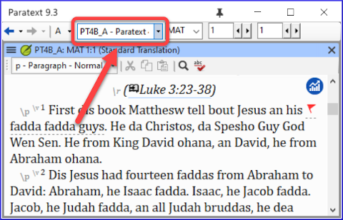

## Paratext Live {#16154c54093a4476b7397c214e78e49f}

Paratext Live utilise plus qu'un serveur.

- Paratext 8, 9.0 and 9.1 use a server called Internet (secondary) WCF and Paratext 9.2 uses Internet (primary) AMQP.
    - _This is why you can't use Paratext Live with 9.2 and 9.1 at the same time_
- Dans Paratext 9.3, lorsque vous démarrez Paratext Live, vous choisissez le serveur que vous souhaitez utiliser.
    - **Internet**, qui est 9.2 et 9.3.
    - **Internet (secondary)** which is 9.0, 9.1 or Paratext 8.

:::note

Everyone in a particular live session still needs to use the same server, it is just that from 9.3 you can work with someone on 9.1 or someone else on 9.2 (just not at the same time)

:::

## Annexes de la Bible d'étude {#8c8628c57aa04e48b5d33488872d0b29}

La nouvelle fonctionnalité la plus évidente est la possibilité de **comparer les versions**.

1. Ouvrez un projet Annexes de la Bible d'étude
1. Dans le menu **Projet**,
1. Sous **Projet**, choisissez **Comparer les versions**  
   *Les changements dans les annexes sont affichés*.
    - _The changes in the additions are displayed_.

## Référence de l'Écriture dans la barre de navigation {#3c00a0202ad949bc8909f66660badb73}

Dans Paratext 9.3, vous pouvez copier et coller une référence biblque dans la barre de navigation.

1. Copier le texte d'une référence (depuis un autre fichier)
1. Cliquez sur le **nom du livre** dans la barre de navigation.
1. Collez en utilisant **Ctrl+V**.  
    

    

The reference should be in a format that matches the interface language.

For example,

- en anglais : MAT 12.3, Mrk 5:4, Galates 1:12
- en espagnol : Romanos 8:28

:::note

The names must matches the names as they are seen in the titles. Currently can't copy from Paratext, but that feature is being added to a later update.

:::

## Outil de recherche de passages parallèles {#f660aff19a7541efaa453398f11dbacd}

- The colours have changed from **green** to **grey**

- You can reduce or expand the Greek / Hebrew by clicking the little arrow.

## Open a text collection {#fd1736d1bd07444fb6902b8dccf951dc}

Il y a un nouvel élément de menu dans le **menu principal**.

1. From the **Paratext menu**

1. Choose **Open text collection**

1. Ouvrez une collection de texte précédemment **enregistrée** en bas à gauche.
1. Vous pouvez également ouvrir une collection de texte à partir de la fenêtre **Ouvrir**.

## Arrangement des fenêtres {#b526a01da9e04357804f4849c39f2fdc}

- 1

:::tip

N'oubliez pas d'enregistrer votre disposition des fenêtres !

:::

## Fenêtres flottantes {#493f51aae2f5480893f25897c408c26c}

- Liste déroulante pour changer le projet actif  

    

### Autres nouveautés/changements {#4796465de7ac4f3190c47faa4b9750b8}

- **RegEx Pal** - from Main menu &gt; Advanced or Project menu &gt; Advanced.
- La **synchronisation** avec Logos et d'autres programmes compatibles est maintenant activée **par défaut**
- Des modifications ont été apportées pour faciliter la localisation des fichiers d'aide et de l'interface utilisateur
- Les **modules bibliques** peuvent maintenant gérer les **marqueurs de chapitre** dans les livres supplémentaires.
