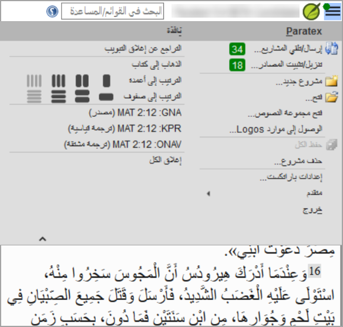

## Paratext 9.5 {#16154c54093a4476b7397c214e78e49f}

Voir le site de Paratext (en anglais) - [What's New in Paratext 9.5](https://paratext.org/features/whats-new/whats-new-in-paratext-9-5)

Points forts

- **Prise en charge des espaces et des caractères invisibles**
  - Note : L'ensemble de l'équipe doit passer à la version 9.5.
  - L'administrateur l'active en cliquant sur le menu déroulant de l'icône du paragraphe

    

- Disponible en
  - Éditeur de texte, liste de mots, liste de résultats, paramètres de références bibliques et paramètres de chiffres
  - Inventaire de caractères, les dialogues de vérification orthographique, les règles des guillemets.

- Améliorations des ajouts à la Bible d'étude (SBA)
  - Tâches et avancement
  - Les images dans Les notes en bas de page et barres latérales
  - Les **paramètres des références bibliques** dans les projets SBA peuvent désormais remplacer les paramètres du projet de base.
  - Amélioration des **fonctions de vérification**, garantissant des processus d'examen plus précis et plus efficaces.

- Inventaires
  - Annuler et refaire

  - Ancrer les panneaux de l'inventaire

  - Les panneaux d'inventaire ont désormais une apparence et un comportement similaires à ceux de la liste de mots.

    

  - l'approbation est gérée en fonction de l'emplacement - texte en verset, texte hors verset ou contenu de l'étude au sein de la SBA.

  - filtrage pour faciliter la recherche et l'organisation des éléments en inventaire.

- Améliorations supplémentaires
  - Afficher **plusieurs langues glossaires** en termes bibliques (Principaux termes bibliques)

    

  - Boutons de filtrage dans la fenêtre de téléchargement/installation des ressources

    

  - Simplification de la création et de l'édition des paramètres du générateur d’interlinéaire.
    - Choisissez parmi ceux qui existent déjà ou cliquez sur **Créer un nouveau**.

      

    - Choisissez le texte du modèle, cliquez sur **Enregistre**.

      

  - Liste des remarques - filtre "non lu et non résolu"

    

### Améliorations supplémentaires {#1ba598a5fd40807f8592f94edb9bef69}

Nous avons également apporté ces améliorations supplémentaires :

- Ajout de la possibilité d'afficher **plusieurs langues de glose** dans les fenêtres **Termes bibliques**.
- Ajout de **boutons de filtrage** à la fenêtre **Téléchargement/Installation des ressources**.
- **Simplifié** le processus de création et d'édition des **paramètres du générateur d'interlinéaire**.
- Ajout d'un filtre **"Non lu et non résolu "** à la liste **Notes de projet**.
- Prise en charge du nouveau format de Flore, Faune et Objets réels dans l'onglet Ressource enrichie Encyclopédie.
- Prise en charge de la Flore, Faune et Objets réels en plusieurs langues.
- Ajout d'un lien d'aide pour l'abréviation de l'appareil dans le texte de la langue source GRK.
- Amélioration de la localisation de l'interface utilisateur.
- Amélioration de la fusion des modifications pour les données de projet.
- Permet de modifier les inventaires et les paramètres des projets de translittération.
- Ajout de la possibilité de formater automatiquement les références lorsque les paramètres des références bibliques sont mis à jour.
- Prévoient l'intégration d'une invitation à l'enquête annuelle Paratext.
- Nombreuses corrections de bugs.

Veuillez consulter la rubrique d'aide _"What's new in Paratext 9.5?_ pour plus d'informations sur ces améliorations.

## Paratext 9.4  {#192598a5fd408046bbd6d5ee536dc483}

Voir le site de Paratext (en anglais)- [What's New in Paratext 9.4](https://paratext.org/features/whats-new/whats-new-in-paratext-9-4)

Points forts

- **Notification des mises à jour des projets sur l'ordinateur de l'utilisateur:** Un point vert dans le menu du projet. Les paramètres de vérification des mises à jour sont disponibles dans la fenêtre **Envoyer/recevoir des projets** . [Menu principal vidéo démo (en anglais)](https://paratext.org/features/whats-new/whats-new-in-paratext-9-4-beta/?vimeography_gallery=157&vimeography_video=857678678)

  

- **Notification des mises à jour des ressources installées.** Un point vert dans le menu principal peut également indiquer des mises à jour des textes des ressources sur l'ordinateur local. L'accès aux paramètres de cette fonction se fait dans le dialogue **Télécharger/Installer ressources** .

- **Amélioration de l'interface droite-gauche.** Paratext affiche désormais correctement les interfaces utilisateur de droite à gauche (comme l'arabe). [RTL vidéo démo (en anglais)](https://paratext.org/features/whats-new/whats-new-in-paratext-9-4-beta/?vimeography_gallery=157&vimeography_video=858761461)

  

- **Option pour cacher les remarques de projet** Accès à partir du **menu Affichage &gt; Afficher les remarques de projet**. [Menu de projet vidéo démo (en anglais)](https://paratext.org/features/whats-new/whats-new-in-paratext-9-4-beta/?vimeography_gallery=157&vimeography_video=857939433)

  

- **Amélioration des vérifications des citations.** La nouvelle vérification de base "Types de citations" sait où les citations doivent se trouver dans le texte sur la base des données [Glyssen](https://software.sil.org/glyssen/) et peut s'assurer qu'elles sont toutes marquées de manière appropriée. [Types de citations vidéo démo](https://paratext.org/features/whats-new/whats-new-in-paratext-9-4-beta/?vimeography_gallery=157&vimeography_video=859138745)

- **Ajout de vidéos aux ressources enrichies.** L'onglet Média des ressources enrichies contient désormais des clips vidéo provenant de [LUMO](https://lumoproject.com/) et de la série "Bible Lands as Classroom" de l'UBS. [Vidéos sur les ressources enrichies - démo vidéo](https://paratext.org/features/whats-new/whats-new-in-paratext-9-4-beta/?vimeography_gallery=157&vimeography_video=858761461)

- **Importer/Exporter des listes de termes bibliques.** Permet aux utilisateurs de créer et d'échanger des listes de termes bibliques au fur et à mesure de l'avancement du projet. [Termes bibliques vidéo démo](https://paratext.org/features/whats-new/whats-new-in-paratext-9-4-beta/?vimeography_gallery=157&vimeography_video=858020833)

**Et bien d'autres améliorations !**

## Paratext 9.3  {#4c850f9665ff4ab8870f1ae0fed0e870}

[Nouveautés de Paratext 9.3](https://paratext.org/features/whats-new/whats-new-in-paratext-9-3/)

### Paratext Live utilise plusieurs serveurs {#14973ac6c79843a3a94db72e3348418d}

- Paratext 8, 9.0 et 9.1 utilisent un serveur appelé Internet (secondaire) WCF et Paratext 9.2 utilise Internet (primaire) AMQP.
  - _C'est pourquoi il n'est pas possible d'utiliser Paratext Live avec 9.2 et 9.1 en même temps_
- Dans Paratext 9.3, lorsque vous démarrez Paratext Live, vous choisissez le serveur que vous souhaitez utiliser.
  - \*\*Internet (primaire), soit 9.2 et 9.3.
  - \*\*Internet (secondaire) qui est 9.0, 9.1 ou Paratext 8.

:::note

Toutes les personnes participant à une session en direct particulière doivent toujours utiliser le même serveur, mais à partir de la version 9.3, vous pouvez travailler avec une personne utilisant la version 9.1 ou une autre utilisant la version 9.2 (mais pas en même temps)

:::

## Annexes de la Bible d'étude {#8c8628c57aa04e48b5d33488872d0b29}

La nouvelle fonctionnalité la plus évidente est la possibilité de **comparer les versions**.

1. Ouvrez un projet Annexes de la Bible d'étude
2. Dans le menu **Projet**,
3. Sous **Projet**, choisissez **Comparer les versions**
  - _Les modifications apportées aux ajouts sont affichées_.

## Référence biblique dans la barre de navigation {#3c00a0202ad949bc8909f66660badb73}

Dans Paratext 9.3, vous pouvez copier et coller une référence biblque dans la barre de navigation.

1. Copier le texte d'une référence (depuis un autre fichier)
2. Cliquez sur le **nom du livre** dans la barre de navigation
3. Collez en utilisant **Ctrl+V**

  

La référence doit être présentée dans un format correspondant à la langue de l'interface.

Par exemple :

- en français : MAT 12.3, Mrk 5:4, Galates 1:12
- en espagnol : Romanos 8:28

:::note

Les noms doivent correspondre aux noms tels qu'ils apparaissent dans les titres.
Actuellement, il n'est pas possible de copier à partir de Paratext, mais cette fonctionnalité sera ajoutée lors d'une prochaine mise à jour.

:::

## Outils > Passages parallèles {#f660aff19a7541efaa453398f11dbacd}

- Les couleurs sont passées du **vert** au **gris (et de nouveau au vert en 9.4)**

- Vous pouvez réduire ou étendre le grec / hébreu en cliquant sur la petite flèche.

## Ouvrir la collection de textes {#fd1736d1bd07444fb6902b8dccf951dc}

Il y a un nouvel élément de menu dans le **menu principal**

1. Dans le **menu Paratext**

2. Choisissez **Ouvrir la collection de textes**
  - _Cette fenêtre ressemble à celle utilisée dans les versions précédentes de Paratext_.

    

3. Ouvrez la collection de texte précédemment enregistrée en bas à gauche

4. Vous pouvez également ouvrir une collection de texte à partir de la fenêtre **Ouvrir**.

## Disposition des fenêtres {#b526a01da9e04357804f4849c39f2fdc}

- Disposer les fenêtres par **lignes** et par **colonnes**.

:::tip

N'oubliez pas d'enregistrer votre disposition des fenêtres !

:::

## Fenêtres flottantes {#493f51aae2f5480893f25897c408c26c}

- Liste déroulante pour changer le projet actif

  

### Autres nouveautés/modifications {#4796465de7ac4f3190c47faa4b9750b8}

- \*\*RegEx Pal - à partir du menu principal \&gt; Avancé ou du menu Projet \&gt; Avancé.
- **La synchronisation avec Logos et d'autres programmes compatibles est maintenant activée par défaut**
- Des modifications ont été apportées pour faciliter la localisation des fichiers d'aide et de l'interface utilisateur
- Les **modules bibliques** peuvent maintenant gérer les **marqueurs de chapitres** dans les livres supplémentaires
