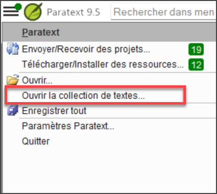

## Paratext Live {#16154c54093a4476b7397c214e78e49f}

Paratext Live utilise plus qu'un serveur.

- Paratext 8, 9.0 et 9.1 utilisent un serveur appelé Internet (secondaire) WCF et Paratext 9.2 utilise Internet (primaire) AMQP.
    - _C'est pourquoi il n'est pas possible d'utiliser Paratext Live avec 9.2 et 9.1 en même temps_
- Dans Paratext 9.3, lorsque vous démarrez Paratext Live, vous choisissez le serveur que vous souhaitez utiliser.
    - **Internet (primaire)**, soit 9.2 et 9.3.
    - **Internet (secondaire)** qui est 9.0, 9.1 ou Paratext 8.

:::note

Toutes les personnes participant à une session en direct particulière doivent toujours utiliser le même serveur, mais à partir de la version 9.3, vous pouvez travailler avec une personne utilisant la version 9.1 ou une autre utilisant la version 9.2 (mais pas en même temps)

:::

## Annexes de la Bible d'étude {#8c8628c57aa04e48b5d33488872d0b29}

La nouvelle fonctionnalité la plus évidente est la possibilité de **comparer les versions**.

1. Ouvrez un projet Annexes de la Bible d'étude
2. Dans le menu **Projet**,
3. Sous **Projet**, choisissez **Comparer les versions**  
   *Les changements dans les annexes sont affichés*.
    - _Les modifications apportées aux ajouts sont affichées_.

## Référence de l'Écriture dans la barre de navigation {#3c00a0202ad949bc8909f66660badb73}

Dans Paratext 9.3, vous pouvez copier et coller une référence biblque dans la barre de navigation.

1. Copier le texte d'une référence (depuis un autre fichier)
2. Cliquez sur le **nom du livre** dans la barre de navigation.
3. Collez en utilisant **Ctrl+V**

    

La référence doit être présentée dans un format correspondant à la langue de l'interface.

Par exemple :

- en français : MAT 12.3, Mrk 5:4, Galates 1:12
- en espagnol : Romanos 8:28

:::note

Les noms doivent correspondre aux noms tels qu'ils apparaissent dans les titres. Actuellement, il n'est pas possible de copier à partir de Paratext, mais cette fonctionnalité sera ajoutée lors d'une prochaine mise à jour.

:::

## Outil de recherche de passages parallèles {#f660aff19a7541efaa453398f11dbacd}

- Les couleurs sont passées de **vert** à **gris**

- Vous pouvez réduire ou développer le grec/hébreu en cliquant sur la petite flèche.

## Ouvrir une collection de textes {#fd1736d1bd07444fb6902b8dccf951dc}

Il y a un nouvel élément de menu dans le **menu principal**.

1. A partir du menu **Paratext**
2. Choisissez **Ouvrir une collection de texte**
    - _Cette fenêtre ressemble à celle utilisée dans les versions précédentes de Paratext_.

        

3. Ouvrez une collection de texte précédemment **enregistrée** en bas à gauche
4. Vous pouvez également ouvrir une collection de texte à partir de la fenêtre **Ouvrir**.

## Arrangement des fenêtres {#b526a01da9e04357804f4849c39f2fdc}

- Classer les fenêtres par **lignes** ainsi que par **colonnes**.

:::tip

N'oubliez pas d'enregistrer votre disposition des fenêtres !

:::

## Fenêtres flottantes {#493f51aae2f5480893f25897c408c26c}

- Liste déroulante pour changer le projet actif  

    

### Autres nouveautés/changements {#4796465de7ac4f3190c47faa4b9750b8}

- **RegEx Pal** - à partir du menu principal \&gt; Avancé ou du menu Projet \&gt; Avancé.
- La **synchronisation** avec Logos et d'autres programmes compatibles est maintenant activée **par défaut**
- Des modifications ont été apportées pour faciliter la localisation des fichiers d'aide et de l'interface utilisateur
- Les **modules bibliques** peuvent maintenant gérer les **marqueurs de chapitre** dans les livres supplémentaires.
