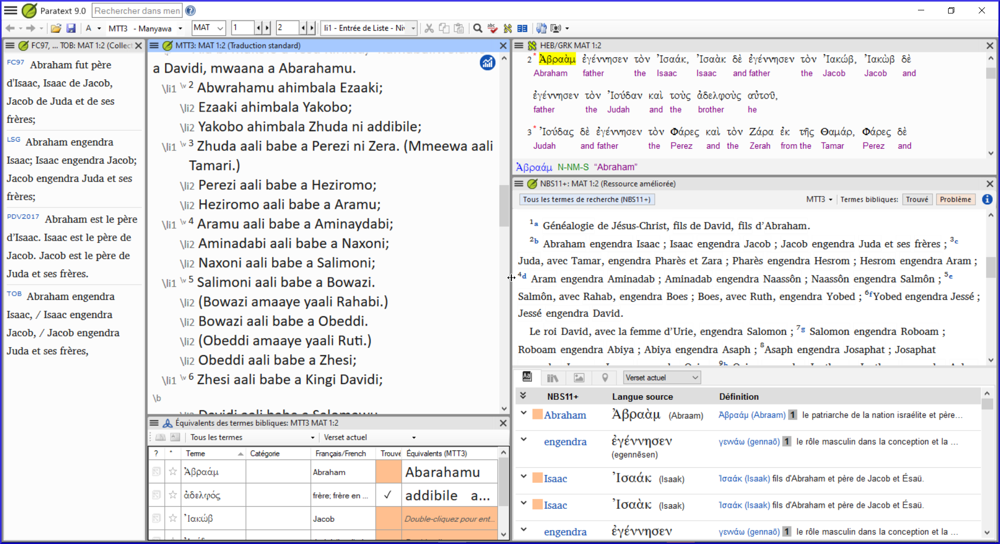
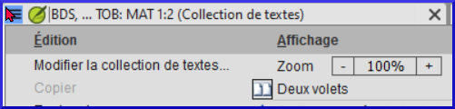
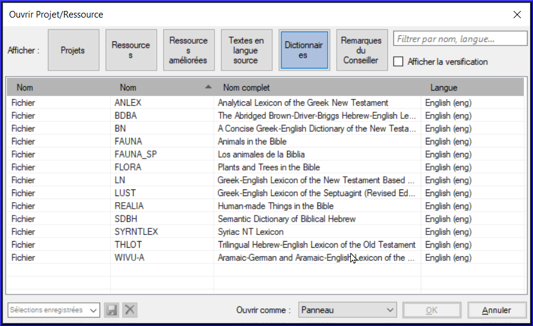

**Introduction**  
Vous désirez travailler sur votre texte en Paratext 9 et consulter les ressources diverses. Dans ce module, vous allez apprendre comment ouvrir des ressources et organiser votre bureau.

**Où en sommes-nous dans le processus ?**  
Nous nous préparez à saisir du texte dans un projet existant. Avant de pouvoir faire ceci, Paratext 9 et les ressources diverses doivent avoir été installés et un projet pour vos données doit avoir été créé.

**Pourquoi cette aptitude est-elle importante ?**  
Le traducteur qui organise bien son bureau a toutes les ressources nécessaires pour son travail.

**Qu’est-ce qu’on va faire ?**  
On va lancer le logiciel Paratext 9, puis ouvrir une disposition des fenêtres qu’est déjà enregistré. Si nécessaire, vous pouvez modifier la disposition des fenêtres et réenregistrer la disposition.

Un certain nombre de vidéos sont disponibles pour vous aider à utiliser les différents types de ressources et à disposer les fenêtres. P.e., 0.2.1b-0.2.1d, 0.2.2a

**Des changements dans Paratext 9**  
Les menus ont changé dans Paratext 9. Pour voir le menu, il faut maintenant cliquer sur l'icône du menu **≡**. Il existe deux types de menus. Le menu principal Paratext se trouve sur la barre de titre  et chaque fenêtre (ou onglet) a son propre menu.  Lorsque vous cliquez sur l'une de ces icônes de menu, tous les menus sont affichés et il vous suffit de cliquer sur la commande.

Dans ce manuel, on écrit **≡ Paratext**, sous **Menu** \> **Command** pour signifier qu'il faut cliquer sur l'icône de menu Paratext ≡, puis sous le menu (par ex. Paratext) choisir la commande (par ex. Ouvrir).

Et on écrit **≡ Onglet**, sous **Menu** \> **Command** pour signifier qu'il faut cliquer sur l'icône du menu de l'onglet ≡, puis sous le menu (par ex. Outils) cliquer sur la commande (par ex. Liste de mots).

### 2.1 Lancer le programme Paratext

- Double-cliquez sur l’icône Paratext 9 sur le bureau  
      
    OU  
- (Dans le menu **Démarrer**, choisissez Paratext 9)

### 2.2 Ouvrir une disposition des fenêtres

1.  Cliquez sur le menu **≡ Paratext**, sous **Fenêtre**
1.  Choisissez une disposition des fenêtres qui est déjà enregistrée.  
   - *Votre écran doit ressembler à l’image ci-dessous (sinon, voir ci-dessous pour comment ouvrir les fenêtres).*  
    

### 2.3 Créer une nouvelle disposition

Si vous n’avez pas encore enregistré une disposition de fenêtres, on vous suggère de faire comme ci-dessous:

**Ouvrir et arranger les fenêtres**  
- Ouvrez 5 fenêtres comme suit :
- 5 = votre projet
    - **≡ Paratext**, sous (**Paratext** \> **Ouvrir** puis cliquez sur projets)
- 1 = équivalents
    - **≡ Onglet**, sous **Outils** \> **Équivalents des termes bibliques**)
- 2 = texte source  
    - **≡ Paratext**, sous (**Paratext** \> **Ouvrir** puis cliquez sur **Textes en langue source**)
- 3 = dictionnaire
    - **≡ Paratext**, sous (**Paratext** \> **Ouvrir** puis cliquez sur **Dictionnaires**)
- 4 = ressources en collection de textes
   - **≡ Paratext**, sous **Paratext** \> **Ouvrir** puis cliquez sur **Ressources**, puis ouvrir en tant que Collection de textes) (voir 2.5)  
- Arrangez les fenêtres comme vous le souhaitez. Voir Paratext vidéo 0.2.1b, c et d.

**Enregistrer la disposition des fenêtres**  
Après avoir arrangé les fenêtres comme vous le souhaitez

1.  **≡ Paratext**, sous **Mise en page** \> **Enregistrer la disposition des fenêtres**
1.  Saisissez un nom  
    [ou pour réenregistrer, choisissez un nom existant]
1.  Cliquez sur **OK**

### 2.4 Supprimer une disposition des fenêtres

Si vous ne voulez plus garder une disposition des fenêtres,

1.  **≡ Paratext** menu, sous **Mise en page** \> **Supprimer la disposition des fenêtres**
1.  Choisissez le nom de la disposition enregistré.
1.  Cliquez sur **Supprimer**

### 2.5 Ouvrir Projet/Ressource en collection de textes

:::tip
Avec Paratext, il est possible d’avoir plusieurs projets/ressources ouverts au même moment. Mais au lieu d’avoir trop de fenêtres, il vaut mieux ouvrir plusieurs ressources dans une seule fenêtre en collection de textes.
:::

1.  **≡ Paratext** menu, sous **Paratext** \> **Ouvrir**  
    
1.  Cliquez sur le bouton ressources
1.  Ctrl+cliquez sur des ressources désirées
1.  Répétez si nécessaire
1.  Cliquez sur la liste déroulante **Ouvrir comme**
1.  Choisissez **Collection de textes**
1.  Cliquez sur **OK**

:::tip Remarque
Il est suggéré que les ressources soient présentées dans l’ordre de la plus littérale à la moins littérale (pour mettre l’accent sur les textes les plus fidèles aux textes sources). Pour les ressources en français, l’ordre suivant est suggéré : TOB, NVSR78Col, NBS, BDS, FC97, PDV11. Parmi les ressources en anglais : ESV, RSV, NIV, NLT.
:::

#####  

Pour modifier l'ordre des textes d'une collection de textes.
1.  **≡ Onglet**, **Modifier la collection de textes**
 
1.  Utilisez les boutons fléchés pour changer l'ordre si nécessaire.  
   
1.  Effectuer toute autre modification
1.  Cliquez sur **OK**

:::info
Vous pouvez changer le texte qui remplira le volet à droite en cliquant sur le lien bleu de la ressource. En Paratext 9 on peut changer l’affichage à aperçu/non formaté/standard (normal).
:::

#####  

### 2.6 Ouvrir une ressource enrichie

1.  **≡ Paratext** menu, sous **Paratext** \> **Ouvrir**
   
1.  Cliquez sur **Ressources enrichies**
:::info
Une ressource enrichie contient un dictionnaire, des images, etc. Lorsque vous ouvrez une ressource enrichie, un guide s'ouvre également.
:::
### 2.7 Ouvrir un dictionnaire

Si vous n'utilisez pas de ressource enrichie, vous pouvez ouvrir un dictionnaire de langue source avec des gloses en français :

1.  **≡ Paratext** menu, sous **Paratext** \> **Ouvrir**  
   
1.  Cliquez sur **Dictionnaires**
1.  Choisissez « A Concise Greek-English Dictionary of the New Testament » OU "Trilingual Hebrew-English Lexicon of the Old Testament"
1.  Cliquez sur **OK**
1.  **≡ Onglet**, sous **Affichage** \> **français**

D'autre dictionnaires (en anglais, mais avec des photos)

- "Plants and Trees in the Bible"
- "Animals in the Bible"

### 2.8 Travailler avec le text en langue source

Vous pouvez ouvrir le text en langue source avec des gloses en français.

1.  **≡ Paratext**, sous **Paratext** \> **Ouvrir**  
    
1.  Cliquez sur **Textes en langue source**
1.  Choisissez le HEB/GRK
1.  Cliquez sur **OK**
1.  **≡ Onglet**, sous **Affichage** \> **Gloses supplémentaires**
1.  Choisissez le projet avec les gloses (GlossFR)
1.  Cliquez sur **OK**
