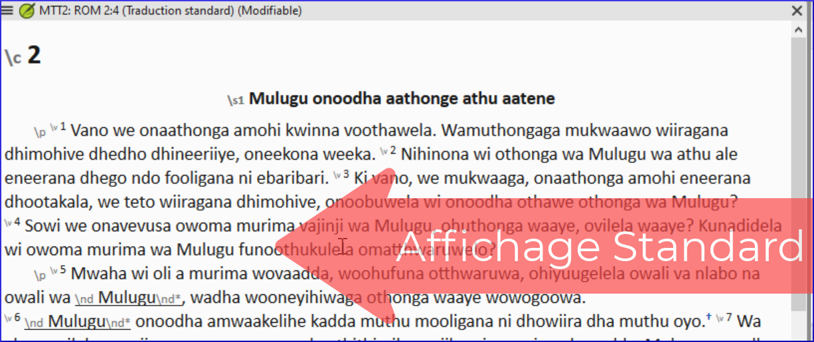

---
title: Comment l'affichage standard vous aide à ajouter des marqueurs (1.2.2a)
---

Dans cette vidéo, nous verrons comment insérer des marqueurs de format standard unifié ou USFMs en affichage standard.

- L'affichage standard montre les marqueurs USFM, mais ils sont petits et gris. Cet affichage est recommandé pour le travail ordinaire lors de la rédaction et de la révision d'une traduction.
- Dans cet affichage, il existe des aides pour saisir le bon marqueur.

### Pour ajouter un nouveau paragraphe

1.  Appuyez sur **ENTRÉE** pour ajouter un nouveau paragraphe
    - *Paratext ouvre automatiquement un menu nous indiquant les marqueurs possibles pour commencer un paragraphe, les plus fréquents sont en haut*.
1.  Utilisez la souris ou tapez la lettre appropriée
    Par exemple, tapez P et appuyez sur **ENTRÉE**

### Pour ajouter d'autres marqueurs (de caractères)

1.  Sélectionnez les mots que vous souhaitez marquer
1.  Appuyez sur **\\**
1.  Sélectionnez le marqueur dans la liste

