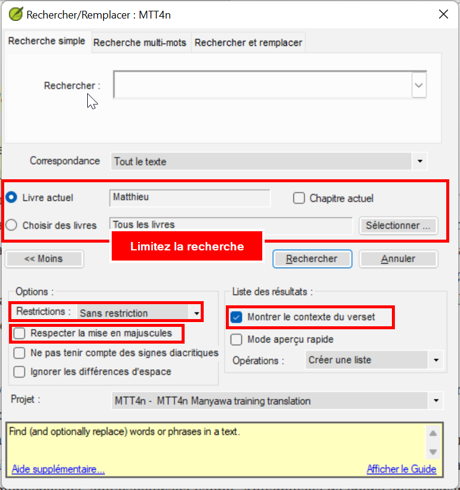

Pour rechercher un mot particulier dans un projet ou une ressource,

1.  Ouvrez le **menu** de la fenêtre.
1.  Sous **Édition**, cliquez sur **Rechercher**.
    - *La boîte de dialogue Rechercher/Remplacer s’affiche*.
1.  Tapez le mot que vous souhaitez rechercher, puis cliquez sur **Rechercher**.
    - *Paratext affiche les correspondances dans une fenêtre de liste*.
1.  Double-cliquez sur une référence dans la fenêtre de liste
    - *Le texte correspondant est affiché dans son contexte*.

### Autres moyens d’ouvrir la boîte de dialogue de recherche

1.  **Icône Rechercher** dans la barre d’outils, ou
1.  **Ctrl-F** le raccourci clavier.
1.  **Menu** \> **Édition** \> Rechercher.
:::tip
Il est utile que la fenêtre dans laquelle vous souhaitez effectuer la recherche soit d’abord active.
:::

##### 

### La boîte de dialogue Rechercher

- La zone de texte **Rechercher** affiche votre recherche précédente.
- **Correspondance** — tout le texte ou texte du verset.
- Limitez la recherche au **livre actuel**, **chapitre actuel**, ou choisissez une plage de livres en utilisant le bouton **Sélectionner**.
- Le bouton **Plus** offre des options supplémentaires.
- **Restrictions**
  - **Mot entier** uniquement,
  - au **début du mot** ou
  - à la **fin du mot** ou
  - **Sans restriction** signifie que les correspondances peuvent être n’importe quelle partie d’un mot ou un mot entier.
- **Respecter la mise en majuscules**–permet de vérifier si les caractères sont en majuscules ou en minuscules.
- **Montrer le contexte du verset** signifie que la liste affiche le mot ou la chaîne de caractères correspondant, avec certains mots adjacents du verset également.
- Pour masquer les options supplémentaires, cliquez sur **\<\<Moins**.
- Pour effectuer la recherche, cliquez sur **Rechercher**.
     
  - *La liste est mise à jour pour montrer les résultats*.

### Remplacer

Il existe trois façons d’ouvrir l’onglet Remplacer

1.  Dans la boîte de dialogue Rechercher/Remplacer, cliquez sur l’onglet **Remplacer**.
1.  **Ctrl-H** le raccourci clavier.
1.  **Menu** \> **Édition** \> **Remplacer**.

Utiliser Remplacer  
1.  Ouvrez la boîte de dialogue **Rechercher et remplacer**
1.  Modifiez le texte dans la zone de **recherche** si nécessaire.
1.  Tapez le texte par lequel vous voulez le remplacer dans la zone **Correspondance**.
1.  Cliquez sur le bouton **Remplacer**.
    - *Au lieu de vous montrer une liste de correspondances, Paratext ouvre la boîte de dialogue Remplacer et vous montre une correspondance à la fois*.

### Remplacement des correspondances

- **Oui** ou **Non –** approuver chaque modification individuellement.
- **Oui à tous**  approuvera tous les autres changements proposés, proposées, **il faut donc l’utiliser avec précaution**.
:::caution **Oui à tous**
Assurez-vous qu’il s’agit bien d’une modification que vous souhaitez effectuer partout (par exemple, passez d’abord en revue avec Rechercher
:::
- **Annuler** va arrêter complètement le processus.
  - *Veuillez noter que les modifications pour lesquelles vous avez déjà cliqué sur Oui ne seront pas annulées*.

:::info 
La fonction **Rechercher** et remplacer **Oui à tous** n’apporte des modifications qu’aux endroits que vous êtes **autorisé** à modifier.
- Paratext vous informera du nombre de correspondances qui n’ont pas été modifiées parce que vous **n’aviez pas l’autorisation** de les éditer.
:::
