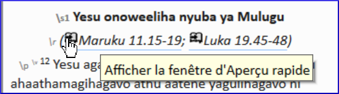

### Ouvrez la fenêtre d'Aperçu rapide :

- Cliquez sur un lien dans la ligne \\r ou \\xt  
    
  - *La fenêtre Aperçu rapide vous montre le texte de cette autre référence.*

   *OU*
- Cliquez sur Projet **≡**, développez le menu, sous **Outils** \> **Aperçu rapide**

:::tip
- Si vous ajoutez la fenêtre au groupe Masquer automatiquement ou comme une fenêtre ancrée (ajusté), Paratext l’utilisera pour ouvrir des liens de référence parallèles ou des liens de référence croisés.
- Dans Paratext 9.1, toute fenêtre flottante dispose désormais de contrôles pour accéder une référence.
:::
