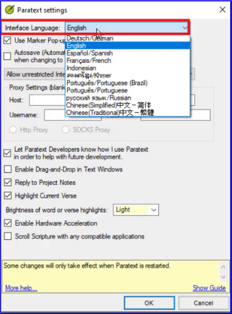

---
title: Comment changer la langue de l'interface utilisateur (0.2.1a)
---

L'interface Paratext est disponible dans de nombreuses langues.

1.  Cliquez sur Menu Paratext **≡** \>  Menu Paratext \> **Paramètres paratext**
1.  Dans le menu déroulant, de la liste des **interface langues** \> Choisir une langue \> **OK**

    

