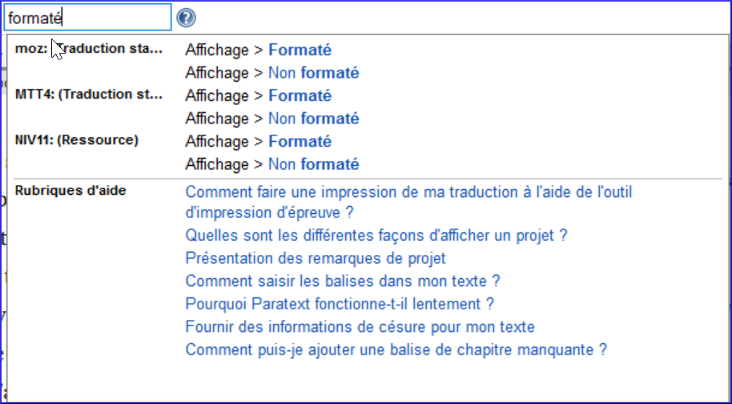

---
title: Trouver des éléments de menu (0.2.1c)
---

N'oubliez pas qu'il existe deux menus - un pour l'ensemble de Paratext (1) et le second pour toute fenêtre ou volet de projet (2)  
  

Il y a trois autres choses à savoir sur les menus :

1.  Pas seulement des projets et des ressources, mais d'autres fenêtres ont leurs propres menus
2.  Il y a deux ensembles de menus, standards et complets.
    - Un menu standard peut être développé en cliquant sur la flèche en bas.
3.  Vous pouvez rechercher les commandes du menu

**Rechercher les commandes du menu**  
1. Cliquez sur la zone de recherche, tapez la commande
    
1. Cliquez sur la commande souhaitée dans la liste des résultats  
    

:::tip
La recherche de menu fonctionne même si vous êtes dans des menus standard et que la commande que vous recherchez est normalement cachée. La même recherche affiche également des rubriques d'aide.
:::