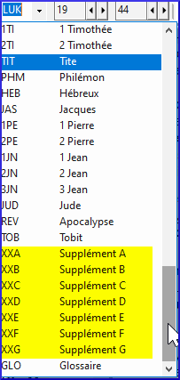

De nombreux livres non bibliques sont répertoriés après Apocalypse (REV) (également les livres deutérocanoniques)

S'ils ont été créés dans le projet, vous pouvez accéder à ces livres en cliquant sur "Sélectionner un livre" dans la barre d'outils.

- par exemple GLO, XXA … XXG

    
