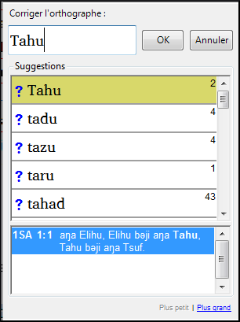
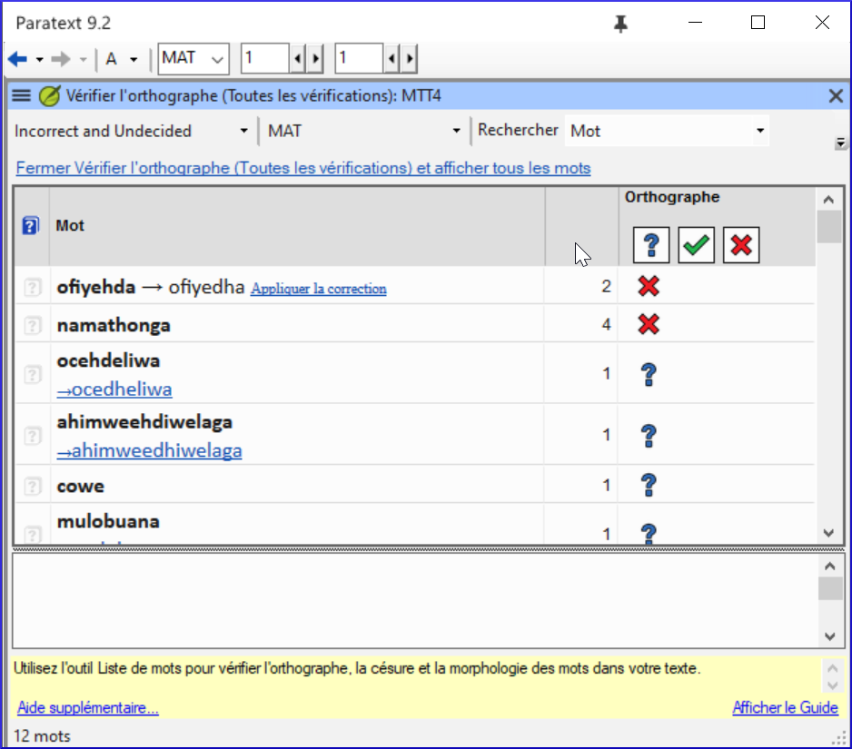
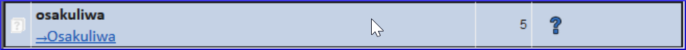
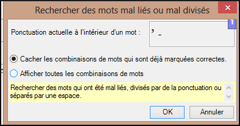

**Introduction**  
Ce module explique comment utiliser une fonctionnalité de Paratext 9 pour la vérification des fautes d’orthographe.

**Où en sommes-nous dans le processus ?**  
Vous avez saisi votre texte dans Paratext 9 et vous l’avez examiné pour déceler les fautes de frappe et les erreurs de composition. Mais il peut encore rester un certain nombre d’erreurs d’orthographe.

**Pourquoi cette fonction est-elle importante ?**  
Vous devez corriger les fautes d’orthographe, afin que votre texte communique le message clairement.

**Qu’est-ce qu’on va faire ?**  
- Configurez la liste de mots pour constituer une base de mots corrects.
- Travaillez dans votre texte avec des lignes ondulées rouges montrant les mots que Paratext ne sait pas être corrects.
- Parcourez votre liste de mots, en corrigeant les erreurs ou en indiquant à Paratext 9 que les mots sont corrects.
- Utilisez une variété de contrôles de la liste de mots.
- Ajoutez une note de discussion sur l'orthographe aux mots qui nécessitent une discussion plus approfondie avant de décider de l'orthographe correcte.

## 8.1 Configurer la liste de mots

:::tip
Avant de vérifier l’orthographe, il est important d’avoir une base de mots corrects. Il y a trois choses à faire :
:::

### Approuver l’orthographe des mots fréquents

Dans Paratext 

-  **≡ Onglet**, sous **Outils** \> **Liste de mots**

Dans la Liste des Mots

1.  **≡ Onglet,** sous **Outils** \> **Approuver l’orthographe des mots fréquents**
1.  Saisissez un chiffre
3.  Cliquez sur **OK**
1.  Cliquez sur **Oui** (pour confirmer que vous savez que vous ne pouvez pas l'annuler)

:::info  
Saisissez un chiffre qui représente le minimum d’occurrences d’un mot pour permettre l’approbation automatique de son orthographe. En d’autres termes, combien de fois le mot doit-il être dans la liste pour qu’on le considère comme bien orthographié ? Le paramètre par défaut est 100, mais on peut choisir plus ou moins que cela.  
:::

### Vérifier les mots que Paratext pense être erronés
Dans la liste de mots (**≡ Onglet**, sous **Outils** \> **Liste de mots**)

1.  **≡ Onglet**, sous **Outils** \> **Vérifier l’orthographe** \> **Toutes les vérifications**  
     -   *La liste de mots s'affiche.*
2.  Cliquez sur un mot dans le volet en haut.
3.  Si correct — cliquez sur la case verte  en haut de la colonne
4.  Si le mot est incorrect, et Paratext a proposé le mot juste, cliquez sur le lien bleu du mot juste
5.  Si le mot est incorrect, et Paratext n'a pas proposé le mot juste, cliquez sur la croix rouge  et corrigez le mot.(Voir 9.3)

### Vérifier les mots qui se ressemblent beaucoup dans l'écriture
Dans la liste de mots

1.  **≡ Onglet**, sous **Outils** \> **Rechercher mots semblables**
1.  Remplissez la boîte de dialogue avec les paires de lettres qui peuvent être confondues séparé par / (p.e.x s/sh)
1.  Cliquez sur **OK**  
     -   *Une liste de mots s'affiche.*
1.  Vérifiez les mots comme au-dessus.
:::tip
Selon votre langue, cochez ou décochez *ne pas tenir compte des signes diacritiques lors de la comparaison des mots*.
:::

## 8.2 Vérifier l’orthographe — dans le texte

Dans Paratext

-  **≡ Onglet**, sous **Affichage** \> **Afficher les fautes d'orthographe**

:::tip
Un mètre de progrès s’affiche puis tous les mots inconnus ou incorrects sont soulignés, avec les lignes ondulées rouges.
:::

### Corrections des erreurs

Paratext 9 soulignera en rouge les mots dans le texte qui ne sont pas marqués corrects dans la liste de mots. (Les mots qui sont incorrects ou incertains.

1.  Cliquez à droite sur un mot souligné en rouge ou gris  
     -   *Une boîte de dialogue s'affiche*  
      
1.  Saisissez la correction ou bien choisissez un mot de la liste
1.  Cliquez sur **OK**.

:::tip
Il est préférable d’utiliser *vérifier l’orthographe* au lieu de corriger les mots un par un dans le texte. C’est mieux parce que Paratext 9 va se rappeler la correction pour l’appliquer aussi dans les autres chapitres.
:::

:::info
Quand il y a plus d’une correction, une boîte de dialogue s’affiche. Choisissez une des options selon le besoin.
-  **Oui** = change ce verset et cherche d’autres.
-  **Non** = ne change pas ce verset, mais cherche d’autres
-  **Oui à tous** est trop dangereux. Ne l’utilisez pas!
-  **Annuler** = arrête ici, ne change rien d’autre
:::

## 8.3 Vérifier l’orthographe du livre actuel

1.  **≡ Onglet**, sous **Outils** \> **Vérifier l’orthographe du livre actuel**  
     -  *Une fenêtre s’affiche avec une liste de plusieurs mots suspects du livre actuel.*  
    
1.  Faites les corrections comme ci-dessus (9.3)
1.  Cliquez sur *Davantage d'éléments disponibles* pour afficher des mots supplémentaires.
1.  Continuez si nécessaire.

## 8.4 Vérification d’orthographe dans la liste de mots

### Utiliser les vérifications

Dans la liste de mots

1.  **≡ Onglet**, sous **Outils** \> **Vérifier l’orthographe**
1.  Choisissez la vérification désirée (voir dessous)  
      
     - *Une liste de mots s’affiche.*
1.  Faites les corrections comme ci-dessus
1.  Cliquez sur **Davantage d'éléments disponibles**  pour afficher des mots supplémentaires.
1.  Continuez si nécessaire.
1.  Quand la liste est vide, un message s’affiche.  
    
1.  Cliquez sur **Oui**.

### Toutes les vérifications
Cela gère tous les contrôles. Ceci est très utile, car il trouvera tous les types d'erreurs et surtout des mots avec plusieurs types d'erreurs.

### Majuscules manquantes
1.  Une liste de mots s’affiche avec les liens d’autres mots qui n’ont pas toujours de majuscules (c'est-à-dire que les deux formes sont utilisées). Le mot avec la minuscule se trouve au-dessus du mot avec la majuscule, qui a un lien bleu.  
    
1.  Cliquez sur le lien bleu pour le mot en majuscule.  
    
1.  Cliquez sur le lien bleu qui convient.
       -  *Afficher les erreurs* (pour voir tous les versets)
       -  *Toutes les deux formes sont acceptables* (pour accepter les deux formes)
       -  *Tout mettre en majuscule* (corriger tous les mots en minuscule)

### Faute de frappe d’un caractère unique
Une liste de mots s’affiche avec les liens d’autres mots qui ressemblent au mot en question, mais qui diffèrent d'une seule lettre.

### Combinaisons inhabituelles des lettres
Une liste de mots s’affiche. Ces mots ont une séquence des caractères rares, par exemple plus d’une consonne ou plusieurs voyelles…

### Erreurs de signes diacritiques
Une liste de mots s'affiche. Cette fois, les mots se distinguent uniquement par leurs diacritiques.

### Fautes de frappe courantes
Une liste de mots s'affiche qui vous montre les mêmes types de problèmes qui ont déjà été corrigés ailleurs. Par exemple : si vous avez corrigé *vres* en *vers* ailleurs, et il trouve *vreset* il va suggérer *verset*.

### Morphologie inconnue
Une liste de mots s’affiche dont l’ordinateur ne peut pas deviner la morphologie basée sur d’autres mots.

### Rechercher des mots mal liés ou mal divisés
Dans la liste de mots

1.  **≡ Onglet**, sous **Outils** \> **Rechercher des mots mal liés ou mal divisés**  
    
1.  Saisissez une ponctuation qui peut apparaître au milieu d'un mot, si elle existe.
1.  Cliquez sur **OK**.  
     -   *Une liste de mots est affichée avec des mots similaires regroupés.*  
    

### Corriger un mot mal marqué
1.  Trouvez le mot dans la liste de mots (en utilisant un filtre si nécessaire)
1.  Cliquez sur la ligne pour voir le mot dans son contexte
1.  Cliquez sur l’état d’orthographe désiré.

## 8.5 Remarque de discussion orthographique

:::tip
Si vous ne décidez pas définitivement de l'orthographe, vous pouvez ajouter une remarque de discussion orthographique.
:::

1.  Double-cliquez sur l’icône de remarque (dans la première colonne)  
    
1.  Saisissez la remarque
1.  Confiez (affectez) la remarque comme désiré.
1.  Cliquez sur **OK**.
