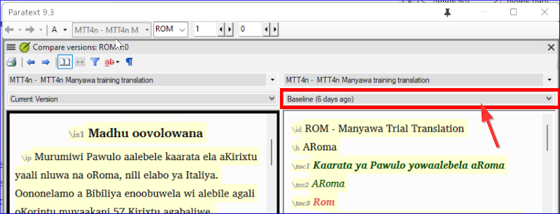
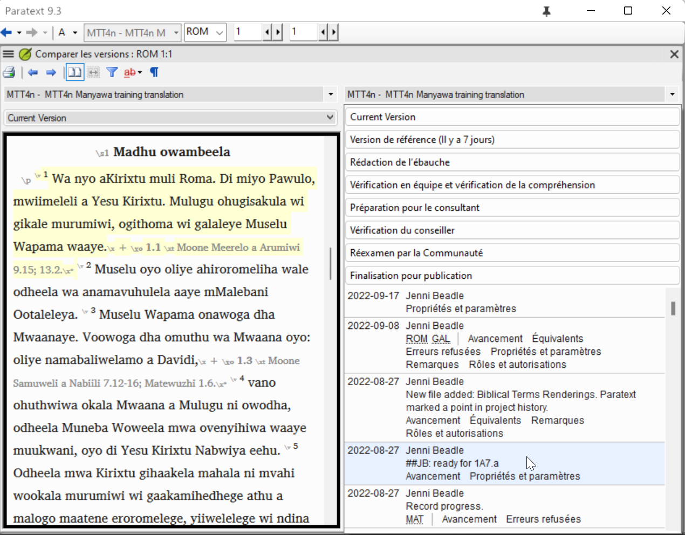
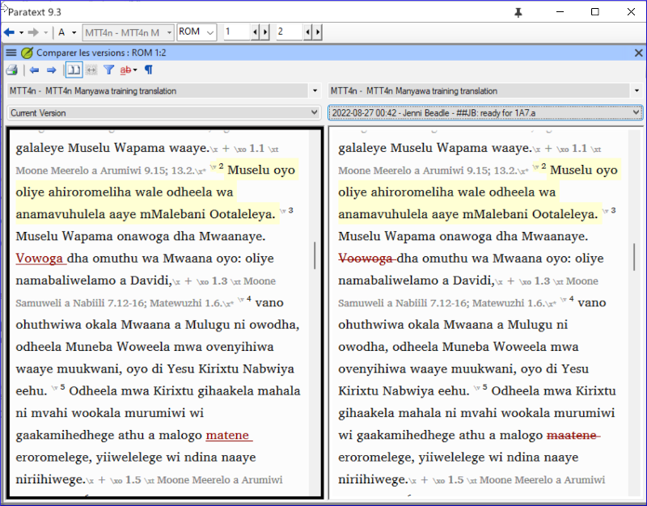

**Introduction**  
Dans ce module, vous apprendrez comment enregistrer les versions anciennes de votre texte pour les revoir plus tard.

**Où en sommes-nous dans le processus ?**  
Vous avez travaillé sur votre texte dans Paratext et vous êtes arrivé au un point important (point de repère) du projet.

**Pourquoi cette aptitude est-elle importante ?**  
Lorsque vous travaillez sur votre traduction, vous faites continuellement des changements. Il est bon d’avoir une copie des anciennes versions de votre texte, par exemple, le texte avant la vérification du conseiller. Vous faites une version quand vous faites **marquer un point de repère dans l’historique du projet**. Vous pouvez comparer les anciennes versions du texte avec le texte actuel.

**Qu’est-ce qu’on va faire ?**   
Vous allez marquer un point de repère dans l’historique du projet auquel vous pourrez revenir plus tard afin de comparer votre travail.

## 18.1 Sauvegarder à chaque étape majeure de votre projet

1. Cliquez dans votre fenêtre de projet (dans Paratext )
1. **≡ Onglet**, sous **Projet** \> **Marquer un point de repère dans l’historique du projet.**
1. Saisissez un commentaire pour décrire l'étape du projet.
1. Cliquez sur **OK**

:::tip
C’est bon de commencer le commentaire avec quelques symboles, comme **\#\#\#**, pour bien trouver les points que vous avez ajourté dans la liste longue de points automatiques que Paratext crée.
:::

## 18.2 Voir les différences entre deux points (ou versions)

1. **≡ Onglet**, développez lw mwnu, sous **Projet** \> **Comparer les versions.**
1. Cliquez sur la liste déroulante **Version de référane…**.
1. Choisissez votre point désiré dans l’historique
      
     - *Une liste de versions s'affiche*.
    
1.  Choisissez le point souhaité dans l'historique  
     -  *L'écran affiche les différences*.
    

:::info
Chaque partie du texte qui a été supprimée est barrée. Chaque partie de texte qui a été ajoutée est soulignée.
:::
