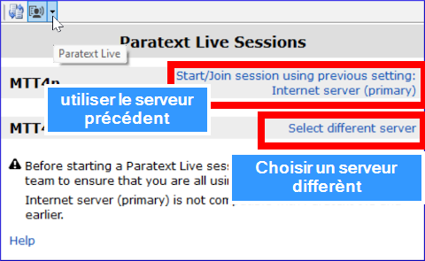
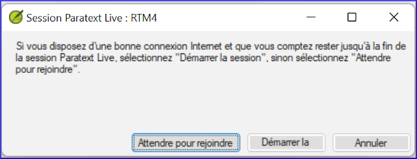
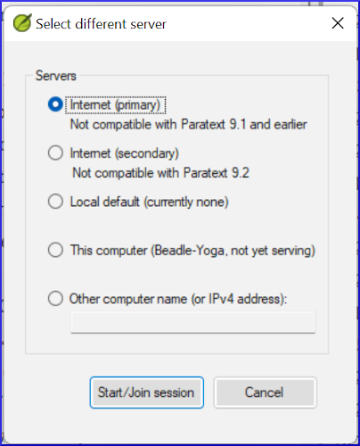

:::caution Mise à jour
Paratext Live a changé dans Paratext 9.3.
:::
**Introduction**  
Dans ce module, vous utiliserez Paratext Live pour permettre à l'équipe de collaborer, de sorte que chacun puisse voir les modifications apportées au texte sur son propre ordinateur.

**Où en sommes-nous dans le processus ?**  
Nous avons déjà vu comment collaborer avec Envoyer/Recevoir. La vérification par un conseiller est l'une des nombreuses occasions où plusieurs personnes doivent examiner le même texte, voire l'éditer ensemble. Paratext Live permet à chacun de consulter le texte sur son propre ordinateur et de voir les modifications apportées en temps réel.

**Pourquoi est-il important ?**  
Il existe plusieurs autres moyens de permettre à tout le monde de regarder le même texte. Mais Paratext Live permet non seulement à tout le monde de voir le texte, mais il permet également à plusieurs personnes de modifier le texte.

**Que ferez-vous ?**  
-  Connectez tous les utilisateurs au même réseau.
-  Faire un envoyer/recevoir
-  Démarrer Paratext Live et se joindre la session live
-  Faire les modifications
-  Échanger tous les fichiers
-  Terminer/quitter la session Live
-  Faire un envoyer/recevoir

:::info 
 Le vidéo **Outils de collaboration est disponible (4.1)**. Mais c'était fait en Paratext 9.2.
::: 

:::caution Mise à jour
Paratext 9.3 vous permet de choisir un serveur. Tous les participants à une session live particulière doivent toujours utiliser le même serveur, alors à partir de la version 9.3, vous pouvez travailler avec quelqu'un sur 9.1 ou quelqu'un d'autre sur 9.2 (**mais pas en même temps**).
:::

## 20.1 Paratext Live

### Envoyer/Recevoir
:::tip 
Avant de démarrer Paratext Live, tous les utilisateurs sont encouragés à effectuer un envoyer/recevoir et tout le monde doit être connecté au même réseau.
:::

### Connecter tous les utilisateurs au même réseau

Paratext Live peut utiliser  
- l'Internet
- un réseau local
- un routeur WiFi hors ligne
- un hotspot avec données mobiles désactivées.

## 20.2 Démarrer Paratext Live  
1.  Ouvrez le **menu** du projet.
1.  Sous **Outils**, cliquez sur **Paratext Live**.
1.  Ou utilisez l'icône de la barre d'outils.  
  - *Deux choix s'affichent.*  

### Choisir le serveur
1. Si tous les utilisateurs utilisent 9.2 ou plus, vous pouvez choisir la première option **Internet (primaire)** pour vous connecter à Internet.  
  -  *Une boîte de dialogue s'affiche*.  

2. Cliquez sur "Attendre pour rejoindre" ou "Démarrer la session" (pour être "l'hôte") selon le cas.  
   - *Une boîte de dialogue peut s'afficher*.  
   - *Si la fonction **Enregistrement automatique** en **Paramètres Paratext** n'est pas activée, la session Live l'activera pour la durée de la session*.

Si ce n'est pas le cas,
3. Choisissez la deuxième option **Sélectionner un autre serveur**.  
   *Une boîte de dialogue s'affiche avec les cinq options disponibles*.  

### Laquelle choisissez-vous ?

- Choisissez la première option **Internet (primaire)** si tous les utilisateurs ont Paratext 9.2 ou plus.
- Choisissez la deuxième option **Internet (secondaire)** si un utilisateur a Paratext 9.0 ou 9.1.
- Choisissez la troisième option si vous êtes tous connectés à un réseau local et que vous souhaitez utiliser ce réseau pour vous connecter.

#### Joindre session ou attendre
1. Cliquez sur **Start/Join Live session**.   
   *Paratext vous demande alors effectivement si vous êtes l'hôte (c'est-à-dire que vous allez rester jusqu'à la fin)* 
2. Si vous n'êtes **pas** le rédacteur principal/hôte, cliquez sur **attendre pour rejoindre**, *n'appuyez pas sur annuler* car cela annulerait votre participation à la session en direct.
3. Si vous **êtes l'hôte**, cliquez sur **Démarrer la session**.  

:::tip
*Lorsqu'une session est active, le bouton Paratext Live est vert*.
:::

### Partager les modifications fait à partir d'outils  
Tout le texte de l'écriture est partagé lorsque vous faites un envoyer/recevoir. Cependant, les modifications apportées à l'aide de divers outils ne sont pas partagées automatiquement. Des exemples de ces modifications non partagées sont l'état de l'orthographe, l'état du passage parallèle, les termes bibliques et leurs équivalents identifiés, et les remarques de discussion. Pour partager ces changements

1.  Cliquez sur le bouton Paratext Live dans la barre d'outils,
   
  
1.  Cliquez sur "**Échanger tous les fichiers**"  
    - *Tous les utilisateurs reçoivent alors les mises à jour de ces fichiers.*

:::caution
Les modifications de tous les utilisateurs sont partagées, mais si deux personnes ont modifié différemment le même élément, seule la modification d'une personne sera enregistrée.
:::

## 20.3 Terminer la session Paratext Live  
1. Cliquez sur le bouton Paratext Live
1. Cliquez sur **Terminer/quitter la session Live**
1. Si vous êtes le rédacteur principal, vous verrez une boîte de message.
1. Cliquez sur **Terminer la session normalement**.
1. Effectuer un **envoyer/recevoir**.

:::info
**Pour plus d'aide**, recherchez **live** dans le champ de recherche de la barre de titre. Il existe de nombreuses rubriques utiles pour vous aider à utiliser Paratext Live.
:::
