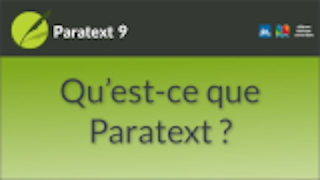

:::note Video
  
https://vimeo.com/483999382
:::

Paratext est la première plateforme de traduction de la Bible utilisée par plus de 10 000 personnes dans le monde pour planifier, gérer, rédiger, réviser et vérifier les traductions de la Bible dans plus de 2 300 langues. Voici quelques-uns des outils proposés par Paratext.

- Un plan de projet, qui présente toutes les étapes nécessaires à la réalisation d'une traduction de haute qualité, avec l'ordre dans lequel les livres doivent être traduits.
- Les membres de l'équipe peuvent communiquer grâce à un système de notes.
- Paratext soutient la traduction elle-même de nombreuses façons, avec des centaines de ressources et plusieurs ressources enrichies pour permettre aux traducteurs moins sûrs du grec et de l'hébreu.
- La collaboration de l'équipe est facilitée par le travail hors ligne ou en ligne avec Paratext Live.
- Paratext est spécialisé dans la traduction de la Bible, comme l'outil Passages parallèles et l'outil Termes bibliques.
- Paratext offre des fonctions de vérification orthographique en recherchant des modèles anormaux pour détecter les erreurs d'orthographe potentielles.
- Lorsque le texte est prêt à être vérifié par un conseiller en traduction, les utilisateurs peuvent préparer une retraduction écrite pour le conseiller, et/ou préparer une retraduction plus littérale à l'aide de le générateur interlinéaire.
- De nombreux supports de formation sont disponibles, notamment des vidéos en ligne dans plusieurs langues.
- Pour télécharger Paratext et demander une licence gratuite, rendez-vous sur Paratext.org.
