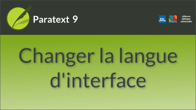

:::note Video
  
https://vimeo.com/410254311 
:::
L'interface Paratext est disponible dans de nombreuses langues.

1.  Cliquez sur Menu Paratext **≡** \>  Menu Paratext \> **Paramètres paratext**
2.  Dans le menu déroulant, de la liste des **interface langues** \> Choisir une langue
3.  Cliquez sur **OK**  
    

