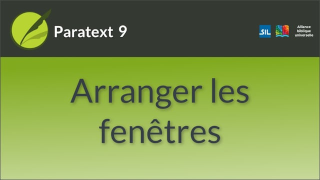

:::note Video
  
https://vimeo.com/446470153 
:::

Une fenêtre dans Paratext peut être configurée pour être affichée sous la forme d’un panneau, d’un onglet, d’une fenêtre déplacée vers masquer automatique ou d’une fenêtre flottante.

**Ouvrir une fenêtre comme un type spécifique:**  
Dans la boîte de dialogue **Ouvrir un projet/une ressource**, utilisez la liste déroulante **Ouvrir en tant que**.

**Réorganiser** Cliquez sur la barre de titre et faites glisser les panneaux pour les réarranger, relâchez la souris lorsque la zone bleue se trouve à la position souhaitée. La zone bleue indique l'endroit vers lequel un panneau en cours de glissement se déplacera.

**Redimensionner:** Les fenêtres peuvent être redimensionnées en faisant glisser les bordures.

**Convertir:** Pour convertir une fenêtre en une fenêtre masquer automatiquement ou flottante, cliquez avec le bouton droit de la souris sur la barre de titre et sélectionnez l'option appropriée.

**Masquer automatique:** Cliquez sur le bouton (dans la colonne latéral) pour le voir, Cliquez en dehors de cette fenêtre ou à nouveau sur le bouton pour la cacher. Faites un clic droit sur une barre de titre pour la déplacer vers masquer automatique.

**Fenêtre flottante:** C'est un bon moyen de maximiser une fenêtre ou de l'envoyer sur un deuxième écran
1.  Clic droit sur la barre de titre \> *Ouvrir comme fenêtre flottante*.
1.  [Pour revenir : Clic droit \> **Ajuster la fenêtre**]

**Enregistrer la mise en page actuelle**

1.  Cliquez sur le menu Paratext et sélectionnez **Enregistrer la disposition de fenêtres actuelle**.
1.  Donnez à la disposition un nom qui vous aidera à vous souvenir de ce qu’elle contient.
1.  Cliquez sur **OK**.
     -  *Le nom de la mise en page est maintenant affiché dans le menu principal de Paratext*.

### Afficher une disposition différente

-  Cliquez sur le **menu Paratext**, puis sur le nom de la disposition.
   -  *Paratext ouvre les fenêtres*.

