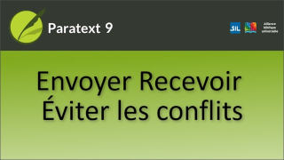

:::note Video
  
https://vimeo.com/438192060
:::

## Éviter les conflits

-  **Un seul membre** à la fois doit avoir l'autorisation d'**édition**.
-  **Les autres** utilisateurs doivent **ajouter des remarques**.
-  **Envoyer/recevoir plus souvent** en cas de modifications considérables.
