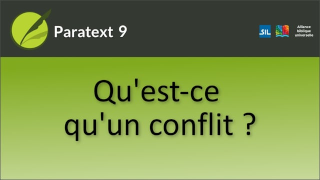

:::note Video
  
https://vimeo.com/297358448
:::

**Un conflit** se produit lorsque deux personnes ou plus **modifient le texte en même temps**. Paratext s'embrouille et ne sait pas lequel garder. Il en choisit un et y ajoute une note de conflit.

Il est préférable d’avoir **un seul traducteur modifier** un texte à la fois. **Les autres membres** de l’équipe devraient **ajouter des remarques** avec leurs suggestions. 

:::tip
Voir les vidéos ultérieures sur les remarques.
:::
