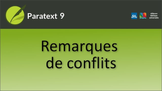
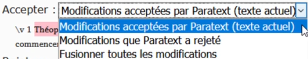

:::note Video
  
https://vimeo.com/465445125
:::

### À quoi elles ressemblent et comment les gérer

Dans cette vidéo, nous allons voir à quoi ressemblent les notes de conflit et comment les gérer. C'est la même dans Paratext 8 et 9.

1. Effectuer un **envoyer/recevoir**
1. Cliquez sur le lien **Ouvrir la fenêtre de la liste de remarques de conflit non résolues**.

**Ouvrir les remarques et résoudre le conflit**

1. **Ouvrir** la note
1. Si la note vous est attribuée, ou si vous êtes un administrateur, une liste déroulante s'affiche.
1. Cliquez sur la liste déroulante en haut
    
1. Choisissez l'option qui vous convient
     - **Accepter** les modifications Paratexte a **accepté** (laisser tel quel)
     - **Accepter** les modifications Paratext a **rejetés** (et rejeter l'autre modification)
     - **Fusionner** tous les modfications (accepter les deux modifications)
1. Cliquez sur **OK**
1. **Résolvez** la note pour que le drapeau disparaisse.

:::tip
Un drapeau d'avertissement spécial pour les notes de conflit se trouvent soit au tout début du livre, soit au numéro du verset.
:::

**Envoyer/Recevoir**

- Faites un Envoyer/Recevoir

**Conflits complexes**

S'il y a de nombreux conflits, votre administrateur peut avoir besoin de **rétablir** le(s) livre(s).
