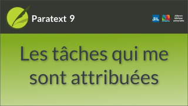
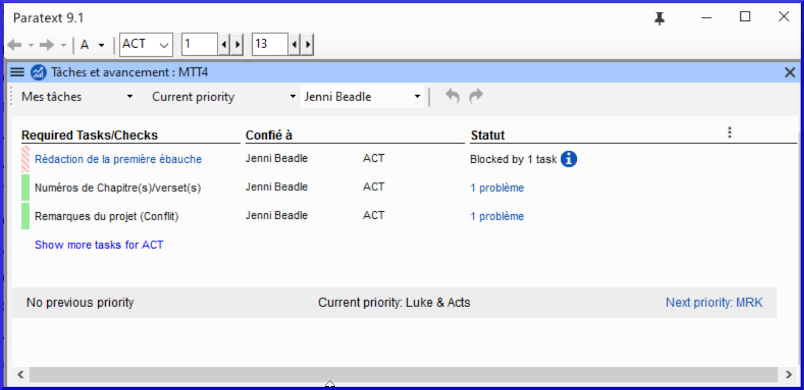

:::note Video
  
https://vimeo.com/495799651
:::

L’administrateur de votre projet (ou un membre avec authorisation "Avancement") peut vous confie des tâches dans Paratext. Les attributions de tâches contrôlent ce que vous pouvez éditer.

:::tip Mise à jour 9.3
Dans la version 9.3, une nouvelle autorisation "avancement" permet à un membre de confier des tâches.
:::

**Afficher les tâches qui vous sont assignées**

-  Ouvrez les Tâches et avancements en cliquant sur le bouton bleu 
   -  *La fenêtre **Tâches et avancement** s'ouvre, affichant Mes tâches dans la priorité actuelle ou dans la dernière vue*.  
    

**Liens suivants/précédents**

1.  **Priorité précédente** - livre précédent avec tâches
2.  **Priorité suivante** - suivant livre avec tâches
3.  Changer à **Toutes les tâches** - pour voir les tâches en attente.

**Afficher les tâches par livre**

1.  Là où il est dit **Priorité actuelle**, cliquez spour afficher le menu.
1.  Cliquez sur **Livre actuel**.
     -  *Il s’agit du filtre par défaut si votre administrateur n’a pas configuré Les priorités*.
1.  Voir les tâches dans un autre livre en cliquant sur **Livre suivant** ou **Livre précédent**.

**État des tâches**

-  **Vert :** Les tâches qui peuvent être lancées immédiatement sont marquées en vert.
-  **Vert rayé :** En attendant que vous finissiez une autre tâche.
-  **Rouge :** Les tâches dépendent des tâches antérieures terminées par d’autres.
-  **Gris :** La tâche est achevée

**Voir plus d'information**
1.  Placez la souris au-dessus de l’icône d’information pour savoir ce qui la bloque.
1.  Cliquez sur **Afficher les tâches bloquées** pour voir les tâches cachées.

