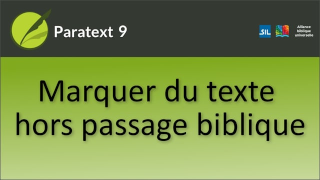

:::note Video
  
https://vimeo.com/496004407
:::

Dans cette vidéo, nous découvrirons comment marquer un texte non biblique. Les traducteurs incluent souvent du texte supplémentaire dans leurs traductions de la Bible pour introduire un livre, indiquer le début d'un sujet différent dans une épître, indiquer le début d'un sujet différent dans une épître, ou un autre événement dans un récit, etc.

**En-têtes de section**

\\s1, \\s2, \\s3 \\s4

1.  Placez le curseur où vous souhaitez ajouter un titre de section.
1.  Appuyez sur **ENTRÉE**
1.  Tapez s  
     -  *Les marqueurs d’en-tête de section sont maintenant répertoriés*.
1.  Tape le chiffre pour correspondre au titre ci-dessus, p.e. 1, puis appuyez sur **ENTRÉE** pour confirmer.  
     -  *Le marqueur est affiché au milieu de la fenêtre, prêt à être utilisé pour entrer dans le titre*.

**Introductions de livres**

Le marqueur de paragraphe ordinaire ne doit pas être utilisé dans l'introduction d'un livre.

1.  Placez le curseur à l'endroit où vous souhaitez ajouter l'introduction.
1.  Appuyez sur **ENTRÉE**
1.  Tapez i  
     -  *Les marqueurs d'introduction sont maintenant répertoriés*.
1.  Choisissez le marqueur approprié.

