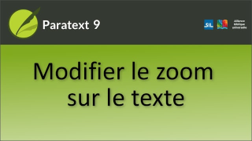

:::note Video
  
https://vimeo.com/467796221
:::

Dans cette vidéo, nous allons apprendre à modifier la taille du texte dans un panneau de fenêtre Paratext.

**En utilisant le menu**

1.  Cliquez sur le menu du projet ≡.
     -  *Sous **Affichage**, il y a une commande **Zoom** avec le niveau de zoom actuel affiché et - et + de chaque côté*.
1.  Pour rendre le texte plus grand, cliquez sur **+.**
     -  *Pour réduire le texte, cliquez sur **-.** 
1.  Cliquez dans le volet pour fermer le menu.

**Retour à la taille du texte original**

1.  ouvrez le **menu** du projet.
1.  Dans le contrôle de zoom, sélectionnez le numéro de niveau de zoom
1.  Tapez 100
1.  Appuyez sur **ENTRÉE**.
1.  Cliquez sur le volet pour fermer le menu.

**Raccourci clavier**

1.  **Ctrl +** augmente **Ctrl -** diminue.
     -  Le niveau de zoom est mémorisé lorsque vous rouvrez ce projet.

:::tip
Cela n'affecte que votre ordinateur, pas les autres membres de l'équipe.
:::
