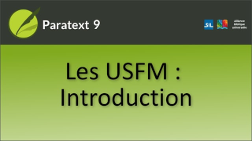

:::note Video
  
https://vimeo.com/449810229
:::

Dans cette vidéo, nous allons découvre pourquoi Paratext utilise des balises spéciales appelées USFMs. Les balises

-  fournir la structure du document en identifiant le début de chaque livre, ainsi que les sections qu'il contient.
-  vous aider à naviguer dans la traduction en utilisant des références bibliques.
-  faciliter également le formatage approprié de la traduction par le compositeur en fonction de ce que chaque partie du texte est réellement, comme un titre, numéro de chapitre, ou quelque chose de spécial dans le texte de la Bible lui-même comme la poésie ou une citation.

USFM signifie **U**nified **S**tandard **F**ormat **M**arker (marqueur de format standard unifié).

Les USFMs commencent toujours par une barre oblique inverse, puis un code, puis un espace. (Par ex. \\ft)

À l’exception d’un marqueur de fermeture qui se termine par un astérisque et n’a pas besoin d’espace.

-  Les USFM les plus courantes sont :

    \\p (paragraphe) \\c (chapitre) \\v (verset)

-  La dernière norme USFM se trouve en ligne - paratext.org/about/usfm, puis cliquez sur le lien documentation.

