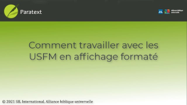

:::note Video
  
https://vimeo.com/446776619
:::

Dans cette vidéo, nous avons changé en affichage formaté et appris l’ajout et la suppression des styles USFM ici.

Les options d'affichage sont disponibles dans le menu du projet.

1.  Cliquez sur le menu **≡** sur la barre de titre du projet.
1.  Développez le menu si nécessaire ˅.
     -  *L’option avec la coche est l’affichage actuellement sélectionné*.
1.  Cliquez sur **Formaté**.
     -  *L'affichage change et les balises USFM sont cachées*.

**Saisie des marqueurs de caractères**

-  Appuyez sur \\ (barre oblique inverse)
    -  *Le menu des marqueurs de caractères comme en affichage standard*.

**Saisie des sauts de paragraphe**

-  Appuyez sur **ENTRÉE**
     -  *Un nouveau paragraphe normal est inséré*.

📄

**Utilisation du choix de style dans la barre d’outils**

Dans les affichages Standard et Formaté, le marqueur qui s'applique au texte est affiché dans le sélecteur de style de la barre d'outils.

1.  Sélectionner le texte
1.  Cliquez sur le sélecteur de style.
     -  *Les marqueurs les plus courants sont  en haut*.
1.  Sélectionnez un marqueur
-  Si nous sélectionnons un style de **paragraphe**, il sera appliqué à l'ensemble du **paragraphe**.
-  Si nous sélectionnons un style de **caractère**, celui-ci sera appliqué **au texte sélectionné**.

**Suppression d’un style de caractère indésirable.**

1.  Sélectionner le texte
1.  Sur le sélecteur de style, sélectionnez Effacer la mise en forme.
     -  *Le texte revient à la normale et (dans les coulisses) les balises USFM ont été supprimées*.

