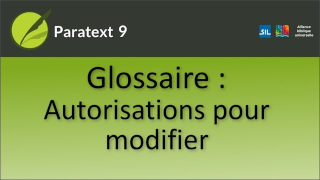

:::note Video
  
https://vimeo.com/543138706
:::

Comme pour l'édition d'autres livres dans Paratext, il est nécessaire qu'un utilisateur ait les affectations de tâches ou les autorisations d'utilisateur appropriées pour ajouter des équivalents au glossaire ou pour éditer directement le livre du glossaire.

### Pouvez-vous saisir dans le champ citation ?

-  Sinon, la barre de titre de la boîte de dialogue **Modifier les équivalents** indique **Non modifiable**.

### Contactez votre administrateur

-  Votre administrateur peut vous donner les autorisations nécessaires, le cas échéant.

