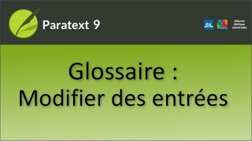

:::note Video
  
https://vimeo.com/545850679
:::

Si vous avez initialement saisi une définition très simple et que vous devez l'améliorer par la suite, vous pouvez le faire soit dans la boîte de dialogue Modifier les équivalents, soit dans le glossaire lui-même. Si vous devez modifier le formulaire de citation pour une raison quelconque, les choses sont un peu plus compliquées.

~Les experts de Paratext recommandent de ne modifier le formulaire de citation que dans le glossaire, car cela permet de garder le glossaire en ordre, mais le lien entre l'équivalent et l'entrée est rompu et devra être rétabli~.

:::tip Paratext 9.3
Vous pouvez maintenant modifier la citation (autonyme) dans l'outil Termes bibliques. Cela ne brisera plus le lien, mais créera une deuxième entrée liée. Vous voudrez supprimer la première entrée du livre GLO.

### Chercher les équivalents

1.  Changez le filtre Versets en "**Tous les livres**".
1.  Cliquez sur _le filtre Termes bibliques courants_ et sélectionnez **Nouveau filtre**.
1.  Dans _le filtre Texte_, sélectionnez _la langue_ dans laquelle vous souhaitez effectuer votre recherche.
1.  Tapez une partie du terme, afin de le rechercher.
1.  Cliquez sur **OK**.
     -  *Vous devriez maintenant voir la liste des équivalents~~ que vous devez relier~~*.

#####  

### Ouvrez la boîte de dialogue des équivalents

1.  Double-cliquez sur l'équivalent
1.  Cliquez sur **Oui** s’il vous demande à enregistrer les modifications.
1.  Cliquez sur **l'onglet Glossaire**.
1.  Commencez à taper le formulaire de citation.
1.  Sélectionnez l'entrée.
1.  Cliquez sur **OK**.
     -  *Utilisez l'outil Termes bibliques si vous en avez plusieurs, car il offre un accès direct à la fonction de recherche*.

:::tip
Lorsque vous modifiez des formes de citation (autonymes) dans le glossaire, si la modification nécessite un changement dans l'ordre des entrées, Paratext 9.3 les réorganisera pour vous, selon le tri alphabétique. Il le fait lorsque vous faites défiler la liste des formes de citation dans un onglet du glossaire.
:::