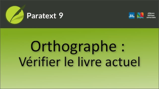

:::note Video
  
https://vimeo.com/580616851/
:::

Dans cette vidéo, nous avons appris comment effectuer la deuxième tâche de vérification de l'orthographe comment utiliser la fonction "Vérifier l'orthographe du livre actuel".

Il est utile d'avoir d'abord utilisé la fonction "Approuver l'orthographe des mots courants".

### Vérification de l'orthographe du livre actuel

1.  Ouvrez le **menu** du projet.
1.  Sous **Outils**, cliquez sur **Vérifier l'orthographe du livre actuel**.  
  - *L'outil **Liste de mots** s'ouvre dans un mode filtré spécial*.  
:::tip
Il affiche uniquement les mots du livre actuel qui sont incorrects ou indécis.
:::
### Définir le statut orthographique

1.   Cliquez sur les icônes d'état dans la ligne correspondant à ce mot.
1.   Pour marquer un mot comme **correct**, cliquez sur la coche **verte**.
1.   Pour marquer un mot comme **incorrect**, cliquez sur le X **rouge**.

### Effectuer une correction

1.   Cliquez sur la ligne correspondant au mot.
      -  *Paratext liste toutes les références avec ce mot*.
1.   Cliquez sur le X rouge du mot
      -  *Paratext ouvre une boîte de dialogue demandant quelle est l'orthographe correcte et faisant quelques suggestions basées sur des mots similaires*.
1.   Utilisez une suggestion ou tapez une nouvelle orthographe,
1.   Cliquez sur **OK**.
      -  *Paratext vous demande ensuite de vérifier chaque remplacement dans son contexte*.
1.   Cliquez sur **Oui** pour changer le mot
1.   Cliquez sur **Non** pour ignorer ce verset
1.   Continuez pour tous les autres versets.
:::note
Veuillez noter que, bien que nous ne vérifions que l'orthographe du livre en cours, l'outil Liste de mots corrige également l'orthographe de ce mot dans **tous les autres livres** où il apparaît. Cependant, Paratext n'effectuera ces changements que si vous avez la permission d'éditer ces livres.
:::
### Utiliser une orthographe alternative

Parfois, Paratext suggère une orthographe alternative pour un mot, qui est affichée en bleu.

1.  Pour utiliser une orthographe, cliquez sur le lien bleu.
     -  *Une boîte de dialogue s’affiche et montre le "Avant", puis avec la nouvelle orthographe, étiqueté "Après"*.

:::tip
Cela vous permet de voir le mot dans son contexte avant d'effectuer des modifications.
:::

1.  Si vous êtes **sûr** que le changement doit être effectué dans ce verset, cliquez sur **Oui**.
1.  Sinon, cliquez sur **Non** pour ne pas effectuer le changement dans ce verset.
     -  *Paratext affichera alors la modification dans tous les autres versets*.

### Corriger les mots mal orthographiés lorsque Paratext n'a pas de suggestions

1.   Cliquez sur le X rouge
      -  *Paratext ne peut trouver que quelques mots similaires. Si aucun des mots listés n'est l'orthographe correcte de ce mot*.
1.   Cliquez dans la case Orthographe correcte et modifiez l'orthographe.
1.   Cliquez sur le bouton **OK** pour continuer.
      -  *Le paratexte montrera chaque verset où ce mot apparaît*.
1.   Cliquez sur le bouton [Oui] pour accepter la modification et afficher l'occurrence suivante.

### Voir plus de mots

Paratext ne charge pas tous les mots potentiellement mal orthographiés dans cette fenêtre en même temps.

-   Faites défiler vers le bas, jusqu'à ‘Davantage d’éléments disponible’ et cliquez sur
      -  *Paratext ajoute d'autres mots à la liste pour que je puisse les vérifier*.

:::tip
Vous devrez probablement cliquer plusieurs fois sur "Davantage d’éléments disponibles…" jusqu'à ce que Paratext ne trouve plus de mots à vérifier dans le livre en cours.
:::