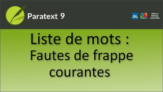

:::note Video
  
https://vimeo.com/531694428
:::

Dans cette vidéo, nous avons appris à utiliser l'une des fonctions de vérification orthographique qui n'est disponible que dans la fenêtre Liste de mots.

### Ouvrir la liste de mots

1.   Ouvrez le **menu** du projet.
1.   Sous **Outils**, cliquez sur **Liste de mots.**
     -  *La fenêtre Liste de mots s'ouvre pour ce projet*.
3.   Ouvrez le **menu** de cette fenêtre.
1.   Sous **Outils**, passez la souris sur **Vérifier l’orthographique** pour afficher le sous-menu.
     -  *Il y a 6 vérifications orthographiques spéciales listées ici, ou vous pouvez les exécuter toutes en même temps*.

### Pour utiliser la fonction Fautes de frappe courantes

-  Cliquez sur **Fautes de frappe courantes**.
     -  *La liste de mots passe en mode vérification orthographique et affiche les coquilles communes probables*.

:::info
Paratext liste les mots contenant un modèle de lettres qui a été précédemment corrigé dans d'autres mots, ainsi qu'une suggestion de reformulation.
:::
1.   Cliquez sur une suggestion.
      -  *Paratext ouvre la boîte de dialogue Remplacer qui montre chaque occurrence du mot mal orthographié et vérifie si nous voulons le remplacer*.
1.   Cliquez sur **'Oui'** ou '**Oui à tous**' pour effectuer le remplacement.

### Revenir au mode normal dans la fenêtre Liste de mots

-   Cliquez sur le lien de commande bleu Fermer la vérification orthographique (Fautes de frappe courantes) et afficher tous les mots.
     -  *Ceci désactive la vérification orthographique (Fautes de frappe courantes)*.
