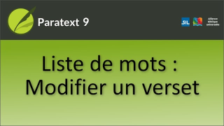

:::note Video
  
https://vimeo.com/598921173
:::

Il y a deux façons de modifier le texte lorsque vous remarquez quelque chose qui doit être modifié dans une vue de concordance.

### Méthode 1

1. Double-cliquez n'importe où sur la ligne contenant le verset que vous devez modifier.
    -  *Dans la fenêtre principale, Paratext se rend sur ce verset et sélectionne le mot concerné*.
1.  Modifiez le texte.
1.  Rétablissez la liste de mots ou la fenêtre de vérification orthographique en survolant la barre des tâches de Windows.
1.  Sélectionnez la fenêtre de vérification orthographique ou la liste de mots en fonction de la fenêtre dans laquelle vous vous trouviez.

### Méthode 2

-  Maintenez la touche Maj et double-cliquez n'importe où sur la ligne contenant le verset à modifier.  
   -  *Une petite fenêtre d'édition s'ouvre, dans laquelle vous pouvez modifier le texte*.

:::caution
Il s'affiche en mode non formaté. Veillez à ne pas modifier les marqueurs.
:::