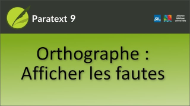

:::note Video
  
https://vimeo.com/599605807
:::

Vous pouvez choisir de voir les mots dont l'orthographe est indécise ou incorrecte mis en évidence par un trait de soulignement en forme de vague.

### Comment afficher les erreurs d'orthographe

1.  ouvrez le **menu** du projet.
1.  Sous **Affichage**, cliquez sur **Afficher les fautes d'orthographe**.
    -  *Les mots dont l'orthographe est indécise sont maintenant mis en évidence par un soulignement ondulé*.
1.  OU cliquez sur Afficher l'orthographe dans la barre d'outils.

### Vagues rouges

Un vague rouge s'affiche sur les mots qui sont incorrects ou qui, selon les calculs de Paratext, sont probablement incorrects.

### Vagues gris

Le gris indique que Paratext ne sait rien de l'état de l'orthographe et ne peut pas déterminer si elle est suspecte.
   -  *Ces mots sont tous indécis*.

### Enregistrer l'orthographe correcte

Si l'orthographe est incorrecte, il est utile que Paratext enregistre la correction.

1. Faites un clic droit sur le mot.
   -  *La boîte de dialogue Corriger l'orthographe s'affiche*.
1. Sélectionnez l'une des orthographes proposées ou tapez dans la case **Orthographe correcte**.
1. Pour effectuer la modification, cliquez sur **OK**.
   -  *Paratext enregistrera la nouvelle orthographe comme correcte, définira l'ancienne orthographe comme incorrecte, enregistrera la correction ET proposera d'effectuer le changement à tous les autres endroits où l'ancienne orthographe est utilisée*.

### Retirer un vague

1. Faites un clic droit sur le mot.
   -  *La boîte de dialogue Correction de l'orthographe s'ouvre*
1. Cliquez sur **OK**.
   -  *Paratext enregistre le nouvel état et supprime le vague*.

### Menu de clic droit

1.   Cliquez avec le bouton droit de la souris sur un vague une deuxième fois pour obtenir le menu.
1.   Si vous voulez la boîte de dialogue "Corriger l'orthographe", il suffit de cliquer à nouveau sur le mot avec le bouton droit de la souris.
1.   Cliquez avec le bouton droit de la souris sur le mot, choisissez Orthographe pour ouvrir la boîte de dialogue Corriger l'orthographe de ce mot.
