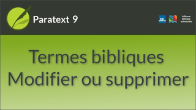

:::note Video
  
https://vimeo.com/635409514
:::

Lorsque plusieurs mots ont été identifiés comme étant des équivalents d'un terme et qu'ils ont tous la même racine centrale, nous pouvons utiliser un astérisque, pour identifier la racine comme étant l'équivalent. Cela correspondra ensuite aux autres formes infléchies qui seront utilisées à l'avenir.

### Pour modifier ou supprimer un équivalent

1. Double-cliquez sur l’équivalent dans le tableau.  
   -  *La boîte de dialogue Modifier les équivalents s'affiche*.
1. Modifiez l’équivalent du haut et changez le préfixe et le suffixe en astérisque.
1. Les équivalents non désirés ou superflus peuvent simplement être supprimés.

### Ajouter une glose à un équivalent

Vous pouvez saisir un glossaire entre parenthèses après un équivalent pour en clarifier l'usage.

### Le Guide

Le Guide contient des informations sur l'utilisation de l'astérisque, et l'ajout d'une glose. 

### Historique

Lorsque vous apportez une modification aux équivalents, un indicateur d'avertissement s'affiche à côté du bouton [Historique].

1.  Cliquez sur le bouton [**Historique**].  
    -  *La boîte de dialogue Historique des équivalents s'affiche*.
1.  Nous pouvons expliquer les modifications que nous venons d'apporter dans la colonne "Pourquoi avoir changé ?".
1.  Cliquez sur [**OK**].

### Questions ou notes descriptives

Vous pouvez également ajouter des questions ou des notes descriptives sur les équivalents dans le champ Description.

Elle sera affichée dans le panneau central de la fenêtre des termes bibliques, sous les équivalents.

### Fermez la boîte de dialogue Modifier les équivalents.  
1.  Cliquez sur [**OK**] pour enregistrer nos modifications.
     -  *Les mots de la colonne Équivalents ont maintenant été mis à jour en fonction des changements effectués dans la boîte de dialogue*.
