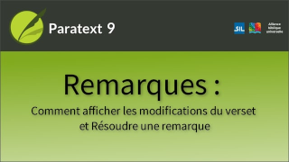

:::note Video
  
https://vimeo.com/711561534
:::

Dans cette vidéo, nous allons apprendre comment afficher ce qui a changé dans le verset depuis la création de la remarque, et comment résoudre une remarque lorsque l'élément à faire a été pris en charge.

**Voir ce qui a changé depuis que la remarque a été insérée.**

1.  Cliquez sur le bouton multicolore qui comprend le barré et le souligné.
     -  *Ce bouton permet d'activer et de désactiver un volet de comparaison spécial*.

**Modifier le style d'affichage**

1.  Cliquez sur le bouton situé à côté du bouton Afficher les modifications, pour modifier l'affichage.

Il existe trois affichages possibles,

1. Par défaut, 
     -  le **nouveau** texte est affiché sur un fond **vert** et 
     -  le texte **supprimé** est affiché sur un fond **rouge**.
2. Le deuxième
     -  le texte **ajouté** est **souligné** et 
     -  le texte **supprimé** est **barré**,
3. Le troisième 
     - le texte **ajouté** **souligné** et 
     - du texte **supprimé** en **exposant**.

**Résoudre des remarques (marquer comme achevé)**

Lorsqu'une remarque est achevée, vous pouvez la résoudre.

-  Cliquez sur le bouton **Résoudre**.
     -  *L'icône de la remarque est supprimée de la vue des écritures, bien que la remarque soit toujours stockée dans le projet et puisse être consultée à nouveau si nécessaire*.

:::tip
Vous pouvez retrouver toutes les remarques dans une fenêtre **Liste des Remarques**.
:::