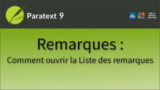

:::note Video
  
https://vimeo.com/712894588
:::

Dans cette vidéo, nous allons apprendre à voir une liste de toutes les remarques d'un projet. Lorsque nous nous concentrons sur les remarques, le moyen le plus simple de les afficher est la liste des remarques du projet.

### Ouvrir la liste des remarques

1.  ouvrez le **menu** du projet.
1.  Sous **Outils**, cliquez sur **Liste des remarques**.
     -  *La boîte de dialogue Ouvrir les remarques s'affiche*.
1.  Vérifiez que Paratext a sélectionné le bon projet,
1.  Cliquez sur **OK**.
     -  *La liste des remarques de ce projet s'ouvre comme un panneau situé sous la fenêtre de votre projet*.

:::tip
Chaque remarque est affichée sur une seule ligne et ne montre que la remarque originale, pas les commentaires ultérieurs.
:::

### Afficher la référence biblique

-  Cliquez sur la référence biblique dans la rangée de la remarque.
     -  *La fenêtre des écritures défile et le curseur se place sur le verset concerné*.

#####  

### Afficher les actions supplémentaires

Lorsque le nombre \> 1, cela signifie que des actions supplémentaires ont été effectuées sur la remarque.

### Pour afficher la boîte de dialogue de la remarque

-  Cliquez sur **Ouvrir**.

### Développer une ligne

-  Cliquez sur **la flèche unique vers le bas** à côté du nombre ⌄.

### Fermer la ligne développée

-  Cliquez sur **la flèche vers le haut** en regard du numéro.

### Développer toutes les remarques en même temps

-  Cliquez sur le bouton **Développer tout**.

### Réduire la vue pour revenir au style résumé

-  Cliquez sur le bouton **Réduire** tout pour réduire les rangées.
