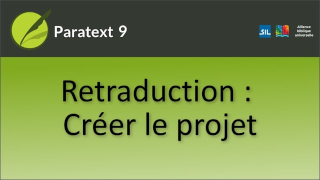

:::note Video
  
https://vimeo.com/611419059
:::

Avant de rédiger la retraduction, assurez-vous que toutes les tâches préalables ont été effectuées et qu'aucun problème en suspens ne bloque la tâche de rédaction. Si vous traitez ces problèmes en premier lieu, vous disposerez d'une traduction vernaculaire plus stable sur laquelle vous pourrez travailler. Une retraduction est stockée dans un projet distinct mais lié.

### Créer un projet pour la retraduction

**Pour créer le projet**

1.  Ouvrez le **menu** principal de Paratext.
1.  Développez le menu.
1.  Cliquez sur Nouveau projet…  
     -  *La boîte de dialogue Propriétés du projet s'ouvre*.

### Pour modifier le nom du projet

1.  Cliquez sur le bouton **Modifier**.
1.  Cliquez sur **OK**.

### Compléter les détails
1.  Dans **Langue**,
1.  Sélectionnez la langue principale que le conseiller en traduction maîtrise.
1.  Dans **Type de projet**,
1.  Sélectionnez **Retraduction**.
1.  Dans **Basé sur**,
1.  Sélectionnez le projet dont il s'agit d'une retraduction.  
     -  *La versification et l'enregistrement sont hérités du projet lié*.
1.  Cliquez sur **OK**.
1.  Sélectionnez USFM 3 ou 2 en fonction de vos besoins.

### Créez les livres dont vous avez besoin
1.  Cliquez sur **Créer un livre**.
1.  L'option présélectionnée est correcte pour copier les marqueurs USFM du projet lié.
1.  Cliquez sur **OK**.  
    -  *Le projet de retraduction est créé et possède tous les marqueurs USFM du projet de base*.

