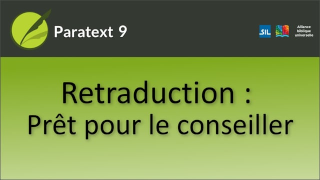

:::note Video
  
https://vimeo.com/612373801
:::

Lorsque la **retraduction est terminée**   
ET **toutes les cases sont marquées comme terminées**,   
**elle est prête** à être transmise à un consultant en traduction.

Le consultant peut insérer des notes dans le projet de retraduction lorsqu'il a des suggestions ou des questions à poser à l'équipe de traduction.
