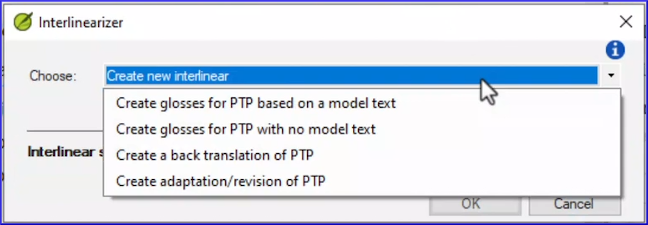
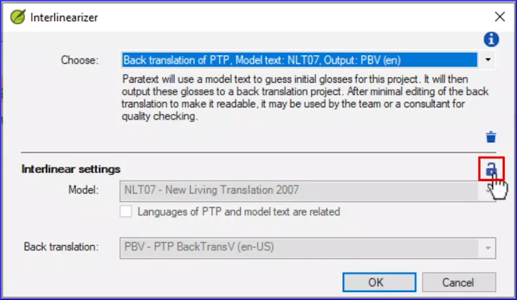

:::note Video
Les vidéos (3.3a et 3.3b) en anglais ont été révisées pour Paratext 9.3 mais ne sont pas encore disponibles en français. Cependant, les vidéos en anglais sont sous-titrées en français. 
  
https://vimeo.com/772376682
:::

Il y a plusieurs objectifs différents pour l'utilisation de l'outil de générateur d'interlinéaire, dont certains ont un texte interlinéaire comme résultat final, d'autres utilisent l'outil d'interlinéaire comme première étape dans la production d'un autre projet. Il peut s'agir d'une rétro-traduction, d'une adaptation ou d'une révision.

### Pour ouvrir le générateur d'interlinéaire

- Cliquez sur le menu ≡ du projet.
- Développez le menu.
- Sous Outils, cliquez sur **générateur d'interlinéaire**.
    - *La boîte de dialogue générateur d'interlinéaire s'affiche.*

## Choisissez ce pour quoi vous voulez utiliser l'interlinéaire

### Créer des gloses pour le projet à partir d'un texte modèle.

- Choisissez le projet ou la ressource que vous souhaitez utiliser comme texte modèle.
- Paratext utilise des statistiques pour deviner les gloses qui sont tirées directement et exclusivement du texte modèle.

:::tip
Pour obtenir des gloses devinées plus précises sur le plan sémantique, sélectionnez comme texte modèle une rétro-traduction du projet préalablement préparée.

Dans tous les cas, vous devez corriger toutes les gloses inappropriées et fournir les gloses manquantes.
:::

- Vous pouvez cocher la case pour produire les gloses dans un projet séparé.

### Créer des gloses pour le projet sans texte modèle

- Au départ, Paratext ne sera pas en mesure de gloser les mots.
- Une fois que vous avez glosé manuellement un mot, Paratext vous proposera votre glose lorsque ce mot reviendra.
- Pour commencer, vous devez spécifier la langue dans laquelle vous allez gloser.
- Vous avez également la possibilité d'enregistrer les gloses dans un projet distinct pour une édition ultérieure ou pour ajouter des notes.

### Créer une retraduction du projet

- Pour cette option, vous devez sélectionner un texte modèle.
- Paratext utilise une analyse statistique pour deviner quels mots sont équivalents, et les aligne.
- Vous devez également sélectionner un projet de retraduction dans lequel copier les gloses approuvées.
- Il peut s'agir d'un projet existant ou, si vous êtes administrateur, vous pouvez choisir d'en créer un nouveau.
- Si une équipe de traduction a utilisé un certain mot de manière constante pour un terme clé, l'analyse statistique de Paratext associera les deux mots.

### Créer une adaptation/révision du projet

- Cette option est similaire à la création de gloses sans texte modèle.
- Vous devez sélectionner un projet dans lequel la sortie interlinéaire sera copiée.
- Il peut s'agir d'un projet existant ou d'un nouveau projet fille.

### La prochaine fois que vous ouvrirez le dialogue générateur d'interlinéaire

Paratext vous offre un moyen rapide de rouvrir une interlinéaire précédente sur laquelle vous avez travaillé.

- Le menu déroulant Choisir comporte maintenant deux sections.
  - *En haut se trouvent les 4 options originales, puis en bas de la ligne, Paratext affiche toutes les options d'interlinéarisation que vous avez précédemment sélectionnées et utilisées.*
- Cliquez sur l'une d'elles pour la sélectionner.
  - *Les paramètres que vous avez sélectionnés la dernière fois sont affichés.*
- Cliquez sur **OK** pour continuer à travailler sur cet interligne.

### Si vous avez besoin de changer les paramètres

- Cliquez sur l'icône du cadenas pour déverrouiller les paramètres.
  - *Les commandes de réglages deviennent actives.*

### Supprimer la configuration interlinéaire

- Cliquez sur l'icône de la poubelle pour supprimer la configuration interlinéaire.
- Cliquez sur **OK** pour confirmer la suppression.

:::note
Les gloses précédemment sauvegardées ne sont pas supprimées par cette action, et seront à nouveau suggérées lors de travaux futurs.
:::
