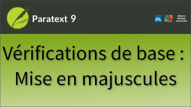

:::note Video
  
https://vimeo.com/725197255
:::

La vérification de la mise en majuscules recherche les mots qui pourraient être incorrectement capitalisés.

La vérification dépend de trois inventaires :

1.  l'inventaire des majuscules mixtes,
1.  l'inventaire de la ponctuation suivie d'une lettre minuscule
1.  et l'inventaire Marqueurs suivis d'une lettre minuscule.

Pour afficher les inventaires,

1.  Ouvrez le **menu** du projet.
1.  **Développez** le menu.
1.  Passez la souris sur **Vérifications des inventaires**.
     - Les trois inventaires dont dépend cette vérification la capitalisation sont listés ensemble au bas du menu.

### Inventaire des majuscules mixtes

Certaines langues mettent en majuscule la racine d'un nom propre, même si elle n'est pas la première lettre en raison d'un préfixe.

1.  Ouvrez l'inventaire de mise en majuscules mixtes
1.  Cliquez sur l'en-tête de colonne pour **Mixed Capitalization Word** (Mot en capitalisation mixte)  
     -  *Le tableau est trié par mot, ce qui permet de voir plus facilement les tendances*.
1.  Cliquez sur **Options**.
1.  Tapez les préfixes en minuscules
1.  Cliquez sur **Préfixes en majuscules**
1.  Tapez les formes en majuscules.
1.  Cliquez sur **OK**.  
     -  *Les formes avec ces préfixes ont été supprimées de la liste*.
1.  Retournez dans la boîte de dialogue **Options** et ajoutez-en d'autres.
1.  Cliquez sur **OK**.

Tous les formes restants seront marqués par le contrôle de la capitalisation.

### Marqueurs suivis d'une lettre minuscule

Cet inventaire vous permet d'identifier les marqueurs qui n'ont pas besoin d'être suivis d'une lettre majuscule.

Il s'agit de marqueurs qui peuvent apparaître au milieu d'une phrase.

1.  Ouvrez l'inventaire.
1.  Cliquez sur la colonne **Fréquence** pour trier les marqueurs les plus fréquents en tête de liste.
1.  Utilisez **Valide** et **Non valide** pour marquer chaque marqueur.
1.  Cliquez sur **OK** pour enregistrer le travail effectué dans l'inventaire.

### Ponctuation suivie d'une lettre minuscule

Cet inventaire liste toutes les fois où un caractère de ponctuation est suivi d'une lettre minuscule.

Utilisez les boutons **Valide** et **Non valide** pour chaque caractère de ponctuation.
:::caution
Vous ne devez pas choisir "Valide", sauf si le signe de ponctuation peut toujours être suivi d'une lettre minuscule.
:::

-  Il peut être utile de cocher la case **Afficher les séquences**.  
     -  *La boîte de dialogue répertorie les séquences uniques de signes de ponctuation qui sont suivies d'une lettre minuscule*.

1.  Cliquez sur **Options**
1.  Ajoutez toutes les abréviations qui se terminent par un point ou un point final.
1.  Cliquez sur **OK**.
1.  Cliquez sur **OK**.
:::tip
Plus vous travaillez sur ces inventaires pour marquer ce qui est valide et ce qui ne l'est pas ou pour spécifier des modèles par le biais des boîtes de dialogue Options, moins il y aura de faux problèmes lorsque vous exécuterez la vérification de la mise en majuscule.
:::

### Exécuter la vérification à partir de Tâches et avancement

1.  Ouvrez la fenêtre **Tâches et avancement**.
1.  Pour afficher les problèmes, cliquez sur le **nombre de problèmes**.
     -  *Paratext ouvre un panneau ou en met un à jour pour afficher les problèmes de capitalisation*.
1.  Double-cliquez sur l'élément dans la liste.
     -  *La fenêtre du projet défile pour montrer le texte en question et sélectionne le texte que Paratext pense être potentiellement erroné*.
1.  Effectuez les corrections.
1.  Cliquez sur **Relancer**.
:::caution
Vous devez avoir la permission d'éditer le chapitre concerné pour effectuer les corrections.
:::
### Paramétrage requis

Si Paratext détermine qu'il serait utile de travailler davantage sur les inventaires avant de lancer la vérification, il affichera **Paramétrage requis** au lieu du nombre de numéros.

Cela peut se produire même si vous avez travaillé sur les inventaires, mais que vous avez laissé quelques éléments inconnus.

### Vérifier une plage de livres

1.  Ouvrez le **menu** du projet
1.  Sous **Outils**, cliquez sur **Effectuer les vérifications de base**.
1.  Sélectionnez **Mise en majuscule** et la plage de livres que vous souhaitez vérifier.
1.  Cliquez sur **OK**.
     -  *Paratext ouvre un panneau ou en met un à jour pour montrer les problèmes de mise en majuscules*.

