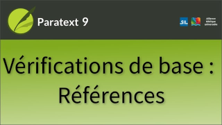

:::note Video
  
https://vimeo.com/718323369
:::

La référence dans un titre de passage parallèle ou un renvoi est signalée par une icône. Lorsque vous cliquez sur l'icône, Paratext ouvre une fenêtre d’aperçu rapide à ce passage.

### Problème avec la référence

-  Si la référence à un problème, l'icône est marquée d'un X rouge.
    - En la survolant, vous pouvez voir une description du problème.

### Paramètres de la référence biblique

1.  Ouvrez le **menu** du projet.
1.  Développez le menu.
1.  Passez la souris sur **Paramètres du projet** et cliquez sur **Paramètres de référence biblique**.  
     - *Trois onglets s'affichent : Format de référence (indique la ponctuation), et les noms des livres*.

:::caution
Seuls les administrateurs du projet peuvent modifier ces paramètres.
:::

#####  

### Pour afficher une liste des erreurs

**À partir de Tâches et avancement :**

-  Cliquez sur le nombre de problèmes à côté de la vérification.
     -  *Paratext ouvre un panneau montrant les erreurs de référence*.

**Utilisation du menu**

1.  Ouvrez le **menu** du projet.
1.  Sous **Outils**, cliquez sur **Effectuer les vérifications de base**.
1.  Sélectionnez la vérification et les Livres à vérifier.
1.  Cliquez sur **OK**.

### Afficher une erreur

-  Double-cliquez sur l'élément dans la liste.
     -  *La fenêtre du projet défile pour afficher l'erreur et sélectionne la partie que Paratext trouve problématique*.

### Erreurs courantes

Si nécessaire, regardez les **paramètres de référence biblique** du projet pour voir ce qui est valable pour votre projet afin de pouvoir corriger les erreurs.

-  **Séparateur de chapitre/verset non valide**
   -  Le séparateur est souvent soit un point, soit un deux-points entre le numéro du chapitre et celui du verset.
     -  Corrigez le caractère.
         -  *Lorsque Paratext reconnaît que l'erreur est corrigée, le x rouge sur l'icône disparaît*.

-  **Séparateur de verset non valide**  
     -  Le séparateur est généralement une virgule (avec ou sans espace).
     -  Pour *une plage de versets*, utilisez le séparateur de plage de versets, qui est généralement un trait d'union.

-  **Livre non valide**  
   - Dans l'onglet des noms de livres, vous définissez trois noms pour chaque livre : le nom entier, le nom abrégé et une abréviation.
       1.  Définissez les noms à utiliser pour le champ \\xt et les références parallèles.  
       1.  Modifiez le nom du livre.
            -  *L'erreur disparaît*.

-  **Séparateur de verset invalide**

     -  Les erreurs liées à ce problème sont parfois plus difficiles à détecter.
     -  Vérifiez le caractère séparateur et les espaces éventuels.

#####  

### Autres erreurs possibles

-  Paratext vérifie uniquement les références en \\r, \\ior, \\x, \\xo, \\xt, \\fr.
-  Les autres marqueurs ne sont pas vérifiés. On peut voir qu'un marqueur n'est pas vérifié si l'on remarque que l'icône de référence est **absente**.

