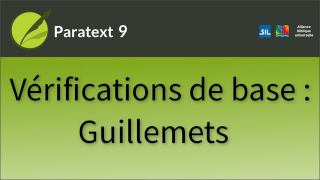

:::note Video
  
https://vimeo.com/719108029
:::

Le contrôle des citations examine les guillemets dans le texte et vérifie qu'ils respectent les règles du projet en matière de citations.

### Règles des guillemets

Seuls les administrateurs peuvent modifier les règles, mais vous pouvez les consulter.

1.  Ouvrez le **menu** du projet.
1.  **Développez** le menu.
1.  Sous **Paramètres du projet**, cliquez sur **Règles des guillemets**.

Consultez l'exemple au bas de la boîte de dialogue pour voir les trois niveaux de devis.

1.  Guillemets de 1e niveau
1.  Guillemets de 2e niveau
1.  Guillemets de 3e niveau.

En plus des guillemets ouvrants et fermants, il existe un guillemet de continuation.

#####  

### Plan du projet

Pour afficher une liste des erreurs

1.  Cliquez sur le **bouton bleu** Tâches et avancement
1.  Vérifier les problèmes pour les citations
1.  Cliquez sur le **nombre de problèmes.**
     -  *Paratext ouvre un panneau montrant les erreurs de citation*.
1.  Pour visualiser une erreur dans le texte de l'écriture, double-cliquez sur l'élément dans la liste.
     -  *Paratext sélectionne la citation ou le texte qui pose problème*.

:::caution
Vous devez avoir la permission d'éditer le chapitre concerné afin de pouvoir corriger chaque problème.
:::
1.  Corrigez les problèmes d'ajout de guillemets et de continuateurs manquants.
1.  Cliquez sur **Relancer** et voyez si l'erreur disparaît.

:::tip
Plusieurs problèmes répertoriés peuvent être causés par une seule erreur. Il peut être nécessaire de faire un travail de détective minutieux pour trouver la cause du problème.
:::

### Énumérer tous les guillemets à proximité de l'erreur

Si vous avez du mal à trouver la cause d'une erreur, il peut être utile de voir une liste de tous les guillemets proches de l'erreur.  
:::caution
Demandez à votre administrateur d'activer cette option pour vous.
:::
1.  Ouvrez le **menu** du projet.
1.  **Développez** le menu.
1.  Sous **Paramètres du projet**, cliquez sur **Règles de citation**.
1.  Cochez la case "Signaler les erreurs à côté d'autres erreurs".  
     -  *Lorsque vous relancez la vérification, il y a beaucoup plus d'éléments listés (tous ne sont pas des erreurs)*.

:::info
Les guillemets proches ont "……" au début.
:::
1.  Double-cliquez sur les éléments de la liste pour parcourir les guillemets ouvrants et fermants et découvrir ce qui manque.

### Afficher une seule liste de guillemets pour l'ensemble du projet

1.  Ouvrez le **menu** du projet.
1.  Sous **Outils**, cliquez sur **Effectuer les vérifications de base**…
1.  Sélectionnez la vérification des citations.
1.  Sélectionnez les livres que vous souhaitez vérifier.
1.  Cliquez sur **OK**.
     -  *La liste affiche maintenant les erreurs de tous les contrôles qui ont été sélectionnés et dans tous les livres sélectionnés*.

