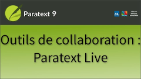
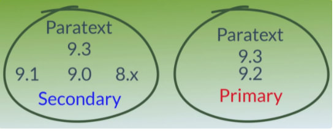

:::note Video
  
https://vimeo.com/725932047
:::

:::info
Cette vidéo a été révisée en fonction des changements apportés à Paratext 9.3. Voir aussi le **[Manuel Paratext manual pour plus de détails](https://manual.paratext.org/Training-Manual/Stage-4/Collaboration-tools)**

:::

Nous avons déjà vu comment collaborer avec Envoyer/Recevoir. Il arrive que plusieurs personnes aient besoin de regarder le même texte, et peut-être de le modifier ensemble. Paratext Live permet à chacun de consulter le texte sur son propre ordinateur et de voir les modifications apportées en temps réel.

Paratext Live peut utiliser

-  l'Internet
-  un réseau local,
-  un routeur WiFi hors ligne, ou
-  hotspot avec les données mobiles désactivées.

### Prérequis

- Il n'est plus nécessaire d'effectuer un envoyer/recevoir avant de commencer. Mais si Paratext Live détecte trop de différences, il vous indiquera que vous devez effectuer un envoyer/recevoir.

### Démarrer Paratext Live

1.  Ouvrez le **menu** du projet.
1.  Sous **Outils**, cliquez sur **Paratext Live**.
1.  Ou utilisez **l'icône** de la barre d'outils.
1.  Cliquez sur **Démarrer/se joindre la session Live**.
:::info
*Si vous n'avez pas activé l'enregistrement automatique dans les paramètres de Paratext, la session Live vous informe qu'il sera activé automatiquement pour la durée de la session*.
:::
1.  Paratext vous demande alors si vous êtes **l'éditeur principal**.
   -  Si vous n'êtes pas l'éditeur principal, **attendez** que l'un des autres participants clique sur *Start as Primary Editor*.
:::caution
**Ne cliquez pas sur Annuler** car cela annulerait votre participation à la session en direct.
:::
   -  Si vous êtes le rédacteur principal, cliquez sur **Start as Primary Editor**.

:::tip
Lorsqu'une session est active, le bouton Paratext Live est vert.
:::
### Modifications non partagées à partir d'Outils

Paratext Live n'affiche (et ne partage) que les modifications apportées au texte des écritures, mais pas les outils.

:::tip
Il se peut que vous souhaitiez passer au partage d'écran lorsque vous travaillez sur ces outils, puis repasser à Paratext Live lorsque vous modifiez le texte afin de profiter des exigences réduites en matière de bande passante.
:::
Ces modifications non partagées concernent par exemple l'état de l'orthographe, l'état du passage parallèle, les termes bibliques et leurs équivalents identifiés, et les remarques.

-  Cliquez sur le bouton **Paratext Live** dans la barre d'outils, puis cliquez sur **Échanger tous les fichiers**.
     -  *Tous les utilisateurs de la session Paratext Live reçoivent alors les mises à jour de ces fichiers*.

:::caution
Les modifications de tous les utilisateurs sont partagées, **mais si deux personnes ont modifié différemment le même élément, seule la modification d'une personne sera enregistrée**.
:::

### Terminer la session Paratext Live

1.  Cliquez sur le bouton **Paratext Live**, puis sur **Terminer/quitter la session Live**.
     -  *Si vous êtes le rédacteur principal, vous verrez cette boîte de message*.
1.  Cliquez sur **Terminer la session normalement**.
1.  Effectuer un **envoyer/recevoir**.

### Paratext 9.2 and 9.3
:::caution
- Avec Paratext 9.2, si l'un des participants a effectué une mise à niveau vers Paratext 9.2, **tous** les participants doivent le faire. 
- Avec Paratext 9.3, tous les participants doivent utiliser le même serveur. **Paratext 9.3 vous permet de choisir le serveur**. À partir de la version 9.3, vous pouvez travailler avec quelqu'un en 9.1 ou en 9.2 (mais pas en même temps).
:::

### Aide supplémentaire

-  Pour plus d'aide, **recherchez** **live** dans le champ de recherche de la barre de titre.
   -  *Il existe de nombreuses rubriques utiles pour vous aider à utiliser Paratext Live.*
