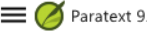

परिचय: जब आप पैराटेक्स्ट 9 का इस्तेमाल करके काम करते हैं, तो आपको अलग-अलग तरह की जानकारी देखने की जरूरत होगी। इस मॉड्यूल में, आप सीखेंगे कि इन जानकारियों को कैसे खोलें और अपने कंप्यूटर पर इन्हें कैसे ठीक से रखें।

शुरू करने से पहले: आप एक पहले से बने प्रोजेक्ट में लिखने के लिए तैयार हो रहे हैं। लेकिन इससे पहले, किसी को प्रोग्राम को इंस्टॉल करना होगा, आपके डेटा के लिए एक प्रोजेक्ट बनाना होगा और जरूरी जानकारियों को इंस्टॉल करना होगा।

यह क्यों महत्वपूर्ण है?: अगर आप अपने डेस्कटॉप को अच्छे से व्यवस्थित करते हैं, तो आपके पास अपने काम के लिए सभी जरूरी चीजें आसानी से उपलब्ध होंगी।

आप क्या करने वाले हैं?: आप पैराटेक्स्ट 9 को चालू करेंगे और पहले से सेव किए गए लेआउट (पाठ संयोजन) को खोलेंगे। अगर जरूरत हो, तो आप अन्य जानकारियों को भी खोलेंगे, विंडो की व्यवस्था बदलेंगे और पाठ लेआउट को फिर से सेव करेंगे।

:::info वीडियो

अलग-अलग प्रकार की जानकारियों और विंडो को व्यवस्थित करने में आपकी मदद के लिए कई वीडियो उपलब्ध हैं। नीचे कुछ सुझाव दिए गए हैं. वीडियो देखने के लिए लिंक पर क्लिक करें.

[**0.2.1b**](https://vimeo.com/368328862) प्रोजेक्ट्स और संसाधनों की मूल बातें

[**0.2.1d**](https://vimeo.com/368328956) विंडोज़ को कैसे व्यवस्थित करें

[**0.2.2a**](https://vimeo.com/377612892) टेक्स्ट संग्रह को कैसे खोलें और संशोधित करें

[**0.2.3a**](https://vimeo.com/382483908) कैसे नियंत्रित करें कि कौन सी विंडोज़ एक साथ स्क्रॉल करें

[**0.2.3c**](https://vimeo.com/377612971) किसी विंडो में टेक्स्ट को कैसे स्वैप करें

[**0.2.3d**](https://vimeo.com/377613013) विंडोज़ को व्यवस्थित करने पर अतिरिक्त युक्तियाँ

:::

### **पैराटेक्स्ट 9 में परिवर्तन** {#ed3427390c2b484f8c1343a8944fe332}

पैराटेक्स्ट 9.0 में मेनू बदल गया है मेनू देखने के लिए, अब आपको मेनू आइकन ≡ पर क्लिक करना होगा। अब दो प्रकार के मेनू हैं।

मुख्य पैराटेक्स्ट मेनू टाइटल बार पर होता है।  प्रत्येक विंडो (या टैब) का अपना मेनू होता है।

जब आप इन मेनू आइकनों में से किसी एक पर क्लिक करते हैं तो सभी मेनू प्रदर्शित होते हैं, और आपको केवल कमांड पर क्लिक करना होता है।

:::tip

इस मैनुअल में, जब यह कहता है **≡ पैराटेक्स्ट**, **मेनू** > **आज्ञा** के अंतर्गत (उदाहरण के लिए **≡ पैराटेक्स्ट**, **पैराटेक्स्ट** के अंतर्गत > **खोलें**). इसका अर्थ है पैराटेक्स्ट मेनू आइकन ≡ पर क्लिक करें, फिर मेनू के अंतर्गत (जैसे कि पैराटेक्स्ट) कमांड चुनें (जैसे कि खोलें)।

और जब यह कहता है **≡ टैब**, **मेनू** > **आज्ञा** के अंतर्गत इसका मतलब है टैब मेनू आइकन पर क्लिक करें, फिर मेनू के अंतर्गत (जैसे कि टूल्स) आज्ञा पर क्लिक करें (जैसे कि शब्द सूची)। सबसे आम टैब प्रोजेक्ट मेनू है इसलिए यह केवल ”**≡ प्रोजेक्ट** **मेनू**” कह सकता है।

:::

## 2.1 प्रोग्राम लोड करें {#c07b16862b1d4f55821e9a5398e26435}

1. पैराटेक्स्ट 9 आइकन पर डेस्कटॉप पर डबल-क्लिक करें

   

   - **या**
2. (स्टार्ट मेनू से, पैराटेक्स्ट 9 चुनें)

## 2.2 एक सहेजे गए लेआउट को खोलें {#d65baaea138b4d72b0dbaaadd85f23d5}

:::info अपग्रेड

9.4 में लेआउट्स को प्रबंधित करने में कुछ सुधार किए गए हैं। आपका हाल ही में उपयोग किया गया लेआउट मेनू के शीर्ष पर होना चाहिए।

अधिक जानकारी के लिए [What's New in 9.4 - मुख्य मेनू - लेआउट प्रबंधन](https://vimeo.com/857678678) देखें।

:::

1. **≡ पैराटेक्स्ट** मेनू पर क्लिक करें, फिर **लेआउट** मेनू के अंतर्गत
2. एक सहेजे गए लेआउट (टेक्स्ट संयोजन) का चयन करें।
   - _आपकी स्क्रीन नीचे दिए गए चित्र की तरह कुछ दिखनी चाहिए (यदि नहीं, तो नीचे देखें)।_

     

## 2.3 एक नया टेक्स्ट लेआउट बनाएँ {#71e308de0d1f4c71b54acfb4d760fae8}

यदि आपने पहले से कोई लेआउट सहेजा नहीं है, तो हम आपको निम्नलिखित करने की सिफारिश करते हैं:

### **विंडोज़ खोलें और व्यवस्थित करें** {#f5f12c7b122148ca9b9b4edd7c7eb807}

- 1=पाठ संग्रह
  - **≡ पैराटेक्स्ट** मेनू, **पैराटेक्स्ट** के अंतर्गत **टेक्स्ट संग्रह खोलें** चुनें, कई संसाधनों का चयन करें, **दायां तीर** बटन पर क्लिक करें, **ओके** पर क्लिक करें। (See [2.5](/2.OD#204f93f95d7e4da7aa004d8b2aefaa86))

- 2 = Your project
  - **≡ पैराटेक्स्ट** मेनू के अंतर्गत **पैराटेक्स्ट** > **ओपन**, प्रोजेक्ट्स

- 5 = प्रतिपादन
  - **≡ टैब** मेनू, टूल्स के अंतर्गत > **बाइबल सम्बन्धी शब्दावली के प्रतिपादन**

- 3 = स्रोत पाठ
  - **≡ पैराटेक्स्ट** मेनू, **पैराटेक्स्ट** > **ओपन > स्रोत भाषा टेक्स्ट** के अंतर्गत

- 4 = उन्नत संसाधन
  - **≡ पैराटेक्स्ट** मेनू, **पैराटेक्स्ट** > **खुला > उन्नत संसाधन** के अंतर्गत

- खिड़कियों को इच्छानुसार व्यवस्थित करें। Watch Paratext videos 0.2.1b, 0.2.1c, and 0.2.3d.

:::info अपग्रेड

पैराटेक्स्ट 9.3 (और ऊपर) में आप मुख्य पैराटेक्स्ट मेनू का उपयोग करके विंडोज को **पंक्तियों** और **कॉलम्स** में व्यवस्थित कर सकते हैं।

:::

:::tip

अपने लेआउट को सहेजना न भूलें!‌

:::

### लेआउट को सहेजें {#d4ebb0ef8d0f49998351a50a09b5942b}

एक बार जब विंडोज वांछित रूप से व्यवस्थित हो जाएँ:

1. **≡ पैराटेक्स्ट**, **लेआउट** के अंतर्गत > **वर्तमान लेआउट को सहेजें**
2. एक नया नाम टाइप करें
3. या किसी मौजूदा लेआउट की जगह लेने के लिए,
   1. दाईं ओर ड्रॉपडाउन पर क्लिक करें
   2. सहेजे गए लेआउट का नाम चुनें।
4. **ओके** पर क्लिक करें।

## 2.4 एक टेक्स्ट लेआउट को हटाएँ {#75e26e8bdc3345529b5b3fc702f4c748}

यदि आप किसी सहेजे गए लेआउट को हटाना चाहते हैं,

1. **≡ पैराटेक्स्ट** के अंतर्गत **लेआउट** > **लेआउटस को प्रबंधित करें**
   - _सारी सहेजी गई लेआउट्स की एक सूची वाला एक संवाद बॉक्स प्रदर्शित होता है_
2. Click the three dots to the right of the name of the saved layout.
   - _एक सबमेनू प्रदर्शित होता है।_
3. सबमेनू से **हटाएँ** चुनें
   - _एक संवाद बॉक्स प्रदर्शित होता है जो आपको चेतावनी देता है कि आप लेआउट हटाने वाले हैं_
4. **हटाएं** की पुष्टि के लिए पुनः क्लिक करें।

## 2.5 एक टेक्स्ट संग्रह में संसाधनों को खोलें {#204f93f95d7e4da7aa004d8b2aefaa86}

:::info 9.4 अपग्रेड

9.4 में, पैराटेक्स्ट आपको अपडेट होने पर आपके सभी संसाधनों के बारे में सूचित कर सकता है।

1. **संसाधन डाउनलोड/इंस्टॉल करें** डायलॉग में, संसाधनों की सूची के नीचे
2. “**संसाधन अपडेट के लिए जाँचें**” के बगल में ड्रॉपडाउन सूची पर क्लिक करें
3. जांचने की आवृत्ति चुनें।
   1. _यदि कोई संसाधन बदला गया है, तो पैराटेक्स्ट मेनू आइकन पर एक हरा डॉट दिखाई देता है।_

For more details, watch [What's new main menu](https://vimeo.com/857678678).

:::

पैराटेक्स्ट के साथ, एक ही समय में कई प्रोजेक्ट/संसाधन खोलना संभव है।  हालांकि, बहुत सारी विंडोज होने के बजाय, एक विंडो में कई पाठ होना बेहतर है।

:::tip अपग्रेड

पैराटेक्स्ट 9.3+ में टेक्स्ट संग्रह को सीधे **≡ पैराटेक्स्ट** मेनू से भी खोला जा सकता है।

:::

### नई विधि - सीधे पैराटेक्स्ट मेनू से खोलें {#72a473aaf424486aaa027854c81aa784}

1. **≡ पैराटेक्स्ट** मेनू, **पैराटेक्स्ट** के अंतर्गत &gt; **पाठ संग्रह खोलें**
2. Ctrl की को दबाते हुए संसाधन पर क्लिक करके कई संसाधनों का चयन करें।
3. Click on the **Right-arrow button**.
   - _चयनित कॉलम में संसाधन सूचीबद्ध होते हैं।_
4. आवश्यकतानुसार दोहराएँ।
5. उन्हें आवश्यकतानुसार पुनः क्रमित करने के लिए ऊपर और नीचे के तीरों का उपयोग करें।

संग्रह को सहेजें

1. नीचे बाईं ओर टेक्स्ट बॉक्स में क्लिक करें।
2. सहेजे गए संग्रह के लिए एक नाम टाइप करें और सहेजें आइकन पर क्लिक करें।
3. ओके पर क्लिक करें
   - _पाठ संग्रह खुलता है।_

### पिछली विधि - डायलॉग खोलें {#4ce29225a23d4f53998f378f3d1f993f}

1. **≡ पैराटेक्स्ट** मेनू, **पैराटेक्स्ट** के अंतर्गत &gt; **खोलें**
2. ऊपर के संसाधन बटन पर क्लिक करें।
3. Ctrl की को दबाते हुए संसाधन पर क्लिक करके कई संसाधनों का चयन करें।
4. आवश्यकतानुसार दोहराएँ।
5. **खोलें के रूप में** ड्रॉपडाउन सूची पर क्लिक करें।
6. **पाठ संग्रह** पैनल चुनें।
7. **ओके** पर क्लिक करें।

:::tip

यह सुझाव दिया जाता है कि स्रोत पाठों के लिए सबसे वफादार टेक्स्ट पर फोकस करने के लिए संसाधनों को कम शाब्दिक से अधिक शाब्दिक क्रम में प्रदर्शित किया जाए अंग्रेजी संसाधनों के लिए: ESV, RSV, NIV, NLT फ्रेंच संसाधनों के लिए, निम्नलिखित क्रम सुझाया जाता है: TOB, NVSR78Col, NBS, BDS, FC97, PDV11

:::

संग्रह में पाठों के क्रम को बदलने के कई तरीके हैं

1. **≡ टैब**, **पाठ संग्रह को संशोधित करें**

**चयनित पाठ डायलॉग से**

1. जरूरत के अनुसार क्रम बदलने के लिए तीर बटनों का उपयोग करें

2. कोई अन्य परिवर्तन करें

3. **ओके** पर क्लिक करें।

:::tip

आप टेक्स्ट के संक्षिप्त नाम के नीले लिंक पर क्लिक करके दूसरे पैन में टेक्स्ट बदल सकते हैं आप **≡ टैब** का उपयोग करके व्यू मेन्यू के अंतर्गत व्यू को बदल सकते हैं (प्रीव्यू, अनफॉर्मेटेड या मानक).

:::

## 2.6 एक पूरे मेनू संसाधन खोलें {#ddb656b63852444cbe84a309b3bb9923}

1. **≡ पैराटेक्स्ट** मेनू, **पैराटेक्स्ट** > **खोलें** के अंतर्गत

2. **पूरे मेनू संसाधन** पर क्लिक करें

:::tip

पूरे मेनू संसाधन में शब्दकोश, छवियाँ, मानचित्र, **वीडियो,** आदि भी शामिल हैं। जब आप एक पूरे मेनू संसाधन खोलते हैं, तो एक मार्गदर्शिका भी खुलती है।

:::

:::info अपग्रेड 9.4

9.4 में, पैराटेक्स्ट आपको सूचित कर सकता है जब कोई संसाधन अपडेट हो गया हो।

:::

## 2.7 एक शब्दकोश खोलें {#7ea1b54db25c492c832d9d92995b4030}

:::tip

यदि आप एक पूरे मेनू संसाधन का उपयोग नहीं करते हैं, तो आप अन्य भाषाओं में ग्लोस के साथ एक स्रोत भाषा शब्दकोश खोल सकते हैं।

:::

1. **≡ पैराटेक्स्ट** मेनू, **पैराटेक्स्ट** > **खोलें** के अंतर्गत

2. **शब्दकोश** पर क्लिक करें

3. "न्यू टेस्टामेंट का एक संक्षिप्त ग्रीक-अंग्रेज़ी शब्दकोश" या "पुराने नियम का त्रिभाषी हिब्रू-अंग्रेज़ी लेक्सिकॉन" चुनें

4. **ओके** पर क्लिक करें।

5. **देखें** > एक भाषा चुनें (उदाहरण के लिए **फ्रेंच**)

:::tip

शब्दकोश विंडोज को ऑटोहाइड में जोड़ना उपयोगी होता है, (टैब नाम पर राइट-क्लिक करें, ऑटोहाइड में ले जाने का चयन करें)।

:::

अन्य शब्दकोश (अंग्रेजी में लेकिन फोटो के साथ)

- "बाइबल में पाए जाने वाले पौधे और पेड़"
- "बाइबल में पाए जाने वाले पशु"

## 2.8 स्रोत भाषा पाठ के साथ काम करना {#9fe3171ca9784daf8bc9ff0681bcaa59}

आप अंग्रेजी के अलावा अन्य भाषा में ग्लोस के साथ स्रोत भाषा पाठ खोल सकते हैं, जैसे कि Gloss FR।

1. **≡ पैराटेक्स्ट**, **पैराटेक्स्ट** > **खोलें** के अंतर्गत

2. **स्रोत भाषा पाठ** पर क्लिक करें

3. HEB/GRK चुनें

4. **ठीक** पर क्लिक करें।

यदि आपने विशेष ग्लोस संसाधन डाउनलोड किया है, तो आप इसे निम्नलिखित प्रकार से लोड कर सकते हैं

1. **≡ टैब** **देखें** के अंतर्गत > **अतिरिक्त ग्लोसेस**
2. ग्लोस वाले विशिष्ट संसाधन को चुनें (जैसे कि GlossFR)
3. **ठीक** पर क्लिक करें।
