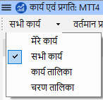
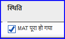
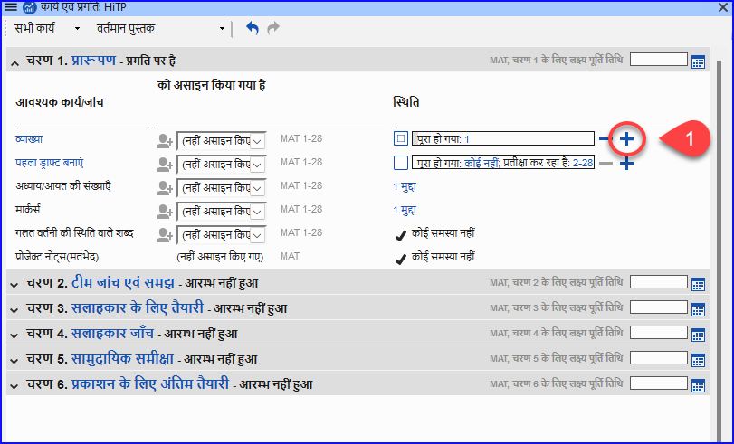
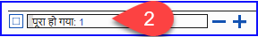
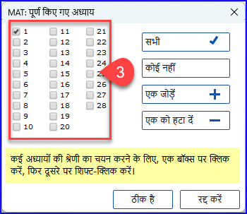

**परिचय** आप अपने काम को व्यवस्थित करने और यह जानने के लिए कि अगला कौन सा कार्य करना है, "असाइनमेंट्स और प्रगति" का उपयोग करते हैं।. एक बार जब आप कार्य पूरा कर लेते हैं, तो आपको इसे पूर्ण के रूप में चिह्नित कर देना चाहिए ताकि आप यह रिपोर्ट कर सकें कि क्या हासिल किया गया है।. [यदि आपने पहले का कोई संस्करण उपयोग किया है, तो आप देखेंगे कि पैराटेक्स्ट 9 में इसमें भारी सुधार हुआ है।.]

**शुरू करने से पहले** आपके द्वारा योजना का उपयोग करने से पहले, इसे कॉन्फ़िगर किया जाना चाहिए।. \[आपके प्रोजेक्ट व्यवस्थापक, जो उचित संगठनात्मक योजना जोड़ेंगे और इसे आपकी टीम के लिए कॉन्फ़िगर करेंगे।.\] \[आपका प्रोजेक्ट प्रशासक जो उचित संगठनात्मक योजना जोड़ेगा और इसे आपकी टीम के लिए कॉन्फ़िगर करेगा।\]

**यह महत्वपूर्ण क्यों है?** एक अनुवाद परियोजना में करने के लिए बहुत सारे कार्य होते हैं।. यह महत्वपूर्ण है कि आप इन सभी कार्यों को सुनिश्चित करने के लिए एक प्रणाली रखें।. अब जब आपकी योजना कॉन्फ़िगर की जा चुकी है, तो आप योजना का उपयोग करके देख सकते हैं कि आपको अगला कौन सा कार्य करने के लिए असाइन किया गया है।. जब आप कार्य पूरा कर लेते हैं, तो आप कार्य को पूर्ण के रूप में चिह्नित कर सकते हैं और अगले कार्य को देख सकते हैं। जब आप कार्य पूरा कर लेते हैं, तो आप कार्य को पूर्ण के रूप में चिह्नित कर सकते हैं और अगले कार्य को देख सकते हैं। जब आप कार्य पूरा कर लेते हैं, तो आप कार्य को पूर्ण के रूप में चिह्नित कर सकते हैं और अगला कार्य देख सकते हैं। आप पर्यवेक्षकों और दाताओं के लिए रिपोर्ट जेनरेट करने के लिए इस जानकारी का उपयोग कर सकते हैं (देखें \[प्रोजेक्ट प्रगति 2\](https://chat.openai.com/6.PP2))।.

**हम क्या करने जा रहे हैं?** आप विभिन्न प्रकार के कार्यों को पूर्ण के रूप में चिह्नित करेंगे।. सटीक चरण प्रति प्रोजेक्ट, प्रति पुस्तक या अध्याय द्वारा कार्य करने पर थोड़ा भिन्न होंगे।. सभी प्रकार के कार्यों के लिए प्रगति चिह्नित करने का स्थान स्टेटस कॉलम है।.

## 3.1 किए जाने वाले कार्यों को देखें {#85dfcb5c87ec4d4ba3afad5489b6d5c4}

या

- [**≡प्रोजेक्ट** मेनू के अंतर्गत, **असाइनमेंट और प्रगति** चुनें]

:::tip

:::

## 3.2 अगले कार्य की पहचान करें {#11b807d65f9a45c8a9da4cd5f798fdb2}

कार्यों की सूची अपूर्ण कार्यों को दिखाती है, प्रत्येक के बगल में एक रंगीन बार के साथ।..

1. वह अगला कार्य पहचानें जिसे आपको करना है।. इसमें या तो एक हरा या धारीदार हरा बार होगा।.
2. जांचें कि यह किसी अन्य कार्य की प्रतीक्षा में नहीं है।. इस स्थिति में, इसमें एक लाल कटी हुई बार होगी।.
3. कार्य करें (यदि आवश्यक हो तो अन्य मॉड्यूल देखें)।.

:::tip

जब आप कार्य पूरा कर लें, तो इसे पूर्ण के रूप में चिह्नित करने के निर्देश नीचे देखें।. (जब 0 मुद्दे होते हैं तो एक जांच पूरी होती है।.)

:::

## 3.3 एक कार्य को पूरा के रूप में चिह्नित करें {#1e10472de6644e289a8dfb9d8ccde488}

### पुस्तक कार्य को पूर्ण के रूप में चिह्नित करें {#03059c2408d64c30baf38c460e0813ff}

- स्थिति के बाईं ओर दिए गए चेकमार्क पर क्लिक करें।
    - _यह ठोस हो जाना चाहिए ताकि यह दिखाई दे कि यह पूरा हो गया है।_

### अध्याय कार्य को पूर्ण के रूप में चिह्नित करें {#dabedb60bf4143888eb08c8f457c7598}

1. अगले अध्याय को पूरा चिह्नित करने के लिए **+** पर क्लिक करें।
2. अन्य अध्यायों को पूरा चिह्नित करने के लिए आप **पूर्ण [2]** शब्द पर क्लिक कर सकते हैं।

    

    - _अध्यायों की एक सूची वाला एक संवाद बॉक्स प्रदर्शित होता है।_

        

3. पूर्ण हुए अध्यायों के नंबर पर क्लिक करें [3]।
4. **ठीक** पर क्लिक करें।

## 3.4 जांचें {#3aa5683d6c7e41f588d4b15d4c498689}

- यदि कार्य एक चेक है, तो चेक की स्थिति या तो **सेटअप आवश्यक** कहेगी या यह शेष **समस्याओं** की संख्या दिखाएगी।
- - जब **कोई समस्याएँ नहीं** होती हैं तो एक जांच पूरी होती है।

### जांचें – सेटअप आवश्यक (व्यवस्थापक) {#cf9cddb209dd432c92295e5baed75ecc}

1. "सेटअप आवश्यक" कहने वाले नीले लिंक पर क्लिक करें।
    - _Paratext 9 उपयुक्त इन्वेंटरी चलाएगा या उस जांच के लिए सेटिंग्स खोलेगा।_
2. उपयुक्त रूप से सेटअप पूरा करें।
3. समाप्त होने पर विंडो बंद करें।

:::tip

यदि एक जांच के लिए एक से अधिक इन्वेंटरी की आवश्यकता है (जैसे कि पूँजीकरण), तो आपको उन्हें मैन्युअल रूप से टूल्स मेनू > चेकिंग इन्वेंटरीज़ से सेटअप करना होगा।

:::

### जांचें – समस्याएँ {#86edf92b36dd43a7af95a16dcf743313}

1. नीले लिंक “…समस्याएँ” पर क्लिक करें।
    - _- _त्रुटियों की एक सूची प्रदर्शित होती है।__
2. आवश्यक सुधार करें।
3. यदि चाहें तो सूची परिणाम बंद करें।
4. **≡ Paratext** के तहत **Paratext** > **सभी सहेजें** (या **Ctrl**+**s**).
5. असाइनमेंट्स और प्रगति पर वापस जाएँ।

:::tip

जब 0 समस्याएँ होती हैं तो जांच को पूरा माना जाता है। यदि आप किसी जांच को पूरा करने में असमर्थ हैं, तो इसे बाद के चरण में स्थगित करना संभव है।

:::

### जांच स्थगित करें {#110391bc0b9647129c47c1ccdebf2ac4}

1. **≡ टैब** के अंतर्गत, **प्रोजेक्ट** मेनू से **असाइनमेंट्स और प्रगति** चुनें।
2. **सभी कार्यों** का दृश्य चुनें।
3. समस्याओं वाले जांच पर मंडराएँ।
4. स्टेटस कॉलम के दाईं ओर प्रकट होने वाले **स्थगित** पर क्लिक करें,
5. चुनें कि आप जांच को किस चरण में स्थगित करना चाहते हैं।
6. जांच को स्थगित करने का कारण टाइप करें।
    - _जांच उस चरण में स्थानांतरित हो जाएगी।_
