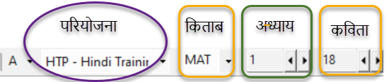
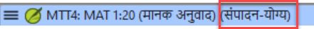
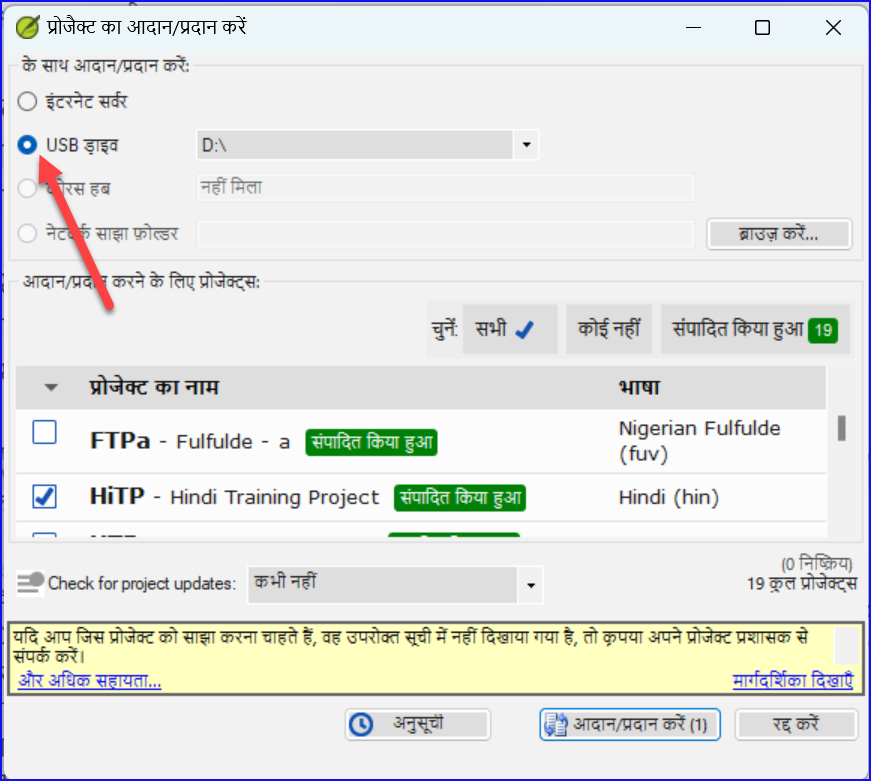

**परिचय** यह मॉड्यूल बताता है कि पैराटेक्स्ट 9 में एक प्रोजेक्ट में अपने मसौदा अनुवादों को कीबोर्ड कैसे करें।

**शुरू करने से पहले** हम एक मौजूदा प्रोजेक्ट में टेक्स्ट को कीबोर्ड करने वाले हैं।  इसे करने से पहले, किसी ने पहले ही प्रोग्राम को इंस्टॉल कर लिया होगा और आपके डेटा के लिए एक प्रोजेक्ट बना दिया होगा।

**यह महत्वपूर्ण क्यों है** यह आपके अनुवाद को कंप्यूटर में दर्ज करने का पहला चरण है।  एक बार टेक्स्ट टाइप किया जा चुका है, आप टेक्स्ट की सामग्री और फॉर्मेट पर विभिन्न जाँच चला सकते हैं।

## 4.1 एक बाइबिलिकल वर्स में जाएँ {#51581b24aa2e48c3bf3d4017c24abce2}

:::tip

टेक्स्ट टाइप करना शुरू करने से पहले, आपको अपना कर्सर सही पुस्तक, अध्याय और वर्स में ले जाने की आवश्यकता है। इसके लिए आप टूलबार का उपयोग करते हैं।

:::

- टूलबार पर आइकनों का उपयोग करके, प्रोजेक्ट, पुस्तक, अध्याय और वर्स को आवश्यकतानुसार बदलें।

    

:::info अपग्रेड

पैराटेक्स्ट 9.3 में आप नेविगेशन बार पर पुस्तक के नाम में एक स्क्रिप्चर रेफरेंस को कॉपी और पेस्ट कर सकते हैं। उदाहरण के लिए, अंग्रेजी में: MAT 12.3, Mrk 5:4, Galatians 1:12।

:::

:::tip

यदि आपको वर्स रेफरेंस पता नहीं है, तो आप **फाइंड** फीचर का उपयोग करके उस वर्स को खोज सकते हैं जिसे आप ढूँढ रहे हैं। Ctrl+F।

Ctrl+F।

## 4.2 जाँचें कि प्रोजेक्ट संपादन योग्य है {#5ace3b29698c4618b278657a58c7cde9}

उदाहरण के लिए, अंग्रेजी में: MAT 12.3, Mrk 5:4, Galatians 1:12।

- _टाइटलबार में शब्द (***संपादन योग्य***) होना चाहिए।*

    

1. यदि यह संपादन योग्य नहीं है, तो दृश्य बदलने का प्रयास करें (नीचे देखें)।
2. यदि पुस्तक अभी भी संपादन योग्य नहीं है, और आपको इसे संपादित करने की आवश्यकता है, तो आपको अपने प्रोजेक्ट प्रशासक से बात करनी चाहिए।

## 4.3 दृश्य बदलना {#4ebf0759e8154f6a938ebc6a44d0d3e0}

:::tip

पैराटेक्स्ट 9 में पाँच दृश्य हैं। आप प्रीव्यू दृश्य को छोड़कर सभी दृश्यों में संपादन कर सकते हैं।

:::

- **Ctrl** + **E** -या-
- **≡ टैब** **व्यू** मेनू के अंतर्गत, दृश्य चुनें (आमतौर पर स्टैंडर्ड)।

## 4.4 विशेष वर्ण टाइप करना {#85ef7d3181e44b0a93f3669ef5068d93}

पैराटेक्स्ट 9 में पाँच दृश्य हैं।

कुछ वर्तनीगत वर्ण कीबोर्ड पर नहीं मिलते हैं। इन वर्णों को टाइप करने के लिए, आपको एक से अधिक कुंजी दबाने की आवश्यकता हो सकती है।

**Ctrl** + **E** -या- **≡ टैब** **व्यू** मेनू के अंतर्गत, दृश्य चुनें (आमतौर पर स्टैंडर्ड)।

1. **Ctrl** + **E** -या-
2. यदि आप Keyman का उपयोग कर रहे हैं तो अपना कीबोर्ड चुनें (उदाहरण के लिए, चाड यूनिकोड) (या MS-कीबोर्ड्स के लिए AF या TR/SQ/TZ/AF…चुनें)
3. विशेष वर्ण के लिए कुंजियाँ टाइप करें (अपनी Keyman फ़ाइल के साथ प्रदान की गई चार्ट देखें)।

कुछ वर्तनीगत वर्ण कीबोर्ड पर नहीं मिलते हैं।

आप **≡ टैब** का उपयोग करके **व्यू** \> **हाइलाइट इनवैलिड कैरेक्टर्स** देख सकते हैं यदि आपने कोई अमान्य वर्ण टाइप किया है तो तुरंत देख सकते हैं। यदि आपको बहुत सारे विराम चिह्न दिखाई देते हैं, तो अपने शिक्षक या प्रशासक से अपनी वर्ण सूची को कॉन्फ़िगर करने के लिए कहें।

:::

## 4.5 एक अन्य मार्कर में टेक्स्ट जोड़ना – शीर्षक या परिचय {#8ec1c85f258b4da2ae2062a80f9897d1}

:::tip

प्रत्येक टेक्स्ट को एक मार्कर की आवश्यकता होती है। अध्यायों और वर्सों के लिए मार्कर पहले से ही आपके प्रोजेक्ट में होते हैं।  जब आप शीर्षकों या परिचयों आदि जैसे टेक्स्ट जोड़ना चाहते हैं, तो आपको निम्नानुसार उपयुक्त मार्कर भी जोड़ना होगा:

:::

1. अपने कंप्यूटर पर आवश्यकतानुसार अपनी कीबोर्ड प्रणाली बदलें।
2. यदि आप Keyman का उपयोग कर रहे हैं तो अपना कीबोर्ड चुनें (उदाहरण के लिए, चाड यूनिकोड) 0(या MS-कीबोर्ड्स के लिए AF या TR/SQ/TZ/AF…चुनें)
3. विशेष वर्ण के लिए कुंजियाँ टाइप करें (अपनी Keyman फ़ाइल के साथ प्रदान की गई चार्ट देखें)। :::tip
4. टेक्स्ट टाइप करें
5. टेक्स्ट के बाद एक पैराग्राफ मार्कर जोड़ें (उदाहरण के लिए: \\p)

प्रत्येक टेक्स्ट को एक मार्कर की आवश्यकता होती है।

एक शीर्षक के बाद और वर्स से पहले हमेशा एक USFM मार्कर होना चाहिए। यह आमतौर पर \\p (सामान्य पैराग्राफ) होता है, लेकिन यह भिन्न भी हो सकता है (उदाहरण के लिए \\q1)।

:::

### वर्ण चिह्न {#a8323ee1f37847e6b1ceaf05b6127968}

:::tip

पैराटेक्स्ट में पैराग्राफ और वर्ण चिह्न दोनों होते हैं  नाम के रूप में सुझाव दिया गया है, पैराग्राफ चिह्न पूरे पैराग्राफ को प्रारूपित करते हैं वर्ण चिह्न आपको पैराग्राफ के एक हिस्से को प्रारूपित करने देते हैं और इसलिए एक शुरुआती और समाप्ति चिह्न की आवश्यकता होती है

:::

1. उस टेक्स्ट का चयन करें जिस पर आप वर्ण शैली लागू करना चाहते हैं।
2. **\\** टाइप करें।
3. सूची से चिह्न चुनें (उदाहरण के लिए, nd)।
4. **Enter** दबाएं।

- पैराटेक्स्ट टेक्स्ट से पहले और बाद में दो चिह्न जोड़ता है।  
  (उदाहरण: \\nd प्रभु\\nd\\*)

:::tip

टेक्स्ट टाइप करें टेक्स्ट के बाद एक पैराग्राफ मार्कर जोड़ें (उदाहरण के लिए: \\p) एक शीर्षक के बाद और वर्स से पहले हमेशा एक USFM मार्कर होना चाहिए।

:::

## 4.6 पैराग्राफ विराम जोड़ें {#9920f9d1850246219d4f1eb1dbaebbcb}

:::tip

पाठ को अनुच्छेदों में विभाजित करना:

:::

1. कर्सर को वहां ले जाएं जहां आप पैराग्राफ तोड़ना चाहते हैं।
2. **Enter** दबाएं।
3. **p** टाइप करें, फिर **Enter**।

## 4.7 अपने काम को सहेजें {#a76d8d7a421841f79c4dcb1e87671678}

:::tip

"पैराटेक्स्ट टेक्स्ट से पहले और बाद में दो चिह्न जोड़ता है।

:::

- **≡ पैराटेक्स्ट** के अंतर्गत **पैराटेक्स्ट** \> **सभी सहेजें**
- या **Ctrl** + **S**

## 4.8 फुटनोट्स डालें {#0def5155dad145a7a96c40b56fe61974}

:::tip

**Enter** दबाएं।

:::

- कर्सर को उस जगह पर ले जाएं जहां आप फुटनोट डालना चाहते हैं।

1. **≡ टैब**, **डालें** के अंतर्गत \> **फुटनोट**
    - *टेक्स्ट के नीचे वाले बॉक्स में फुटनोट चिह्नों का एक सेट जोड़ा जाता है*

2. \\ft के बाद टेक्स्ट टाइप करें

कर्सर को उस जगह पर ले जाएं जहां आप फुटनोट डालना चाहते हैं।

**≡ पैराटेक्स्ट** के अंतर्गत **पैराटेक्स्ट** \> **सभी सहेजें** या **Ctrl** + **S**

- फुटनोट को **बदलने** के लिए, टेक्स्ट में सुपरस्क्रिप्ट अक्षर पर **क्लिक** करें।
- फुटनोट को **हटाने** के लिए, आप सुपरस्क्रिप्ट अक्षर को **हटा** सकते हैं।
- या फुटनोट टेक्स्ट पर राइट-क्लिक करें और **हटाएं** चुनें।

फुटनोट को **बदलने** के लिए, टेक्स्ट में सुपरस्क्रिप्ट अक्षर पर **क्लिक** करें।

## 4.9 सेंड/रिसीव {#70bb5cddeb3342d8bc10e403e64348ea}

फुटनोट को **हटाने** के लिए, आप सुपरस्क्रिप्ट अक्षर को **हटा** सकते हैं।

आपके अनुवाद की एक दूसरी कॉपी रखना और अपनी टीम के अन्य सदस्यों के साथ अपने काम को साझा करना आवश्यक है।  यह सेंड/रिसीव करके किया जाता है जैसा कि निम्नानुसार है:

आपके अनुवाद की एक दूसरी कॉपी रखना और अपनी टीम के अन्य सदस्यों के साथ अपने काम को साझा करना आवश्यक है।

### इस प्रोजेक्ट को इंटरनेट पर सेंड/रिसीव करें {#062239d736b749eba1e1ab44dd3be2d4}

1. सुनिश्चित करें कि आपका कंप्यूटर इंटरनेट से जुड़ा हुआ है।
2. **≡ टैब** **प्रोजेक्ट** के अंतर्गत,\> **इस प्रोजेक्ट को सेंड/रिसीव करें**
    - _पैराटेक्स्ट तुरंत सेंड/रिसीव करेगा यानी विभिन्न विकल्पों की पेशकश किए बिना।_

:::info 9.4 अपग्रेड

9.4 में, पैराटेक्स्ट आपको सूचित कर सकता है जब आपके किसी भी प्रोजेक्ट में अपडेट होते हैं।

:::

सेंड/रिसीव डायलॉग पर, प्रोजेक्ट्स की सूची के नीचे

1. “**प्रोजेक्ट अपडेट्स की जांच के लिए**” के बगल में ड्रॉपडाउन सूची पर क्लिक करें। जांचने की आवृत्ति चुनें।
    - *यदि कोई प्रोजेक्ट बदल गया है, तो प्रोजेक्ट मेनू आइकन पर एक हरा डॉट दिखाई देता है।*

अधिक जानकारी के लिए देखें [What's new main menu](https://vimeo.com/857678678).

जांचने की आवृत्ति चुनें।

### इंटरनेट के साथ आदान/प्रदान करें {#eeef5150739042cebaf6ba88512fe809}

1. सुनिश्चित करें कि आपका कंप्यूटर इंटरनेट से जुड़ा हुआ है।
2. यदि आप अन्य प्रोजेक्ट्स को सेंड/रिसीव करना चाहते हैं, या सेंड/रिसीव करने का तरीका बदलना चाहते हैं
3. **≡ पैराटेक्स्ट** के अंतर्गत **पैराटेक्स्ट** \> **प्रोजेक्ट्स को सेंड/रिसीव करें**
4. **इंटरनेट सर्वर** चुनें।
5. सेंड/रिसीव करने के लिए प्रोजेक्ट्स के बगल में बॉक्स को चेक करें।
6. **सेंड/रिसीव** पर क्लिक करें।
    - _कंप्यूटर आपकी फाइलों की एक प्रतिलिपि बनाएगा। एक प्रगति मीटर प्रदर्शित किया जाएगा। कोई समस्या होने पर ही एक संदेश बॉक्स प्रदर्शित होगा।_

### अपने डेटा को यूएसबी स्टिक पर सेंड/रिसीव करके बैकअप लें {#d6ce92480ac444279ffa54dc26dc945b}

आपके अनुवाद की एक दूसरी प्रति होना आवश्यक है। यदि आपके पास इंटरनेट तक पहुँच नहीं है, तो आप एक यूएसबी स्टिक का उपयोग कर सकते हैं। अपने डेटा को यूएसबी स्टिक पर बैकअप लेने के लिए आप सेंड/रिसीव इस प्रकार करते हैं:

1. अपने कंप्यूटर में अपनी यूएसबी की डालें।

2. **≡ पैराटेक्स्ट**, **पैराटेक्स्ट** के अंतर्गत \> **प्रोजेक्ट(स) को सेंड/रिसीव करें** **यूएसबी ड्राइव** चुनें।

4. सेंड/रिसीव करने के लिए प्रोजेक्ट्स के बगल में बॉक्स को चेक करें।

5. **सेंड/रिसीव** पर क्लिक करें।
    - कंप्यूटर आपकी फाइलों की एक प्रतिलिपि बनाएगा। एक प्रगति मीटर प्रदर्शित किया जाएगा। कोई समस्या होने पर ही एक संदेश बॉक्स प्रदर्शित होगा।

### फिर से सेंड/रिसीव करें {#19ba693a99554a0eb9ffcd86a15367c2}

:::tip

अगली बार जब आप सेंड/रिसीव करना चाहते हैं तो आप टूलबार का उपयोग करके पिछली बार की तरह ही सेटिंग्स का उपयोग करके सेंड/रिसीव कर सकते हैं। यह विकल्प आपको एक अलग विधि या अलग प्रोजेक्ट्स चुनने की अनुमति नहीं देता है।

:::

- अपने यूएसबी स्टिक को अपने कंप्यूटर में डालें या इंटरनेट से जुड़ें।

- सेंड/रिसीव आइकन पर क्लिक करें
    - पैराटेक्स्ट तुरंत सेंड/रिसीव करेगा।

## 4.10 अपने कर्सर को कुशलतापूर्वक ले जाएँ {#f79550c3c28c4ac6a277a839e6c8546d}

आपके कर्सर को उस जगह पर ले जाने में बहुत समय लगता है जहाँ आपको टेक्स्ट जोड़ना है या सुधार करना है। यहाँ कुछ उपयोगी कीस्ट्रोक्स हैं जो आपके कर्सर को जल्दी से ले जाने में मदद कर सकते हैं।

- कुंजियाँ
    - तीर कुंजियाँ **←** **↑** **→** **↓**
    - **Home**, **End**, **PgUp**, और **PgDn**,
    - **F8** (अध्याय), **F9** (पुस्तक)
- किसी भी उन कुंजियों के साथ **Ctrl** दबाकर प्रयास करें।  कुछ काफी अलग हो सकते हैं जैसे कि आप उम्मीद करते हैं।
    - Ctrl + Arrow Down = अगला वर्स (Ctrl + Arrow Up पिछला वर्स के लिए)
    - F8 = अगला अध्याय (Ctrl + F8 पिछला अध्याय के लिए)
    - F9 = अगली पुस्तक (Ctrl + F9 पिछली पुस्तक के लिए)
    - Alt + Arrow Left/Right = पिछला/अगला संदर्भ इतिहास में
    - Alt + Arrow Up/Down = पिछला/अगला संदर्भ एक सूची में
    - Ctrl + B = टूलबार के नेविगेशन क्षेत्र में जाएं।

## 4.11 याद रखें: {#b43d69d9dc4a44029b365e87160c50be}

अगर टाइटलबार में Editable (या आपका नाम) नहीं कहता है, तो आपको \__________ बदलने की कोशिश करनी चाहिए।

अलग मार्कर (जैसे कि सेक्शन हैडिंग) जोड़ने के लिए आप \_______ दबाते हैं।

पैराग्राफ मार्कर जोड़ने के लिए आप \________ टाइप करते हैं।

फुटनोट डालने के लिए, आप \______\_ मेनू का उपयोग करते हैं और \______________ चुनते हैं।

सेंड/रिसीव करने के लिए, आप \___\_ मेनू का उपयोग करते हैं फिर \__________ करते हैं।

**सेंड/रिसीव** पर क्लिक करें।

[उत्तर: दृश्य, Enter या , Enter, डालें, फुटनोट, प्रोजेक्ट, इस प्रोजेक्ट को सेंड/रिसीव करें]

सेंड/रिसीव करने के लिए प्रोजेक्ट्स के बगल में बॉक्स को चेक करें।

