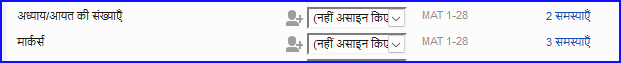

# 5. मूल जांच 1 {#584144d4a3454570845a09cb69b1318f}

**परिचय** इस मॉड्यूल में, आप दो तरीकों से अध्यायों/श्लोकों और चिह्नों की जाँच करेंगे: असाइनमेंट्स और प्रोग्रेस और प्रोजेक्ट मेनू (4a.चेकिंग) के माध्यम से।

**शुरू करने से पहले** आपको पहले ही पैराटेक्स्ट 9 में कुछ टेक्स्ट टाइप किया होना चाहिए अब आप जाँच शुरू करना चाहते हैं इस मॉड्यूल में हम पहली दो मूल जांचों के साथ शुरुआत करेंगे शेष जांचें [मूल जांच 2][ में कवर की गई हैं](/12.BC2)।

**यह महत्वपूर्ण क्यों है** ये जांचें आपको यह सुनिश्चित करने में मदद करती हैं कि आपके पास सभी अध्याय और श्लोक हैं और अन्य चिह्न सही हैं अध्याय/श्लोक जाँच पहले करना महत्वपूर्ण है क्योंकि अन्य सभी जांचें इस पर निर्भर करती हैं ये जांचें करने से आप मसौदा चरण को पूरा कर सकते हैं।

**आप क्या करने वाले हैं** आप दो अलग-अलग तरीकों से पहली दो मूल जांचें चलाने वाले हैं सबसे आसान तरीका है असाइनमेंट्स और प्रोग्रेस से जांचें चलाना हालांकि, यदि आप एक साथ एक से अधिक पुस्तक की जांच करना चाहते हैं तो आप प्रोजेक्ट मेनू **(टूल्स)** से भी जांच कर सकते हैं।

## 5.1 असाइनमेंट्स और प्रोग्रेस से जांचें चलाना {#28ad38164bcc4c688e8e4d2f4a392b64}

शेष जांचें [मूल जांच 2](/12.BC2) में कवर की गई हैं।

### **त्रुटियों को देखें और सही करें** {#8dab705513394c93b89c6f71228b4783}

1. अपनी प्रोजेक्ट विंडो के ऊपरी दाएं हिस्से में **नीले आइकन** पर क्लिक करके असाइनमेंट्स और प्रोग्रेस देखें।

1. यदि कोई "मुद्दे" (त्रुटियाँ) हैं, तो दाईं ओर नीले लिंक पर क्लिक करें

    

    - त्रुटियों की सूची के साथ एक विंडो प्रकट होती है।
2. सूची में एक पंक्ति पर डबल-क्लिक करें।
3. अपनी प्रोजेक्ट में त्रुटि सुधारें।
4. सूची में अगली पंक्ति पर डबल-क्लिक करें।
5. प्रत्येक त्रुटि के लिए यह प्रक्रिया जारी रखें।

### **पुष्टि करें कि त्रुटियाँ सही हो गई हैं** {#648ac1a433e748dd82299215b61cb8b3}

1. **पुनः चलाएँ** बटन पर क्लिक करें।
    - _परिणामों की सूची कोई शेष त्रुटियाँ दिखाती है।_
2. कोई भी त्रुटियाँ ठीक करें।
3. परिणाम सूची विंडो बंद करें (यदि इच्छित हो)।
4. **असाइनमेंट्स और प्रोग्रेस** पर वापस जाएँ।
5. चिह्नों की जांच से मुद्दों को दिखाने के लिए लिंक पर क्लिक करें।

:::tip

जब आप एक जांच के साथ समाप्त कर लेते हैं, तो कुछ लोग परिणाम सूची बंद करना पसंद करते हैं, जबकि अन्य इसे खुला रखना पसंद करते हैं, विशेषकर यदि यह आपकी विंडो लेआउट को बदलता है आप इसे किसी अन्य विंडो के टैब में भी ले जा सकते हैं।

:::

:::info

सबसे आसान तरीका है असाइनमेंट्स और प्रोग्रेस से जांचें चलाना

:::

## 5.2 मेनू से जांचें चलाना {#3d7c1c2bb72b412c84fa0be8315c0899}

असाइनमेंट्स और प्रोग्रेस से जांचें चलाना आसान है।

### अध्याय/ श्लोक {#ac301c02271b4d2cbe873464d1494925}

त्रुटियाँ ढूंढें

1. अपनी प्रोजेक्ट विंडो में क्लिक करें
2. **≡ टैब**, **टूल्स** के अंतर्गत \> **मूल जांचें चलाएं**
3. केवल **अध्याय/श्लोक संख्या** की जांच करें
4. अन्य जांचों को अनचेक करें
5. यदि आवश्यक हो, **चुनें...** पर क्लिक करें और जांच करने के लिए पुस्तकें चुनें
6. **ठीक** पर क्लिक करें
    - _त्रुटियों की सूची के साथ एक विंडो प्रकट होती है।_

### त्रुटियाँ सही करें {#2724585e15974d88b2f788b23d7711dc}

1. सूची में एक पंक्ति पर डबल-क्लिक करें।
2. अपनी प्रोजेक्ट में त्रुटि सुधारें।
3. सूची में अगली पंक्ति पर डबल-क्लिक करें।
4. सभी त्रुटियों के लिए यह प्रक्रिया जारी रखें।
5. सभी त्रुटियाँ सही होने की जांच के लिए **पुनः चलाएँ** बटन पर क्लिक करें।
6. परिणाम सूची विंडो बंद करें।

### चिह्नों की जांच {#b9296e794a82435ca258a466eb7c9ee4}

चिह्नों की जांच आपके टेक्स्ट में चिह्नों का एक अवलोकन प्रदर्शित करती है आप कुछ भी बदल नहीं सकते, लेकिन आप उन चिह्नों की खोज कर सकते हैं जो त्रुटियाँ हो सकती हैं।

1. **≡ टैब**, **टूल्स** के अंतर्गत \> **चेकिंग इन्वेंटरीज** फिर **मार्कर्स इन्वेंटरी**
    - _आपके टेक्स्ट में चिह्नों का एक अवलोकन दिखाते हुए सूची प्रदर्शित होती है।_
2. सूची में चिह्नों की समीक्षा करें (नीचे देखें)
3. चिह्न सूची बंद करें (यदि इच्छित हो)।
4. **≡ टैब**, **टूल्स** के अंतर्गत \> **मूल जांचें चलाएं**
5. **मार्कर्स** की जांच करें
6. **ठीक** पर क्लिक करें।
7. कोई भी त्रुटियाँ सही करें।

:::info

क्या देखना है जो चिह्न केवल कुछ बार आते हैं समान चिह्न \q और \q1 ऐसे चिह्न जो एक साथ आते हैं लेकिन उनकी गिनती समान नहीं होती (जैसे \f और \f*)।

:::

