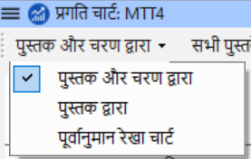

**परिचय** इस मॉड्यूल में, आप सीखेंगे कि कैसे कार्यों को पूरा करके अपनी प्रगति को अपडेट करना है। आप एक प्रगति रिपोर्ट भी बनाएंगे।

**शुरू करने से पहले** आप अपने अनुवाद पर काम कर रहे हैं और एक कार्य को पूरा कर चुके हैं। अब आप अपनी प्रगति को अपडेट करना चाहते हैं।

**यह महत्वपूर्ण क्यों है** असाइनमेंट्स और प्रोग्रेस को अच्छी तरह से काम करने के लिए, आपको उन कार्यों को चिह्नित करना होगा जिन्हें आपने पूरा किया है। इससे पैराटेक्स्ट 9 अन्य टीम सदस्यों के लिए अगला कार्य उपलब्ध करा सकता है। इससे पैराटेक्स्ट 9 अन्य टीम सदस्यों के लिए अगला कार्य उपलब्ध करा सकता है यह रिपोर्ट के लिए आपकी प्रगति पर पैराटेक्स्ट को सटीक जानकारी भी देता है। प्रगति रिपोर्ट बनाने से आपको अपने पर्यवेक्षकों और फंडर्स के लिए एक रिपोर्ट तैयार करने में मदद मिलती है।

**आप क्या करने वाले हैं** आप असाइनमेंट्स और प्रोग्रेस विंडो खोलेंगे और की गई प्रगति को अपडेट करेंगे।  इसके बाद आप एक रिपोर्ट तैयार करेंगे।

## 6.1 योजना की प्रगति को अद्यतन सुनिश्चित करें {#1baa7ce081654a3a9aa755bf4ebdfc4d}

1. असाइनमेंट्स और प्रोग्रेस खोलें (नीले बटन का उपयोग करके)
2. सभी कार्यों पर प्रगति अपडेट करें (प्रत्येक प्रकार के कार्य के निर्देशों के लिए [[3. Assignments and Progress](/3.PP1) for instructions on each type of task).

## 6.2 Change an assignment {#420f3c9ae4d6494d8246e72237cc8030}

:::caution

आप यह केवल तभी कर सकते हैं जब आपके पास **प्रगति अनुमतियां** हों।

:::

1. From the **≡ Tab**, under **Project** menu, select **Assignments and Progress…**
2. From the first drop-down list at the top left of the dialog, select **All Tasks**.
3. In the **Assigned to** column, use the drop-down list to choose who will have responsibility for the task or check (listed in the **Task/Check** column at the far left).

## 6.3 Produce a Project Health Report {#5164035c401f4b409f6e8addbc7d0167}

1. From the **Project** menu, select **Project Health Report…**.
2. रिपोर्ट करने के लिए प्रोजेक्ट(स) चुनें।
3. Click **OK**.
    - _The report will contain a column for each project you selected._

## **6.4 View team progress charts** {#6d88f283bc7643daa88084ac0d8a055f}

- From the **≡ Tab**, under **Project** menu, select **Progress charts…**

    

1. पहले ड्रॉपडाउन बॉक्स का उपयोग करके चार्ट का प्रकार चुनें।
2. आवश्यकतानुसार पुस्तकें चुनें।
3. प्रिंट आइकन पर क्लिक करें।
    - _A window opens_
4. Click the **Print** icon
5. अपना प्रिंटर (या PDF प्रिंटर) चुनें।
6. Click **OK**.
