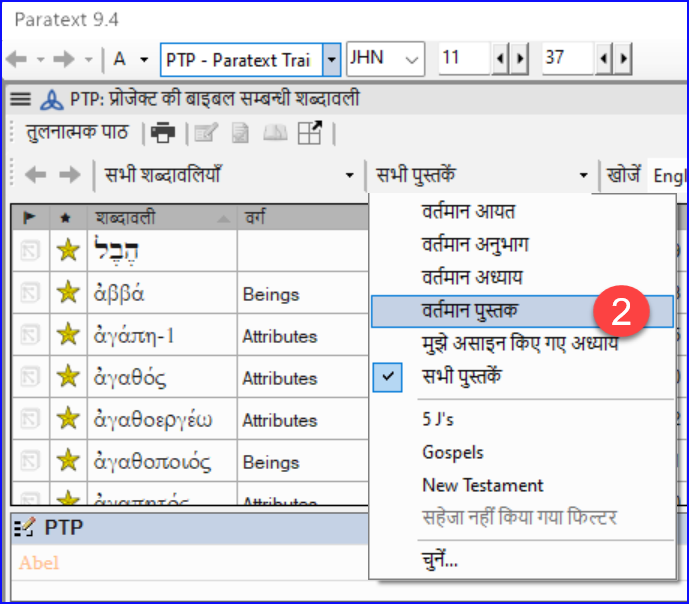
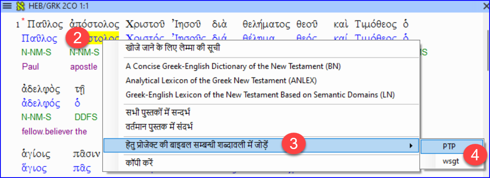

**परिचय** _बाइबल सम्बन्धी शब्दावली के प्रतिपादन_ विंडो और अलग _बाइबल सम्बन्धी शब्दावली_ टूल बहुत उपयोगी हैं ताकि आप शर्तों के प्रयोग में एकरूपता बनाए रखें, विशेषकर महत्वपूर्ण शर्तों में। कई किताबों में कई शर्तों के साथ, यह एक बड़ा कार्य बन सकता है। यह मॉड्यूल आपको आपके बाइबिल संबंधी शब्दों को ठीक एक जैसा बनाने के लिए चार आसान स्टेप्स समझाता है। आपको इस प्रक्रिया को जांच के बजाय अनुवाद प्रक्रिया का हिस्सा समझना चाहिए।

**शुरू करने से पहले** आप Paratext 9 में एक पद का अनुवाद कर रहे हैं, और आप देखना चाहते हैं कि इस पद के शब्दों के लिए आपने पहले से कौन से रेंडरिंग चुने हैं, और फिर यह सुनिश्चित करें कि वे अन्य पदों के साथ एकसमान हों।

**यह क्यों महत्वपूर्ण है** आपके पाठकों के लिए आपके पाठ को समझना, आपको शब्दों के उपयोग में एकसमान होना जरूरी है। इन्हें पूरी तरह से सुसंगत बनाना एक बड़ा काम है। यदि आप जिस पद्य का अनुवाद कर रहे हैं, वहीं से शुरू करें और वहीं से आगे बढ़ें तो कार्य अधिक आसान हो जाता है। इसका लक्ष्य यह है कि बाइबल की शर्तों का लगातार अनुवाद किया जाए और यह अच्छी तरह से प्रलेखित किया जाए कि आपने परिवर्तन क्यों किए।

**तुम क्या करने वाले हो** यह विधि चरणों की एक छोटी सूची तक सीमित है:

1. **[A]** उन सभी तरीकों को खोजें जिनसे आपने इस टर्म को रेंडर किया है, और उन्हें रेंडरिंग संवाद में दर्ज करें।
2. **[B]** चुनें कि कौन सा रेंडरिंग सबसे अच्छा है, और लिखें कि यह सबसे अच्छा क्यों है।
3. **[C]** दस्तावेज़ करें कि आपने अन्य रेंडरिंग को क्यों अस्वीकार कर दिया।
4. **[D]** अपने पूरे अनुवाद में इस रेंडरिंग को एकसमान बनाकर अपने अनुवाद को साफ़ करें। (सुसंगत बनाना, मानकीकृत करना, सामान्यीकृत करना, सामंजस्य स्थापित करना)।

- अगला बाइबिल शब्द ढूंढें और बाइबिल शब्द रेंडरिंग विंडो में फिर से करें।
- आप नए Paratext 9.4 फीचर का इस्तेमाल करके बाइबिल शब्दों की लिस्ट से शब्द निकालेंगे और अपने दोस्तों के साथ शेयर करेंगे।

## 10.1 बाइबिलिकल टर्म्स वाली विंडो खोलें {#f8f57567e6ff4b9193367abfbee7302a}

1. अपनी प्रोजेक्ट विंडो में क्लिक करें
2. ≡ टैब, उपकरण > बाइबिल शब्दों की रेंडरिंग के तहत
3. **≡ टैब** (नई विंडो का), **बाइबल संबंधी शब्दावली** के अंतर्गत > **बाइबल संबंधी शब्दावली सूची का चयन करें**
4. इच्छित सूची चुनें
5. **ओके** पर क्लिक करें.

## 10.2 A: यह शर्तें रेंडरिंग के सारे तरीके खोजें {#df4c8121b667426ca013ce2feace7348}

### वर्तमान आयत के लिए शर्तें खोजें {#3ffdc542c5f84c369b2c4cdfcc8569e1}

- क्या आपको मिला कॉलम में टिक मार्क है?
- अगर टिक मार्क है, तो आपके श्लोक में यह शब्द है, और आप अगले शब्द पर जा सकते हैं।
- अगर नहीं, तो आपको या तो अपने टेक्स्ट को ठीक करना होगा या नया शब्द जोड़ना होगा जो आपने इस्तेमाल किया है (नीचे देखें)।

### एक और रेंडरिंग जोड़ें {#dae5da6bfb1b40c99e9eb4f0c7fe1f06}

अगर आपने जो शब्द इस्तेमाल किया है वह सूची में नहीं है, तो आप उसे जोड़ सकते हैं:

1. अपने टेक्स्ट में शब्द का रेंडरिंग चुनें।

2. इसे कॉपी करें (**Ctrl**+**C**)

3. बाइबिल संबंधी शर्तें रेंडरिंग विंडो के रेंडरिंग सेल में डबल-क्लिक करें।
  - _रेंडरिंग संपादन संवाद प्रदर्शित होता है_.

4. रेंडरिंग को डायलॉग बॉक्स में चिपकाएँ (**Ctrl**+**V**)।

5. **ओके** पर क्लिक करें.

### वर्तमान पुस्तक में उसी बाइबल शब्द वाले अन्य छंद खोजें {#bbdc4762638048adb945ccfff0f3c9e3}

बाइबिल संबंधी शब्दों के प्रतिपादन विंडो में

1. **टर्म** कॉलम में किसी शब्द पर डबल-क्लिक करें
  - _बाइबल सम्बन्धी शब्दावली टूल खुलता है_

2. दूसरे फ़िल्टर बटन से **वर्तमान पुस्तक** चुनें.

3. आयतों में शब्दों के अनुवाद तब तक जोड़ते रहें जब तक कि आप उन सभी आयतों में शब्दों की पहचान न कर लें (नीचे देखें)।

### अन्य आयतों से रेंडरिंग जोड़ें {#a5212cc460da4fabb7cb3db81d405280}

1. पद्य में प्रस्तुतीकरण का चयन करें
2. **Ctrl**+**A** का उपयोग करके रेंडरिंग जोड़ें
3. तब तक जारी रखें जब तक आप उन सभी श्लोकों में प्रयुक्त शब्दों को पहचान न लें।

### उन आयतों से निपटना जो इस शब्द का उपयोग नहीं करती {#3867de64e3064e85a08eed2cdab64dad}

:::tip

कई बार ऐसा होता है कि किसी श्लोक का अनुवाद वास्तविक शब्द का प्रयोग किए बिना ही कर दिया जाता है। उदाहरण के लिए, जब आप सर्वनाम का प्रयोग करते हैं। इस मामले में आपको यह अस्वीकार करना होगा कि यह एक त्रुटि है।

:::

- आयत संदर्भ लिंक के बाएँ में लाल क्रॉस पर क्लिक करें
  - _लाल क्रॉस हरे टिक में बदल जाता है जिसमें एक छोटा लाल x होता है_

:::caution

यदि आप गलती से क्रॉस पर क्लिक कर देते हैं, तो हरे टिक पर क्लिक करें और यह लाल क्रॉस पर वापस आ जाएगा।

:::

## 10.3 B: सबसे अच्छे शब्द की पहचान करें {#55582923eae649c9964c1e0068ec29ac}

1. शीर्ष फलक में शब्द पर डबल-क्लिक करें।
  - _संपादन रेंडरिंग संवाद प्रदर्शित होता है जिसमें सभी रेंडरिंग शामिल होती हैं जिन्हें आपने जोड़ा है।_

    

2. सर्वोत्तम रेंडरिंग का निर्णय लें

3. चुनें, फिर काटें (**Ctrl**+**x**) और इसे संवाद बॉक्स के शीर्ष पर चिपकाएँ (**Ctrl**+**v**)

4. समान रेंडरिंग को संयोजित करने के लिए आवश्यकतानुसार \* जोड़ें

:::tip

आप \* का प्रयोग कई अलग-अलग तरीकों से कर सकते हैं: उपसर्गों के लिए शब्द से पहले और प्रत्ययों के लिए शब्द के बाद। आप किसी शब्द के बीच में \* भी लगा सकते हैं। \* का उपयोग करने के अधिक तरीकों के लिए मार्गदर्शिका देखें।

:::

## 10.4 C: सभी अन्य को अस्वीकार करें {#91a3dcb7525c41919b79cdc020e1ca63}

- अन्य रेंडरिंग का चयन करें और काटें।

## 10.5 D: परिवर्तन का कारण दस्तावेज करें {#c70df72e555f44d4a73cd41076bd8718}

- **इतिहास** बटन पर क्लिक करें

- कारण लिखें कि आपने क्यों अन्य को अस्वीकार किया और पहला क्यों सबसे अच्छा था।

- **ओके** पर क्लिक करें।

### यदि आपको एक से अधिक रेंडरिंग की आवश्यकता है {#7efa68af7a544631bf7f24302fa0449e}

:::tip

यदि उपयुक्त हो तो आप एक से अधिक रेंडरिंग जोड़ सकते हैं। अनुवाद के बाद कोष्ठक में पिछला अनुवाद जोड़ना अच्छा रहता है। उदाहरण के लिए,
गुलाम (गुलाम)
आदमी \* काम के लिए (वह आदमी जो काम करता है)

:::

1. रेंडरिंग संपादित करें संवाद बॉक्स खोलें
2. आवश्यकतानुसार रेंडरिंग को संपादित करें।

### अन्य पुस्तकों को साफ करें (जैसा समय अनुमति देता है) {#ad15f3d2b6c24b35a1bb0ef7a8c04731}

1. फ़िल्टर बदलें ताकि सभी प्रकाशित पुस्तकें प्रदर्शित हों.
2. आवश्यकतानुसार छंदों को साफ़ करें।

### बाइबिल शब्दों के नोट्स जोड़ें — चल रही चर्चा {#90110e260d7c40ca81c55c8e3604926b}

1. नोट आइकन पर डबल-क्लिक करें (दूसरे कॉलम में)

  

2. नोट टाइप करें

3. आवश्यकतानुसार नोट आवंटित करें।

4. **ओके** पर क्लिक करें.

### रेंडरिंग का वर्णन में निर्णय जोड़ें {#1d89b36b75b14ab2a712924ef0e101e5}

1. शब्द पर डबल-क्लिक करें

2. विवरण क्षेत्र में सहमत रेंडरिंग टाइप करें

3. **ओके** पर क्लिक करें।

## 10.6 एक शब्द जोड़ें – स्रोत भाषा के पाठ से {#1ec5422db83c4bdeb51842a53f7df352}

:::tip

आप किसी विशिष्ट यूनानी/हिब्रू शब्द के लिए छंदों की एक सूची बना सकते हैं और फिर उस सूची का उपयोग करके उस शब्द/वाक्यांश को अपनी परियोजना की बाइबिल संबंधी शब्दों की सूची में जोड़ सकते हैं।

:::

1. स्रोत पाठ वाली विंडो पर क्लिक करें।

  

2. स्रोत भाषा पाठ विंडो में लेम्मा (नीला शब्द) पर राइट-क्लिक करें

3. **परियोजना बाइबिल शब्दों के लिए जोड़ें** चुनें

4. फिर अपना प्रोजेक्ट चुनें

5. यदि आवश्यक हो तो चमक संपादित करें

6. **उन्नत** टैब पर क्लिक करें

7. यदि आवश्यक हो तो शर्तों को संपादित करें

8. **ओके** पर क्लिक करें।

### नया शब्द देखें {#f269fc949f124cd5b1b68bb9a60766ad}

1. **बाइबिल शब्द उपकरण** में बदलें
2. शब्द पर डबल-क्लिक करें.

## 10.7 एक शब्द जोड़ें – संदर्भ पाठ खोज से {#f683ccf4cdcf45f09c516c09c78ab277}

:::tip

आपकी भाषा और संस्कृति के लिए महत्वपूर्ण कुछ शब्द भी होंगे जो सूची में नहीं होंगे। आप इन शर्तों को अपनी परियोजना सूची में जोड़ सकते हैं।

:::

पैराटेक्स्ट में

- अपने संदर्भ पाठ से, एक खोज करें (**≡ टैब** का उपयोग करके, **संपादित करें** &gt; **खोजें** के अंतर्गत) और शब्द खोजें।
  - _एक सूची प्रदर्शित होती है जिसमें उस शब्द के साथ आयतें दिखाई जाती हैं।_

परिणामों की सूची से

1. **≡ टैब**, **संपादित करें** के अंतर्गत > **परियोजना बाइबिल शब्दों में जोड़ें**, फिर अपनी परियोजना चुनें

2. यदि आवश्यक हो तो चमक संपादित करें

3. **उन्नत** टैब पर क्लिक करें

4. शब्द के लिए एक नाम टाइप करें

5. **ओके** पर क्लिक करें।

## 10.8 बाइबिल शब्दों की सूची साझा करें (वैकल्पिक) {#b6ca108e1c374004b5acb581e61ebecc}

:::info अपग्रेड

In Paratext 9.4, you can import or export terms from a Biblical Terms list. फिर आप उस निर्यातित सूची को अपने टीम सदस्यों के साथ साझा कर सकते हैं। यहाँ एक अवलोकन है। For more details, watch [What’s New in Paratext 9.4 Biblical Terms](https://vimeo.com/858020833)

:::

1. **परियोजना ≡** से, **बाइबिल शब्द** खोलें
2. इच्छित शब्द चुनें या फ़िल्टर करें
3. **≡ टैब** से, **फ़िल्टर्ड बाइबिल शब्द निर्यात करें** चुनें
4. फ़ाइल का एक नाम टाइप करें
5. फ़ाइल को किसी सहकर्मी के साथ साझा करें.
6. वे साझा सूची खोल सकते हैं, **≡ टैब**, बाइबिल शब्द उपकरण में **फ़िल्टर्ड बाइबिल शब्द सूची आयात करें** चुनें।
