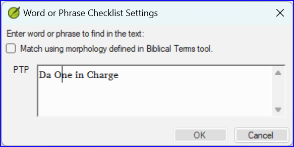
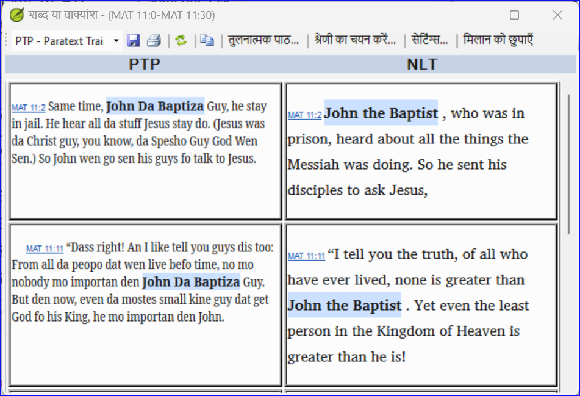
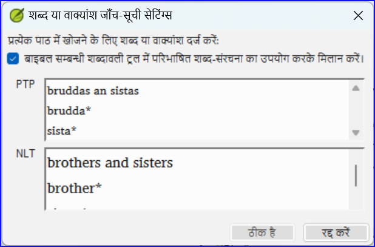
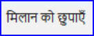
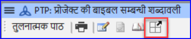
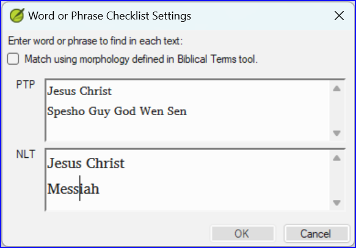

**परिचय**  इस मॉड्यूल में, आप एक परियोजना में एक शब्द या वाक्यांश की खोज करेंगे और उसे दूसरे परियोजना में उस शब्द या वाक्यांश के अनुवाद के साथ तुलना करेंगे।

**यह महत्वपूर्ण क्यों है?**  Paratext 9 (और उसके ऊपर) में, आप एक परियोजना में एक शब्द या वाक्यांश की खोज कर सकते हैं और इसे एक या अधिक अन्य परियोजनाओं में समरूप शब्द या वाक्यांश के साथ तुलना कर सकते हैं। उदाहरण के लिए, आप "roi" की खोज कर सकते हैं जो एक फ्रेंच परियोजना में मिलता है और इसे एक स्पेनिश परियोजना में "rey" के साथ तुलना कर सकते हैं।

आप करोगे

- टेक्स्ट और बाइबिल टर्म्स टूल दोनों से चेकलिस्ट "शब्द या वाक्यांश" का उपयोग करें।
- सेटिंग्स और तुलनात्मक पाठों में परिवर्तन करना होगा
- उस शब्द या वाक्यांश को लिखिए जिसकी तुलना आप प्रत्येक परियोजना के लिए करना चाहते हैं

## 11.1 पाठ से एक शब्द या वाक्यांश की तुलना करें {#659828b2f3ee4616a7b10dd9380b9ce2}

:::tip

आपकी पहली तुलना काम नहीं करेगी क्योंकि अभी तक कोई तुलनात्मक पाठ चुने नहीं गए हैं। आपको तुलनात्मक पाठों को सेट करने से पहले एक शब्द खोजने के लिए टाइप करना होगा।

:::

1. उस परियोजना पर क्लिक करें जिसे आप तुलना करना चाहते हैं

2. **≡ टैब** के अंतर्गत **टूल्स** प्राप्त करें, **चेकलिस्ट** चुनें, और **शब्द या वाक्यांश** का चुनाव करें।

3. प्रत्येक परियोजना के डायलॉग में वाक्यांश के टेक्सटबॉक्स में उस शब्द या वाक्यांश को दर्ज करें जिसे आप देखना चाहते हैं

4. **OK** पर क्लिक करें

   - _एक विंडो प्रदर्शित होती है_.

### तुलना करने के लिए पाठ चुनें {#1b10fbeee1314150907b71b710e97dbd}

1. **तुलनात्मक पाठ** पर क्लिक करें…

2. वह पाठ चुनें जिसे आप तुलना करना चाहते हैं और **OK** पर क्लिक करें।
    - _**समायोजन** डायलॉग प्रदर्शित होता है_

### तुलना करने के लिए शब्द या वाक्यांश टाइप करें {#ed9ce5e42eee4988945547297f12b1e0}

1. प्रत्येक परियोजना के लिए टेक्सटबॉक्स में वह शब्द या वाक्यांश टाइप करें जिसे आप तुलना करना चाहते हैं

2. ओके पर क्लिक करें

    - _एक विंडो प्रदर्शित होती है जिसमें टूलबार पर **मिलान छिपाएँ** बटन होता है।_

:::tip

आप **मिलान छिपाएँ** बटन का उपयोग केवल उन संदर्भों को दिखाने के लिए कर सकते हैं जहां अंतर होते हैं। शब्द या वाक्यांश हल्के नीले रंग में होता है।

:::

## 11.2 बाइबलिकल टर्म्स टूल से एक शब्द या वाक्यांश का उपयोग करके तुलना करें {#14e18bd78f934875aa5084b16c1d7269}

### बाइबलिकल टर्म्स टूल में {#20feff24077248faa227e0c7cdef2fec}

1. ऐसा शब्द चुनें जिसमें प्रतिपादन हो

2. टूल आइकन पर क्लिक करें

    - _समायोजन डायलॉग प्रदर्शित होता है जिसमें रेंडरिंग भरी हुई होती है।_

3. अन्य परियोजनाओं के लिए शब्द या वाक्यांश टाइप करें

4. **ओके** पर क्लिक करें।

:::tip

यदि आप एक समय में एक से अधिक शब्द या वाक्यांश की तुलना करना चाहते हैं, तो प्रत्येक शब्द या वाक्यांश के बाद **एंट्रर** दबाएँ ताकि वे अलग-अलग लाइनों पर हों।

:::

