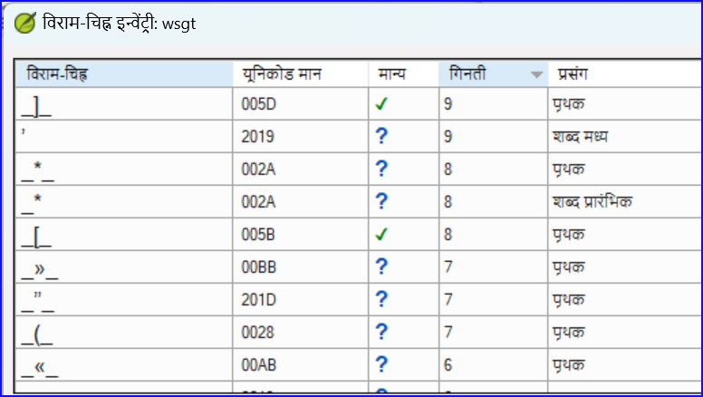

**परिचय** इस मॉड्यूल में, आप कई अन्य बुनियादी जांच (**अक्षर**, **करना सीखेंगे विराम चिह्न**, **बड़े अक्षर**, और **दोहराए गए शब्द**। जैसा कि पहले मूल जाँच मॉड्यूल (5 में। [बेसिक चेक 1](https://sillsdev.github.io/paratext-manual/5.BC1)), इन चेक को असाइनमेंट और प्रोग्रेस से चलाना सबसे आसान है। हालाँकि, यदि आप कई पुस्तकों की जाँच करना चाहते हैं, तो आपको **टूल्स** मेनू का उपयोग करना होगा।

**शुरू करने से पहले** आपने अपने अनुवाद को पैराटेक्स्ट 9 में टाइप किया है। सुनिश्चित करें कि आपने अध्याय/आयत की संख्याएँ और मार्कर्स की जांच की है, जैसा कि 5 में वर्णित है। 5.BC1 जारी रखने से पहले बुनियादी जांच 1, और यह कि आपके व्यवस्थापक ने या तो जांच का सेटअप पूरा कर लिया है या आपके पास है अभी सेटअप करने के लिए.

**यह महत्वपूर्ण क्यों है?** पैराटेक्स्ट 9 में ग्यारह **बुनियादी जांच** हैं। आपने पहले दो को पहले ही देख लिया है, अध्याय/आयत की संख्याएँ और मार्कर्स। यह मॉड्यूल आपको अक्षरों, विराम चिह्नों, बड़े अक्षरों और दोहराए गए शब्दों से संबंधित त्रुटियों को खोजने में मदद करेगा हालांकि ये त्रुटियाँ पाठ की सामग्री को प्रभावित नहीं कर सकतीं, इन्हें सही करने से पाठ पढ़ने में आसान हो जाता है

**What we are going to do:**  Most of the checks require that your administrator has completed an inventory. In this module you will

- Confirm that someone has done the setup (or have the administrator do the setup)
- do the Basic Checks
- correct any errors.

## 12.1 Confirm the setup {#96b5c12dac164c719816a72af9b6bdea}

Before you can run these other basic checks, someone must setup the check. Some checks require an inventory others require rules or settings.

:::caution

You can do most of the inventories, but **only your Administrator** can do the rules or settings.

:::

## 12.2 Using inventories to setup {#2af0f49b3c8248368dd82611ad6daed7}

:::tip

These inventories show what is currently in your text, that is, both the good and the bad. You need to work through the inventory and tell Paratext 9 which elements are correct (valid) and which are errors (invalid).

:::

Once you have finished the inventory you will be ready to do the check.

1. From the **≡ Tab**, under **Tools** &gt; **Checking inventories** menu, choose the appropriate inventory (for example Character inventory).
2. Click on an item in the list in the top pane.
    - _The verses are shown in the bottom pane._
3. For each item in the top pane, choose either **Valid** or **Invalid**.
4. Repeat for each item.
5. **ओके** पर क्लिक करें।

:::tip

Instead of using the mouse, you can use **Ctrl** + **y** to mark an entry as **Valid** or **Ctrl** + **n** to mark an entry as **Invalid**.

:::

## 12.3 Characters {#62a1b14481984178905fe3720ad81e98}

:::tip

This check (and inventory) helps you identify all the incorrect characters, i.e. the characters that are not in your alphabet (as defined in the language settings **≡** Tab, under **Project Properties** \&gt; **Language Settings** \&gt; **Alphabetic characters**.

:::

### सेटअप आवश्यक है {#e87d6701d2f546faa45b5584b3b45d3a}

1. **≡ Tab**, under **Tools** &gt; **Checking inventories** &gt; **Character inventory**
2. For each item, choose **Valid** or **Invalid**.

:::caution

If one of your alphabetic characters is currently "Unknown", then that your Administrator should add the character to your language settings by the administrator.

:::

### जाँच {#26d95e0dcad04a3a99dff3ea83702c82}

**≡ Tab**, under **Tools**&gt; **Run Basic Checks**

1. **अक्षर** की जाँच करें
2. **ओके** पर क्लिक करें।
    - _A list of errors is displayed._
3. आवश्यकतानुसार सुधार करें।

## 12.4 Punctuation {#7a03d8fd1d3d4de38e992c7820f94bc7}

:::tip

This check (and inventories) helps you identify all the incorrect or misplaced punctuation marks. (Use the Unicode character column to clearly identify the punctuation.)

:::

### सेटअप आवश्यक है {#21350c0dd462479184cc36dc9fc50d24}

1. **≡ Tab**, under **Tools** &gt; **Checking inventories** &gt; **Punctuation Inventory**
2. Check each punctuation mark in its context.
    - The contexts can be:
        - **word initial**, **word medial**, **word final** or **isolated**
    - For each punctuation in its context,
        - choose **Valid** or **Non valid** or leave as **Unknown**

        

3. When finished click **OK**.
4. **≡ Tab**, under **Tools** &gt; **Checking inventories** &gt; **Markers Missing Final Sentence Punctuation**
5. For each item, choose **Valid** or **Invalid**.

### जाँच {#a24bedcb31944326a9c14889a7bf5a29}

1. **≡ टैब**, **टूल्स** के अंतर्गत \> **मूल जांचें चलाएं**
2. Check **Punctuation**
3. **ओके** पर क्लिक करें।
    - _त्रुटियों की एक सूची प्रदर्शित होती है।_
4. आवश्यकतानुसार सुधार करें।

## 12.5 Matched Pairs {#829c1d30e9d044ce9808a2a1c3ce63fd}

### सेटअप आवश्यक है {#458176d1cea940d5aa50db2af73cf078}

1. **≡ Tab**, under Tools &gt; **Checking inventories** &gt; **Unmatched pairs of punctuation**:
2. If the list is empty, then there are no errors with these pairs of characters.
3. If necessary, click **Options…** to add other pairs

### जाँच {#b1cbb995508b4d5eb82eec2f09af40ec}

1. **≡ टैब**, **टूल्स** के अंतर्गत \> **मूल जांचें चलाएं**
2. Check **Unmatched pairs of punctuation**
3. **ओके** पर क्लिक करें।
    - _A list of errors is displayed._
4. Make any corrections as needed.

## 12.6 Repeated words {#17ce3bddd4ed49c4afaceb8f4b874e20}

:::info

This check is to identify words that have been repeated in the text. यह एक त्रुटि का संकेत हो सकता है, लेकिन आवश्यकता नहीं है।

:::

### सेटअप की आवश्यकता है {#9d08869684634685aa5a788e974cda3e}

1. **≡ Tab**, under **Tools** &gt; **Checking inventories** &gt; **Repeated words inventory:**
2. For each item, choose **Valid** or **Invalid**.

### जाँच {#ef2ea7921ac94cbca127e812b46341dc}

1. **≡ टैब**, **टूल्स** के अंतर्गत \> **मूल जांचें चलाएं**
2. Check **Repeated words**
3. **ओके** पर क्लिक करें।
    - _त्रुटियों की एक सूची प्रदर्शित होती है।_
- आवश्यकतानुसार किसी भी सुधार करें।

## 12.7 कैपिटलाइज़ेशन {#7f4309ed10a44e7cae14a3c07da88d72}

:::info

कैपिटलाइज़ेशन जाँच कई प्रकार की कैपिटलाइज़ेशन समस्याओं की तलाश करता है. कैपिटलाइज़ेशन के लिए तीन इन्वेंट्री हैं, लेकिन केवल एक जाँच है। You may need to click on the **Options** button to add markers or punctuation.

:::

### **सेटअप आवश्यक है** {#4ffe45925e6249d19d3c3d98f5a2a6eb}

1. **≡ Tab**, under **Tools** &gt; **Checking inventories** &gt; **Markers followed by a lower case letter**
2. For each item, choose **Valid** or **Invalid**.
3. **≡ Tab**, under **Tools** &gt; **Checking inventories** &gt; **Punctuation Followed by a Lower Case letter**
4. For each item, choose **Valid** or **Invalid**.
5. **≡ Tab**, under **Tools** &gt; **Checking inventories** &gt; **Mixed Capitalization**
6. If you have lowercase prefixes, click **Options** and enter the details.
7. For each item, choose **Valid** or **Invalid**.

### **जाँच** {#491e80502e594776829f3545b770e886}

1. **≡ टैब**, **टूल्स** के अंतर्गत \> **मूल जांचें चलाएं**
2. Check **Capitalization**
3. **ओके** पर क्लिक करें।
    - _A list of errors is displayed._
4. Make any corrections as needed.

## 12.8 Making minor corrections {#69410b6613db4a8b8cba359728e2caf1}

:::caution

It is possible to make minor corrections from within a displayed inventory. However, if there are several errors it is best to run the check to make the corrections.

:::

1. Click on a verse in the lower pane
2. Hold the **Shift** and double-click
3. Make the correction
4. **ओके** पर क्लिक करें।

:::caution

In some cases, it is preferable to use the Wordlist or the spell checker to correct several errors at once.

:::

### **समीक्षा** {#555ab76059a54d4689dd06ae94ccb00c}

There are many basic checks in Paratext 9. The table below summarizes the setup needed for each of the checks.

| **जाँच**                       | **सेटअप**                                                                                                                |
| ------------------------------ | ------------------------------------------------------------------------------------------------------------------------ |
| अध्याय/आयत की संख्याएँ         | कुछ नहीं                                                                                                                 |
| मार्कर्स                       | none. (Marker inventory displays all current markers)                                                                    |
| अक्षर (संयोजन)                 | अक्षर इन्वेंट्री...                                                                                                      |
| विराम-चिह्न                    | Punctuation inventory Markers Missing Final Sentence Punctuation                                               |
| कैपिटलाइज़ेशन                  | 3 inventories Markers followed by a lower case letter; Punctuation Followed by a Lower Case letter; Mixed Capitalization |
| दोहराए हुए शब्द                | Repeated words inventory                                                                                                 |
| विराम-चिन्ह के बेजोड़ जोड़े... | Unmatched pairs of punctuation inventory                                                                                 |
| उद्धरण                         | **≡ Tab**, under **Project Setting** > **Quotation rules**                                                               |
| संख्या                         | **≡ Tab**, under **Project Setting** > **Number settings**                                                               |
| रेफरेन्सस                      | **≡ Tab**, under **Project Setting** > **Scripture reference settings**                                                  |
| Footnotes Quotes               | कुछ नहीं                                                                                                                 |

:::caution

It is possible to run all the checks at the same time, however when running the checks for the first time it is better to run them one at a time to avoid large list of errors.

:::

