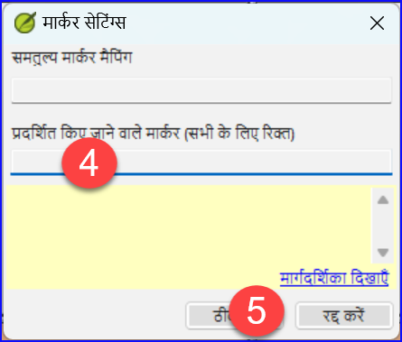
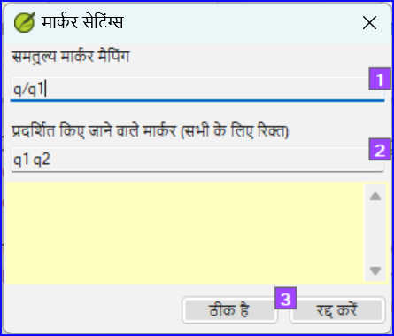

**परिचय**  इस मॉड्यूल में, आप प्रारूपण और लेआउट त्रुटियों को खोजें और सही करेंगे।

**शुरू करने से पहले**  आपने अपने ड्राफ़्ट को पैराटेक्स्ट में एक प्रोजेक्ट में टाइप किया है। आप जाँच-सूची का उपयोग करेंगे ताकि आप स्वरूपण और लेआउटस त्रुटियों से संबंधित त्रुटियों को खोजें और सही करें।

**यह क्यों महत्वपूर्ण है** एक नया नियम केवल अध्यायों और आयतों से अधिक है। वहाँ टाइटल, सेक्शन हेडिंग्स, और कई प्रकार के पैराग्राफ भी हैं। ये जांचें आपको यह सुनिश्चित करने की अनुमति देती हैं कि आपके पाठ का लेआउट सही है और आपके शीर्षक आदि समान रूप से संगत हैं।

**तुम क्या करने वाले हो?**  तुम जाँच-सूची का उपयोग करोगे

- अपने शीर्षक और अनुभाग शीर्षकों की तुलना करें
- अपने पैराग्राफ विराम जाँचें
- अपने पाठ में चरणचिन्हों की तुलना संदर्भ पाठ के साथ करें
- विशेष पाठ स्वरूपण के लिए मार्कर्स जोड़ें।

## 13.1 जाँच-सूची का उपयोग - सामान्य {#ab06f030df1d407db09305cfb4731d3d}

:::caution

कई जाँच-सूचियाँ हैं जो थोड़ी अलग हैं लेकिन उनके निम्नलिखित समानताएँ हैं:

:::

**जाँच-सूची कैसे प्रदर्शित करें**

- **≡ टैब**, **टूल्स** > **जाँच-सूची** > इच्छित सूची चुनें
- Add a comparative text (if desired) by clicking on the **Comparative text** button
- आवश्यकतानुसार आयत/पुस्तकों का चयन करें **श्रेणी का चयन करें** का उपयोग करके

**सुधार करना**

- क्लिक करें संपादित करें लिंक को किसी भी त्रुटि को सही करने के लिए
- संदर्भ लिंक पर क्लिक करें ताकि आप अधिक सन्दर्भ देख सकें

**सूची को बंद करें**

- जब आप सूची के साथ समाप्त कर लें, तो विंडो के ऊपर दाहिने कोने में X पर क्लिक करके इसे बंद करें।

## 13.2 जाँच-सूची का उपयोग – अनुभाग शीर्षक {#3bb3fb489ec245438ee65525a4671432}

- **≡ टैब**, नीचे > **टूल्स** > **जाँच-सूची** > **खंड शीर्षक**

जाँचें कि

- शीर्षक आपके संदर्भ पाठ (लंबाई, व्याकरण, शैली) के अनुरूप हैं
- सारे शीर्षक कैपिटल से प्रारंभ होते हैं
- अंत में कोई विराम-चिह्न नहीं है
- वे बहुत लंबे नहीं हैं

## 13.3 पैराग्राफ विराम {#4beb41c77b7b41588a954c89f01a44d6}

1. **≡ टैब**, **टूल्स** > **जाँच-सूची** > **मार्कर्स**

2. अपने संदर्भ पाठ को **तुलनात्मक पाठ** के रूप में चुनें

3. **सेटिंग्स** पर क्लिक करें

4. प्रदर्शित करने के लिए पैराग्राफ मार्कर टाइप करें
   (उदाहरण के लिए, p m)

5. **ओके** पर क्लिक करें.

6. नीले **संपादित करें** लिंक पर क्लिक करके कोई भी सुधार करें।

या

1. नीले **आयत संदर्भ** लिंक पर क्लिक करें।
2. पैराटेक्स्ट में कोई भी सुधार करें।
3. टास्कबार पर आइकन पर क्लिक करके जाँच-सूची पर लौटें।

## 13.4 लेआउटस और इन्डेंट्स {#17698276f8084544a20d3d426679de1d}

1. **≡ टैब**, **टूल्स** > **जाँच-सूची** > **मार्कर्स**
2. अपने संदर्भ पाठ को तुलनात्मक पाठ के रूप में चुनें
3. **सेटिंग्स** पर क्लिक करें

- मार्कर्स को जाँचने के लिए टाइप करें।

- **ओके** पर क्लिक करें.

- ऐसे अनुच्छेदों की तलाश करें जिन्हें विभिन्न मार्कर्स जैसे कि q1 और q2 के साथ प्रारूपित किया गया है

- कोई आवश्यक परिवर्तन करें (नीचे देखें)।

## 13.5 विशेष पाठ प्रारूप फ़ॉर्मेट करने के लिए USFMs जोड़ें {#2fed410218164e21834d0949e5ab3c07}

- विशेष प्रारूप वाले अनुच्छेदों की सूची देखें [अनुबंध A](https://manual.paratext.org/Training-Manual/Appendix/A.st)।
- आवश्यकतानुसार USFM को जोड़ें (यदि आवश्यक हो तो मॉड्यूल KD या सहायता देखें).
