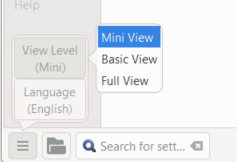

**परिचय** इस मॉड्यूल में आप सीखेंगे कि अपनी अनुवाद का ड्राफ़्ट कैसे प्रिंट करें और उसकी जाँच और संशोधन कैसे करें।

\*\* आपके शुरू करने से पहले \*\*   आपने पैराटेक्स्ट 9 में अपनी अनुवाद को दर्ज किया और जाँच की है और अब कॉपी प्रिंट करने के लिए तैयार हैं। पैराटेक्स्ट 9.4 में, आपका प्रोजेक्ट प्रिंट करने से पहले पंजीकृत होने की आवश्यकता नहीं है।

**यह क्यों महत्वपूर्ण है**  आपका काम कागज़ पर संशोधित करना और जांचना कंप्यूटर से बहुत आसान है। आप इसे और लोगों को भी दे सकते हैं अगर यह कागज पर है।

**तुम क्या करने वाले हो** तुम सबसे पहले अपनी अनुवाद का एक PDF संस्करण प्रदर्शित करोगे, जिसे तुम प्रिंट कर सकते हो या दूसरों के साथ (जिनमें Paratext उपयोगकर्ता शामिल नहीं हैं) साझा कर सकते हो। यदि आवश्यक हो, तो आप PDF फ़ाइल को अपनी USB स्टिक पर कॉपी कर सकते हैं और इसे एक कंप्यूटर पर ले जा सकते हैं जिसमें प्रिंटर हो।

:::info पैराटेक्स्ट 9.4 को अपग्रेड करें

**PTXPrint** ने पिछली ड्राफ़्ट PDF को बदल दिया है। अगर यह इंस्टॉल नहीं है, तो यह पहले आपको इसे डाउनलोड करने और इंस्टॉल करने के लिए कहेगा। PTXPrint बहुत शक्तिशाली है और इसमें कई विकल्प हैं। हम अनुशंसा करते हैं कि आप Mini View का उपयोग करें।

:::

## 14.1 अपनी पहली PDF फ़ाइल बनाएँ {#f6c39f92a81d44aead7aa92c0f6bb317}

:::caution

ड्राफ़्ट को प्रिंट करने से पहले सुनिश्चित करें कि आपने **मार्कर्स जाँच** पूरी कर ली है।

:::

1. **≡ टैब**, **प्रोजेक्ट** > **ड्राफ्ट पीडीएफ निर्यात करें** **(पीटीएक्स प्रिंट)** के अंतर्गत
2. नीचे बाईं ओर, **मेन्यू बटन** पर क्लिक करें
3. क्लिक करें **देखें स्तर >**  **मिनी व्यू**
4. साइडबार के ऊपर बाईं ओर **मूल** पर क्लिक करें
5. जाँचें कि आपका प्रोजेक्ट चयनित है।
6. **या तो** **एकल पुस्तक** चुनें, फिर पुस्तक और अध्याय चुनें
7. **या** यदि आप अपनी प्राथमिकता या एक से अधिक पुस्तकें प्रिंट करना चाहते हैं, तो **विभिन्न हिस्से या एकाधिक पुस्तकें** चुनें और संदर्भों को मैन्युअल रूप से दर्ज करें।

### पृष्ठ सेटिंग्स को निम्नलिखित चुनें {#ff7614d604f1485c8c6c4de117939575}

1. बाएँ साइड पैनल पर **लेआउट** पर क्लिक करें। पृष्ठ सेटिंग्स को निम्नलिखित चुनें
2. पृष्ठ आकार:
   - 210 मिमी, 297 मिमी (A4) या
   - 148mm, 210mm (A5)
3. आवश्यकतानुसार **मूल फ़ॉन्ट आकार** समायोजित करें (आमतौर पर 11pt)
4. **मूल लाइन स्पेसिंग** को समायोजित करें (एकल स्पेसिंग फ़ॉन्ट का 120% है)
5. **दो कॉलम लेआउट** बंद करें

### पाठ के लिए फ़ॉन्ट चुनें {#2f450c521a5a46e69f24dc8ef01b4262}

1. बाएँ साइडबार पर **फॉन्ट्स+स्क्रिप्ट्स** पर क्लिक करें
2. पाठ के फ़ॉन्ट (नियमित) का चयन करें: Charis SIL (या Charis SIL Compact)
3. आकार: 10 (या 11)

### प्रिंट करें (PDF में ड्राफ्ट निर्यात करें) {#bcd83f846ef549d2ac75fcb83c8df8e6}

1. **प्रिंट (PDF बनाएं)** बटन पर क्लिक करें
2. इंस्टॉल PDF में ड्राफ्ट निर्यात करें
   - PDF आपके डिफ़ॉल्ट PDF प्रोग्राम में खुलता है।

### आगे कोई परिवर्तन चाहिए? {#d80d8aac8a4a43f7a53d3502637d61c0}

:::tip

मिनी व्यू आपके PDF को परीक्षण करने के लिए अच्छा है। यदि आप किसी परिवर्तन करना चाहते हैं, तो आप व्यू स्तर को **मूल व्यू** पर बदल सकते हैं। फुल व्यू बहुत ही एडवांस्ड है और आपके अंतिम प्रकाशन के लिए अच्छा है।

:::

1. मूल व्यू में परिवर्तन करें
   1. नीचे बाईं ओर, **मेन्यू बटन** पर क्लिक करें
   2. क्लिक करें **देखें स्तर >**  **मूल व्यू**
2. साइडबार के ऊपर बाईं ओर **लेआउट** पर क्लिक करें
   1. **मार्जिन** चुनें
   2. **मिरर पेजेज** की जाँच करें
3. साइडबार में **हैडर+फुटर** पर क्लिक करें।
   1. आप **हैडर** (पृष्ठ के शीर्ष पर पाठ) में क्या रखना चाहते हैं चुनें।
   2. आप **फूटर** में क्या रखना चाहते हैं चुनें।
   3. आवश्यकतानुसार कोई अन्य विकल्प चुनें।
4. **प्रिंट (PDF बनाएँ)** पर क्लिक करें और प्रतीक्षा करें, फ़ाइल आपके PDF रीडर में खुलेगी।

### एक A5 पुस्तिका प्रिंट करें {#4ef8b4336abd46cf8f7383fcd9ae08c2}

:::tip

सुनिश्चित करें कि आपने बेसिक व्यू में बदल दिया है।

:::

PTXPrint में

1. साइडबार में **फिनिशिंग** पर क्लिक करें।
2. **बुकलेट पैजिनेशन, प्रत्येक स्प्रेड पर पृष्ठों** के अंतर्गत
3. **2-अप** चुनें।
4. जाँचें कि भौतिक कागज का आकार सही है।
5. **प्रिंट (PDF बनाएँ)** पर क्लिक करें।

अपने PDF सॉफ़्टवेयर में

1. **फ़ाइल** > **प्रिंट**
2. **2-अप** संस्करण को डबल-साइड प्रिंट करें।

- **प्रिंटर प्रॉपर्टीज** बटन पर क्लिक करें।
  - _एक डायलॉग दिखाई देगा जो भिन्न हो सकता है लेकिन डबल-साइड सेट करने का तरीका होगा।_ उदाहरण के लिए
  - **फिनिशिंग** पर क्लिक करें।
  - **डुप्लेक्स** या **दो तरफ़ें** चुनें।
  - **ओके** पर क्लिक करें।
- **प्रिंट** पर क्लिक करें।

:::tip

यदि आप किसी विराम चिह्न प्रणाली (जैसे फ्रेंच) का पालन करना चाहते हैं और जटिल विराम चिह्नों से पहले स्वचालित रूप से रिक्त स्थान डाले जाते हैं, तो अपने PrintDraftChanges.txt में परिवर्तन करने के लिए एक सलाहकार से मिलें।

:::

## 14.3 कॉपी PDF फ़ाइल को USB स्टिक पर {#2f0e6aec647e495db41b1992e5f40094}

:::info

पैराटेक्स्ट आपके परियोजना फ़ोल्डर के **PrintDrafts** फ़ोल्डर में PDF फ़ाइल को सहेजता है। उदाहरण के लिए, C:\My Paratext 9 Projects\XXX\local\ptxprint

:::

:::tip

फाइलें कॉपी करने के कई तरीके हैं। एक विधि नीचे वर्णित की गई है।

:::

1. विंडोज कुंजी को दबाए रखें और **E** टाइप करें।
   - _विंडोज़ एक्सप्लोरर खुलता है_
2. अपने **My Paratext 9 Projects** फ़ोल्डर पर जाएं
3. अपने प्रोजेक्ट फ़ोल्डर पर डबल-क्लिक करें।
4. **local** फ़ोल्डर पर और फिर **ptxprint** पर डबल-क्लिक करें।
5. वांछित PDF फ़ाइल पर राइट-क्लिक करें।
6. **भेजें** चुनें।
7. अपनी USB स्टिक चुनें।
